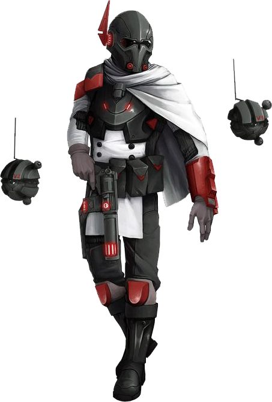

# Scout

Rough and grizzled looking, a human stalks alone through the shadows of trees, hunting the quarry he knows is planning a raid on a nearby settlement. Clutching a techblade in each hand, he becomes a whirlwind of steel, cutting down one enemy after another.

After tumbling away from the shrapnel of a missile's explosion, a bothan finds her feet and quick-fires two shots from her carbine at the oncoming tank. Shrugging off the wave of fear that threatens to permeate her entire being, she strafes around her foe, firing shot after shot to try to penetrate the tank's thick armor.

Glancing at his wristpad, a sullustan looks through the eyes of his tracker droid. Transmitting instructions, he sends his droid to distract the houk he's been tracking while he readies his sniper rifle for the shot.

Scouts are the first on the trail and the last to lose it, tracking their quarry for miles unimpeded. They are adaptable, wielding both tech powers and their weaponry to overcome their foes

## Deadly Hunters
Warriors in their own right, scouts specialize in tracking and hunting the monsters that threaten civilization-humanoid raiders, rampaging beasts and monstrosities, terrible Force-wielders, and renegade droids. They learn to track their quarry as a predator does, moving stealthily through any terrain and hiding themselves in brush and rubble. Scouts focus their combat training on techniques that are particularly useful against their specific favored foes.

Scouts acquire the ability to cast tech powers through utilization of a wristpad. Their powers, like their combat abilities, emphasize speed, stealth, and the hunt. A scout's talents and abilities are honed with deadly focus on the grim task of protecting the civilization.

## Independent Adventurers
Though a scout might make a living as a bounty hunter, a guide, or a tracker, a scout's true calling is to defend civilization from the ravages of monsters and humanoid hordes that press in. In some places, scouts gather in secretive orders, though many scouts are independent almost to a fault, knowing that, when a rancor or a band of pirates attacks, a scout might be the first-and possibly the last-line of defense. This fierce independence makes scouts well suited to adventuring, since they are accustomed to life far from the comforts of a dry bed and a hot bath. Faced with city-bred adventurers who grouse and whine about the hardships of the wild, scouts respond with some mixture of amusement, frustration, and compassion. But they quickly learn that other adventurers who can carry their own weight in a fight against civilization's foes are worth any extra burden. Coddled city folk might not know how to feed themselves or find fresh water in the wild, but they make up for it in other ways.

<!--- image here  --->

## Creating a Scout
As you create your scout character, consider the nature of the training that gave you your particular capabilities. Did you train with a single mentor, tracking together until you mastered the scout's ways? Did you leave your apprenticeship, or was your mentor slain-perhaps by some kind of bestial monstrosity on which you've sworn revenge? Or perhaps you learned your skills as part of a band of mercenaries. 

What's the source of your particular hatred of a certain kind of enemy? Did a monster kill someone you loved or destroy your home village? Or did you see too much of the destruction these monsters cause and commit yourself to reining in their depredations? Is your adventuring career a continuation of your work, or a significant change?

What made you join up with a band of adventurers? Do you find it challenging to teach new allies the ways of the wild, or do you welcome the relief from solitude that they offer?

## Quick Build
You can make a scout quickly by following these suggestions. First, make Strength or Dexterity your highest ability modifier, depending on whether you want to focus on melee combat or on ranged weapons (or finesse weapons). Your next-highest score should be Intelligence. Second, choose the bounty hunter background.

## The Scout

|Level|Proficiency Bonus|Features|Ranger's Quarry|Tech Powers Known|Tech Points|Max Power Level|Routines Known|Routine Radius|
|:--:|:--:|:--|:--:|:--:|:--:|:--:|:--:|:--:|
| 1st|+2|Ranger's Quarry, Pathfinder			            | d4| -| -|	 -|-|     -|
| 2nd|+2|Techcasting, Fighting Style         			    | d4| 4| 2|1st|-|     -|
| 3rd|+2|Scout Routine, Scout Technique	        	    	| d4| 5| 3|1st|1| 5 ft.|
| 4th|+2|Ability Score Improvement			        		| d4| 6| 4|1st|1| 5 ft.|
| 5th|+3|Extra Attack					        			| d6| 7| 5|2nd|1| 5 ft.|
| 6th|+3|Expertise           						        | d6| 8| 6|2nd|1| 5 ft.|
| 7th|+3|Technique feature                                  | d6| 9| 7|2nd|2| 5 ft.|
| 8th|+3|Ability Score Improvement                        	| d6|10| 8|2nd|2| 5 ft.|
| 9th|+4|-	        		                                | d8|12| 9|3rd|2|15 ft.|
|10th|+4|Commando        					        		| d8|13|10|3rd|2|15 ft.|
|11th|+4|Technique feature				            		| d8|14|11|3rd|2|15 ft.|
|12th|+4|Ability Score Improvement		        			| d8|15|12|3rd|2|15 ft.|
|13th|+5|-								                    |d10|16|13|4th|2|15 ft.|
|14th|+5|Expertise, Combat Tech			                    |d10|17|14|4th|2|15 ft.|
|15th|+5|Technique feature                                  |d10|18|15|4th|3|15 ft.|
|16th|+5|Ability Score Improvement				            |d10|19|16|4th|3|15 ft.|
|17th|+6|-                                                  |d12|20|17|5th|3|30 ft.|
|18th|+6|Supreme Awareness					                |d12|21|18|5th|3|30 ft.|
|19th|+6|Ability Score Improvement			                |d12|22|19|5th|3|30 ft.|
|20th|+6|Foe Slayer								            |d12|23|20|5th|3|30 ft.|

## Class Features
As a scout, you gain the following class features.

### Hit Points
- **Hit Dice:** 1d10 per scout level
- **Hit Points at 1st Level:** 10 + your Constitution modifier
- **Hit Points at Higher Levels:** 1d10 (or 6) + your Constitution modifier per scout level after 1st

### Proficiencies
- **Armor:** Light armor, medium armor
- **Weapons:** All blasters, all vibroweapons
- **Tools:** None
- **Saving Throws:** Strength, Dexterity
- **Skills:** Choose three from Animal Handling, Athletics, Insight, Investigation, Perception, Piloting, Stealth, Survival, and Technology

### Equipment
You start with the following equipment, in addition to the equipment granted by your background.
- *(a)* mesh armor or *(b)* a combat suit, blaster rifle or simple blaster, and two power cells
- *(a)* a vibroweapon and a light physical shield or *(b)* two simple vibroweapons
- *(a)* a hold-out and a power cell or *(b)* two vibrodaggers
- *(a)* a dungeoneer's pack or *(b)* an explorer's pack
- A wristpad

### Variant: Starting Wealth 
In lieu of the equipment granted by your class and background, you can elect to purchase your starting gear. If you do so, you receive no equipment from your class and background, and instead roll for your starting wealth using the criteria below:

|	&emsp;&emsp;Class		|	Funds&emsp;&emsp;	|
|	:--			|	--:			|
|   &emsp;Scout     |	8d4 x 100 cr&emsp;  |

### Ranger's Quarry
_**Scout:** 1st, 5th, 9th, and 17th level_ 
You learn how to effectively read and track your prey. Once on each of your turns, you can choose a creature you can see within 120 feet and mark it as your quarry (no action required). For the next hour, you gain the following benefits:
- Once per turn, when you hit the target with a weapon attack, you can deal 1d4 additional damage to it of the same type as the weapon's damage. This die changes as you gain scout levels, as shown in the Ranger's Quarry column of the scout table.
- You have advantage on any Wisdom (Perception) or Wisdom (Survival) check you make to find it while it's on the same planet as you.

You can only have one creature marked in this way at a time. Beginning at 5th level, you can use your reaction to mark a creature when it enters your line of sight, provided it is within range of your Ranger's Quarry.

The duration increases to 8 hours at 9th level and 24 hours at 17th level.

### Pathfinder
_**Scout:** 1st level_ 
You are skilled at navigating the untamed wilds. You ignore difficult terrain, and when traveling for an hour or more, you gain the following benefits:
- Difficult terrain doesn't slow your group, provided they can see and hear you.
- You can't become lost by unenhanced means.
- Even when you are engaged in another activity while traveling (such as foraging, navigating, or tracking), you remain alert to danger.
- If you are traveling alone, you can move stealthily at a normal pace.
- When you forage, you find twice as much food.
- You have advantage on Survival checks.

### Techcasting
_**Scout:** 2nd level_ 
You have derived powers from schematics with the aid of your wristpad. See chapter 10 for the general rules of techcasting and chapter 12 for the tech powers list.

#### Tech Powers Known
You learn 4 tech powers of your choice, and you learn more at higher levels, as shown in the Tech Powers Known column of the scout table. You may not learn a tech power of a level higher than your Max Power Level.

#### Tech Points
You have a number of tech points equal to your scout level, as shown in the Tech Points column of the scout table, + your Intelligence modifier. You use these tech points to cast tech powers. You regain all expended tech points when you finish a short or long rest.

#### Max Power Level
Many tech powers can be overcharged, consuming more tech points to create a greater effect. You can overcharge these powers to a maximum level, which increases at higher levels, as shown in the Max Power Level column of the scout table.

You may only cast tech powers at 4th and 5th-level once. You regain the ability to do so after a long rest.

#### Techcasting Ability
Intelligence is your techcasting ability for your tech powers. You use your Intelligence whenever a power refers to your techcasting ability. Additionally, you use your Intelligence modifier when setting the saving throw DC for a tech power you cast and when making an attack roll with one.

___

**Tech save DC** = 8 + your proficiency bonus + your Intelligence modifier

___

**Tech attack modifier** = your proficiency bonus + your Intelligence modifier

___

#### Techcasting Focus
You use a wristpad (found in chapter 5) as a tech focus for your tech powers.

### Fighting Style
_**Scout:** 2nd level_ 
You adopt a particular style of fighting as your specialty. Choose one of the fighting style options, detailed in Chapter 6. 

### Scout Routine
_**Scout:** 3rd level_ 
You've developed one routine, as detailed at the end of the class description, and you gain more at higher levels, as shown in the Routines Known column of the scout table. Your routine has a radius of 5 feet, which increases at higher levels, as shown in the Routine Radius column of the scout table.

### Scout Technique 
_**Scout:** 3rd, 7th, 11th, and 15th level_ 
You choose to focus on a specific scout technique, which is detailed at the end of the class description.

### Ability Score Improvement 
_**Scout:** 4th, 8th, 12th, 16th, and 19th level_ 
You can increase one ability score by 2, or you can increase two ability scores by 1. You can't increase an ability score above 20 using this feature.

### Extra Attack
_**Scout:** 5th level_ 
You can attack twice, instead of once, whenever you take the Attack action on your turn.

### Expertise
_**Scout:** 6th and 14th level_ 
Choose two of your skill proficiencies, or one of skill proficiencies and one of your tool proficiencies, or two of your tool proficiencies. You gain expertise in those skills or tools.

At 14th level, you can choose another two proficiencies (in skills or tools) to gain this benefit.

### Commando 
_**Scout:** 10th level_ 
You can take the Dash or Hide actions as a bonus action on each of your turns. Additionally, you can remain perfectly still for long periods of time to set up ambushes. 

When you attempt to hide on your turn, you can opt to not move on that turn. If you avoid moving, creatures that attempt to detect you take a -10 penalty to their Wisdom (Perception) checks until the start of your next turn. You lose this benefit if you move or fall prone, either voluntarily or because of some external effect. You are still automatically detected if any effect or action causes you to no longer be hidden. 

If you are still hidden on your next turn, you can continue to remain motionless and gain this benefit until you are detected.

Finally, you can no longer be tracked by unenhanced means, unless you choose to leave a trail.

### Combat Tech
_**Scout:** 14th level_ 
When you use your action to cast a tech power, you can make one weapon attack as a bonus action.

### Supreme Awareness 
_**Scout:** 18th level_ 
You gain preternatural senses that help you fight creatures you can't see. When you attack a creature you can't see, your inability to see it doesn't impose disadvantage on your attack rolls against it. 

You are also aware of the location of any invisible creature within 30 feet of you, provided that the creature isn't hidden from you and you aren't blinded or deafened.

### Foe Slayer 
_**Scout:** 20th level_ 
You become an unparalleled hunter. Your Strength or Dexterity score increases by 2, and your Intelligence score increases by 2. Your maximum for those scores increases by 2.

Additionally, once on each of your turns, you can add your Intelligence modifier to the attack roll or the damage roll of an attack you make. 

___

## Scout Routines
The routines are presented in alphabetical order. If multiple scouts grant the same routine, affected creatures can only benefit from it once. You must be conscious to grant the benefit of your routines.

### Adaptability Routine
At the start of each of your turns, you can choose an ability score with a saving throw in which you are not proficient. Until the start of your next turn, you add half your proficiency bonus to saving throws you make with the chosen ability. Alternatively, you can choose to extend this benefit to allies within 5 feet of you.

### Maven's Routine
At the start of each of your turns, you can choose to gain resistance to damage from tech powers until the start of your next turn. Alternatively, you can choose to extend this benefit to allies within 5 feet of you.

### Mesmer's Routine
At the start of each of your turns, you can choose to have advantage on saving throws against effects that would incapacitate you or put you to sleep until the start of your next turn. Alternatively, you can choose to extend this benefit to allies within 5 feet of you.

### Nomad's Routine
At the start of each of your turns, you can choose to gain advantage on Constitution saving throws to avoid exhaustion from unenhanced sources, as well as being naturally adapted to both hot and cold climates. Alternatively, you can choose to extend this benefit to allies within 5 feet of you.

### Responder's Routine
When you roll initiative, you can choose to add your proficiency bonus to the initiative check and have advantage on attack rolls against creatures that have not yet acted. Alternatively, you can choose to allow each friendly creature within 5 feet of you to add half your proficiency bonus to the initiative check and have advantage on the first attack roll they make against a creature that has not yet acted.

### Sharpshooter's Routine
At the start of each of your turns, you can choose to gain a bonus to the first weapon attack roll you make before the start of your next turn equal to your Intelligence modifier. Alternatively, you can choose to allow each friendly creature within 5 feet of you to add half your Intelligence modifier to the first weapon attack roll they make before the start of your next turn.

### Strider's Routine
At the start of each of your turns, you can choose to have each slowed level only reduce your speed by 5 feet, unless it would reduce your speed to 0 until the start of your next turn. Alternatively, you can choose to extend this benefit to allies within 5 feet of you.

### Warden's Routine
At the start of each of your turns, you can choose to gain a crawling, climbing, and swimming speed equal to your walking speed until the start of your next turn. Alternatively, you can choose to extend this benefit to allies within 5 feet of you.

___

## Scout Techniques
Scouts tend to share knowledge amongst them selves, focusing on specific techniques and honing them to perfection. Your technique grants you features at 3rd, 7th, 11th, and 15th level.
