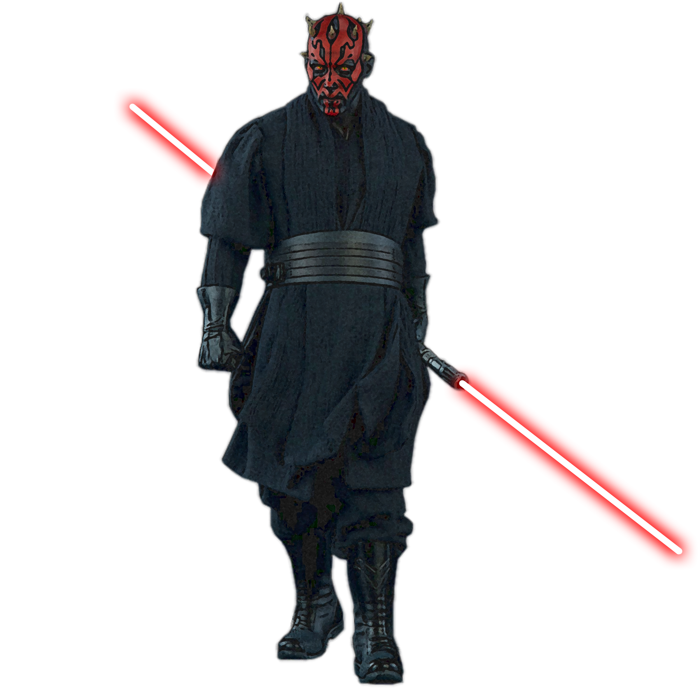

## Path of Focus

The ways of the Force can reveal themselves to a sentinel through intense concentration and, most importantly, focus. Those sentinels who follow the Path of Focus use debilitating bursts of lightsaber strikes and force powers to exhaust their foes, crushing any hopes they had of mounting an effective defense.

### Focused Burst
_**Path of Focus:** 3rd level_ 
You learn the *burst* force power, which does not count against your total powers known. Additionally, you can use The Double Strike Force-Empowered Self options when you cast it as your action. If more than one creature would be affected, only one creature takes the additional damage. Finally, you add your Wisdom or Charisma modifier (your choice, minimum of +1) to damage rolls with it, and creatures that succeed on their saving throw take half damage, instead of none.

### Blade Dance
_**Path of Focus:** 3rd level_ 
When you deal damage to a creature within 5 feet of you, you can move up to 10 feet without provoking opportunity attacks.

### Blade Storm
_**Path of Focus:** 7th level_ 
Your bursts become even more overwhelming. Once on your turn, when a creature takes damage from you twice, you can immediately make one additional attack against that creature (no action required). This attack uses your Kinetic Combat die instead of the weapon's damage die.

### Focused Flow
_**Path of Focus:** 13th level_ 
Whenever you use a Force-Empowered Self feature, you may instead expend no force points and roll a d4 in place of your Kinetic Combat die.

### Master Strike
_**Path of Focus:** 18th level_ 
At 18th level, your bursts can overpower even the fiercest of foes. Once on your turn, when a creature takes damage from you three times, you can force it to make a Constitution saving throw against your universal force save DC. On a failed save, it becomes stunned until the end of its next turn.
