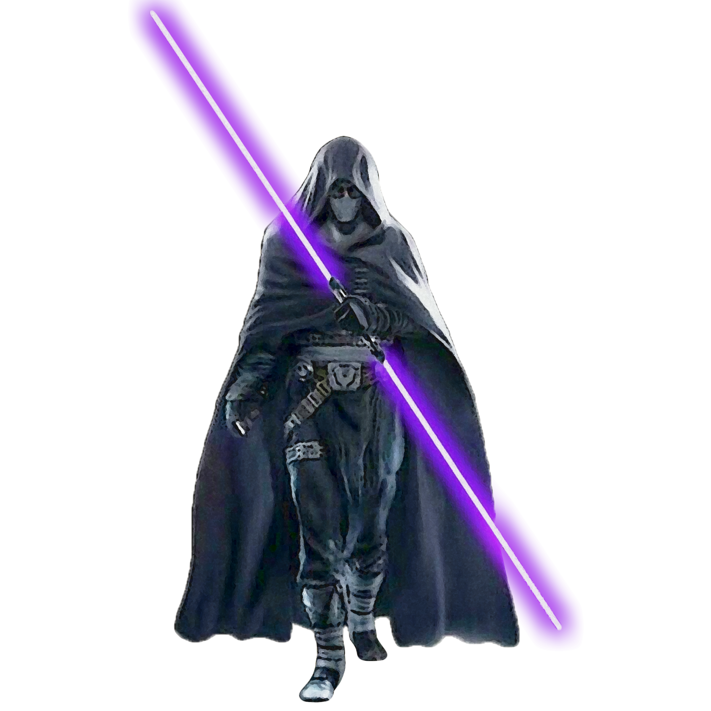

# Path of Shadows
In darkness, there is protection. Those sentinels who follow the Path of Shadows utilize a calculated plan, becoming masters of stealth and ambush who forgo the head-on attack for the vulnerable flank.

## Dead Silence
_**Path of Shadows:** 3rd level_ 
You learn the *psychic charge* force power, which does not count against your total powers known. Additionally, you can use Wisdom or Charisma as your forcecasting ability for it, and when you hit a creature with the *psychic charge* force power and the target tries to speak, it takes additional damage equal to your Wisdom or Charisma modifier (your choice, minimum of +1), and its voice does not produce sound until the end of your next turn.

## Cloak of Shadows
_**Path of Shadows:** 3rd level_ 
You can take the Hide action as a bonus action on your turn. Additionally, you can try to hide when you are lightly obscured from the creature from which you are hiding.

## Shadow Strike
_**Path of Shadows:** 7th level_ 
You learn to strike from the shadows. Once per turn, you can deal an extra 1d6 damage to one creature you hit with an attack if you have advantage on the roll. 

The extra damage increases to 2d6 at 11th level and 3d6 at 17th level.

## Shadow Step
_**Path of Shadows:** 13th level_ 
You gain the ability to step from one shadow into another. While you are in dim light or darkness, as a bonus action you can teleport up to 60 feet to an unoccupied space you can see that is also in dim light or darkness. You then have advantage on the first melee attack you make before the end of the turn.

## Shadow's Wrath
_**Path of Shadows:** 18th level_ 
Your training has taught you advanced techniques while you maneuver in the shadows. While you are hidden from your target, the first attack roll you make each round does not automatically reveal your presence. Make a Dexterity (Stealth) check against your target's Wisdom (Perception) check. On a success, you remain hidden. If you are also invisible, you remain invisible.
