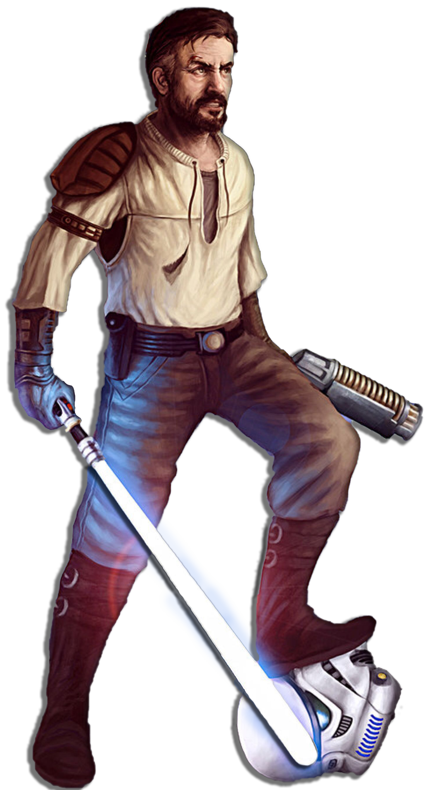

# Path of the Corsair

There may come a time when a sentinel finds themselves stranded, hunted, or in any situation where they must hide their nature as a force wielder. Those sentinels who follow the Path of the Corsair make use of alternative weaponry not commonly associated with force-wielders to great effect.

## Bonus Proficiencies
_**Path of the Corsair:** 3rd level_ 
You gain proficiency with demolitions kits and three blasters of your choice.

## Corsair Munitions
_**Path of the Corsair:** 3rd level_ 
You can throw grenades and set mines with your bonus action, instead of your action. Additionally, when you throw a grenade, you can use Wisdom or Charisma instead of Strength when determining your throwing range. Lastly, when determining the save DC of a charge, grenade, mine, missile, or rocket you control, you can use your universal force save DC, if it would be higher than the item's DC.

## Force-Empowered Detonators
_**Path of the Corsair:** 3rd, 5th, 9th, 13th, and 17th level_ 
You learn to create a number of small but potent grenades. Over the course of a short or long rest, you can create two grenades. You must have a demolitions kit in order to create these grenades. Your grenades can only be used by you, and they lose their potency at the end of your next short or long rest.

Your grenades can be set to detonate on impact or with a timer that causes them to explode on initiative count 20 (losing all initiative ties). As an action, you can prime and throw one of these grenade at a point you can see within 30 feet + your Strength modifier x 5. Each creature within 5 feet must make a Dexterity, Constitution, or Wisdom saving throw (your choice when you generate the grenade) against your universal force save DC. A creature takes damage using your Kinetic Combat die + your Wisdom or Charisma modifier (your choice) on a failed save, or half as much on a successful one. The damage is force for Dexterity, necrotic for Constitution, or psychic for Wisdom.

You can make additional grenades at higher level: three at 5th level, four at 9th level, five at 13th level, and six at 17th level.

## Remote Start
_**Path of the Corsair:** 7th level_ 
You learn to easily detonate primed explosives. As a bonus action on your turn, you can detonate a primed explosive you can see within 60 feet. Alternatively, if you take the Attack action on your turn and you are wielding a blaster weapon with which you are proficient, you can choose to shoot the explosive rather than use your bonus action to detonate it as long as you wouldn't have disadvantage on the attack roll.

When you do so, the explosive immediately detonates, and you have advantage on the damage roll you make with that explosive. 

## Energized Kinetics
_**Path of the Corsair:** 13th level_ 
Once per turn, when you deal damage with a Force-Empowered Detonator or your Double Strike feature, you can deal additional damage using your Kinetic Combat die. The damage type is force, lightning, necrotic, or psychic (your choice).

## Disorienting Detonations
_**Path of the Corsair:** 18th level_ 
When a creature fails the saving throw against a Force-Empowered Detonator, you can spend 2 force points to subject it to one of the following conditions until the end of your next turn: blinded, deafened, ignited (1d12), shocked, or slowed.
