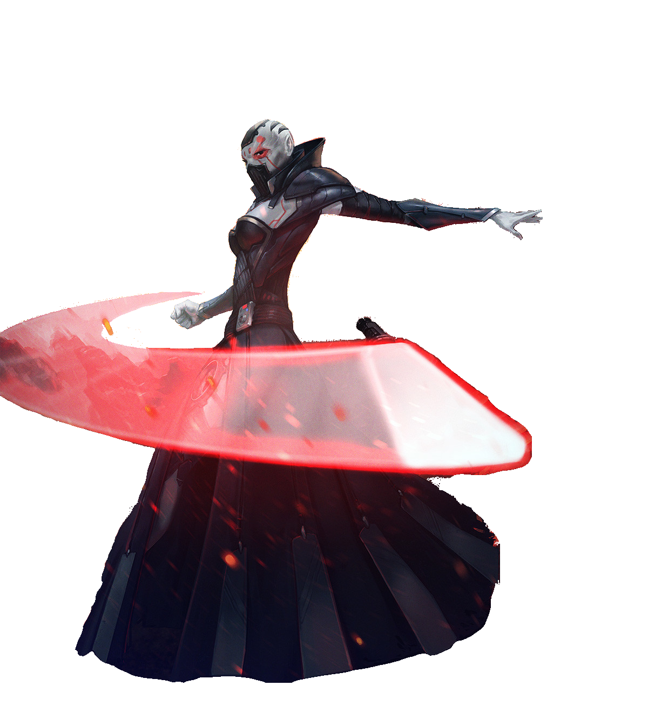

# Path of the Forceblade

Some few master their weapon in ways that differ from their peers. Those sentinels who follow the Path of the Forceblade channel the Force into their weapon, forming a unique connection that grants you greater control over the weapon; it becomes an extension of their will.

## Phasethrow
_**Path of the Forceblade:** 3rd level_ 
You learn the *saber throw* force power, which does not count against your total powers known. Additionally, you no longer have disadvantage on the attack roll with it if you are within 5 feet of a hostile creature, and you can use the Double Strike Force-Empowered Self options when you cast it as your action and hit a target. Finally, when you hit a creature with the *saber throw* force power, you deal additional damage equal to half your Wisdom or Charisma modifier (your choice, minimum of +1) if it doesn't already include that modifier.

## Forceblade Bond
_**Path of the Forceblade:** 3rd level_ 
You learn how to bond with a light- or vibro-weapon through the Force, making it part of you.

You perform the ritual over the course of 1 hour, which can be done during a short rest. The weapon must be within your reach throughout the ritual, at the conclusion of which you touch the weapon and forge the bond, gaining the following benefits:
- You can't be disarmed of that weapon while you are conscious. 
- If the weapon is within 60 feet of you and you can see it, you can summon that weapon as a bonus action on your turn, causing it to travel instantly to you. If you have a free hand, you catch the weapon. Otherwise, it lands at your feet.
- You can use Wisdom or Charisma instead of Strength or Dexterity for the attack and damage rolls.

You can have two weapons bonded to you in this way at a time, and you can summon both of them to you with the same bonus action.

## Twin Saber Throw
_**Path of the Forceblade:** 7th, 9th, 13th, and 17th level_ 
When you cast *saber throw* while wielding your forceblade, you can attack the same target multiple times.

Additionally, when you deal damage to a creature within 30 feet of you with your forceblade, you can use your bonus action to teleport to within 5 feet of that creature and make a melee weapon attack against that creature. This attack uses your Kinetic Combat die instead of your weapon's damage die. You can use this feature three times. You gain an additional use at 9th, 13th, and 17th level. You regain all expended uses when you complete a long rest.

## Disruptive Throw
_**Path of the Forceblade:** 13th level_ 
When you are the target of a ranged attack, and the source is within range of your *saber throw* force power, you can use your reaction to throw your forceblade at the source of the attack. Make a ranged force attack. On a hit, this attack deals damage using your Kinetic Combat die instead of the weapon's damage die and you impose disadvantage on the triggering attack roll.

## Forceblade Mastery
_**Path of the Forceblade:** 18th level_ 
You've mastered controlling your forceblade with your mind, using it to keep your enemies at bay. As an action, you can telekinetically control your forceblade and have it strike any number of creatures within 10 feet of you, spending 1 force point per target. Each target must make a Dexterity saving throw (DC = 8 + your bonus to weapon attack rolls with that weapon). On a failed save, it takes damage using your Kinetic Combat die + half your sentinel level, is pushed back 10 feet and knocked prone.
