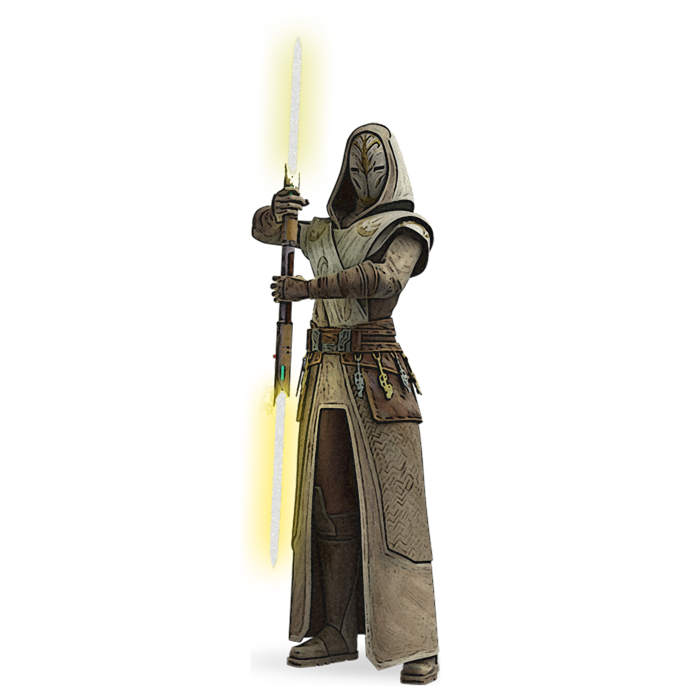

# Sentinel

Clad in black robes, the rattataki pulls his hood forward and steps into the shadowy alcove, only to reappear further down the hall. As his quarry walks past, he presses the hilt of his lightsaber to the back of their head, quickly toggling it on-and-off. He is gone before the corpse hits the ground.

The togruta dashes across the battlefield, doublesaber deflecting blaster shots to the ground. She pulls her wounded padawan to her feet, and guides her away from the warzone.

Green-bladed lightsaber a blur, the cathar ferociously presses the attack. With each strike, she guides her opponent closer to the ravine's edge. A flurry of blows followed by a quick *force push* and her foe tumbles over the edge.

Sentinels are the masters of blending force powers with weapon attacks. They weave the two together so expertly that their foes have trouble predicting them.

## The Middle of the Road
The sentinel uses stealth and subterfuge to accomplish the will of the Force. Where the consular focuses on mastery of the Force and the guardian focuses on the mastery of the lightsaber, the sentinel focuses on merging the two. 

## Solitary Action
Sentinels are notoriously independent, most comfortable acting alone and without backup; where some use a team to make up for their weaknesses, the sentinel uses the Force to overcome theirs. While some take this independent streak to the extreme, they are usually accepting of authority, as long as they are allowed to carry out directions using their preferred methods.

## Creating a Sentinel
While creating your sentinel, consider your personal philosophy in regards to the Force and its most famous practitioners ñ the Jedi and the Sith.  Are you a member of one of the two orders, or do you walk a different path? Are you an operative tapping into a latent Force-sensitivity? Were you trained in the force from a young age, or did you discover it as an adult? How do you treat those weaker than you? What was your family like? Do you see the Force as light and dark, or an impartial river of gray?

## Quick Build
You can make a sentinel quickly by following these suggestions. First, make Dexterity your highest ability score, followed by Wisdom or Charisma. Second, choose the Jedi or Sith background.

## The Sentinel

|Level|Proficiency  Bonus|Features|Force Powers  Known|Force  Points|Max Power  Level|Kinetic  Combat|Ideals  Known|Ideal  Manifests|
|:--:|:--:|:--|:--:|:--:|:--:|:--:|:--:|:--:|
| 1st|+2|Forcecasting, Led by the Force			    | 7| 3|1st|  -|-|-|
| 2nd|+2|Force-Empowered Self, Sentinel Ideals		| 9| 6|1st|	d4|2|2|
| 3rd|+2|Sentinel Calling			                |11| 9|2nd| d4|2|2|
| 4th|+2|Ability Score Improvement                  |13|12|2nd| d4|2|2|
| 5th|+3|Extra Attack                               |15|15|2nd| d6|2|2|
| 6th|+3|-                                          |17|18|3rd| d6|3|2|
| 7th|+3|Calling feature   				    		|18|21|3rd| d6|3|2|
| 8th|+3|Ability Score Improvement                  |19|24|3rd| d6|3|2|
| 9th|+4|-                                          |21|27|4th| d8|3|3|
|10th|+4|Battle Readiness   						|22|30|4th| d8|3|3|
|11th|+4|-                                          |24|33|5th| d8|4|3|
|12th|+4|Ability Score Improvement                  |25|36|5th| d8|4|3|
|13th|+5|Calling feature			                |26|39|5th|d10|4|3|
|14th|+5|-                                          |28|42|6th|d10|4|3|
|15th|+5|Enlightened Evasion                        |29|45|6th|d10|4|3|
|16th|+5|Ability Score Improvement                  |30|48|6th|d10|4|3|
|17th|+6|-                                          |32|51|7th|d12|4|4|
|18th|+6|Calling feature	                        |33|54|7th|d12|4|4|
|19th|+6|Ability Score Improvement                  |34|57|7th|d12|4|4|
|20th|+6|Center of the Force                        |35|60|7th|d12|4|4|

## Class Features
As a sentinel, you gain the following class features.

### Hit Points
- **Hit Dice:** 1d8 per sentinel level
- **Hit Points at 1st Level:** 8 + your Constitution modifier
- **Hit Points at Higher Levels:** 1d8 (or 5) + your Constitution modifier per sentinel level after 1st

### Proficiencies
- **Armor:** Light armor
- **Weapons:** Simple lightweapons, simple vibroweapons, martial lightweapons with the finesse property, martial vibroweapons with the finesse property
- **Tools:** One specialist's kit of your choice
- **Saving Throws:** Dexterity, Charisma
- **Skills:** Choose three from Acrobatics, Animal Handling, Insight, Intimidation, Perception, Persuasion, Piloting, Stealth, and Technology

### Equipment
You start with the following equipment, in addition to the equipment granted by your background:
- *(a)* two simple lightweapons or vibroweapons or *(b)* one lightweapon or vibroweapon with which you are proficient
- *(a)* a dungeoneer's pack or *(b)* an explorer's pack
- A specialist's kit with which you are proficient
- A combat suit and a light physical shield

#### Variant: Starting Wealth 
In lieu of the equipment granted by your class and background, you can elect to purchase your starting gear. If you do so, you receive no equipment from your class and background, and instead roll for your starting wealth using the criteria below:

|	&emsp;&emsp;Class		|	Funds&emsp;&emsp;	|
|	:--			|	--:			|
|   &emsp;Sentinel  |	6d4 x 100 cr&emsp;  |

### Forcecasting
_**Sentinel:** 1st level_ 
In your meditations on the force, you have learned powers, fragments of knowledge that imbue you with an abiding force ability. See chapter 10 for the general rules of forcecasting and chapter 11 for the force powers list.

#### Force Powers Known
You learn 7 force powers of your choice, and you learn more at higher levels, as shown in the Force Powers Known column of the sentinel table. You may not learn a force power of a level higher than your Max Power Level, and you may learn a force power at the same time you learn its prerequisite.

#### Force Points
You have a number of force points equal to your sentinel level x 3, as shown in the Force Points column of the sentinel table, + your Wisdom or Charisma modifier (your choice). You use these force points to cast force powers. You regain all expended force points when you finish a long rest.

#### Max Power Level
Many force powers can be overpowered, consuming more force points to create a greater effect. You can overpower these abilities to a maximum level, which increases at higher levels, as shown in the Max Power Level column of the sentinel table.

You may only cast force powers at 5th, 6th, and 7th-level once. You regain the ability to do so after a long rest.

#### Forcecasting Ability
Your forcecasting ability varies based on the alignment of the powers you cast. You use Wisdom for light side powers, Charisma for dark side powers, and Wisdom or Charisma for universal powers (your choice). You use this ability whenever a power refers to your forcecasting ability. Additionally, you use this ability modifier when setting the saving throw DC for a force power you cast and when making an attack roll with one.

___

**Force save DC** = 8 + your proficiency bonus + your forcecasting ability modifier

___

**Force attack modifier** = your proficiency bonus + your forcecasting ability modifier

___

### Led by the Force
_**Sentinel:** 1st level_ 
You can add half your proficiency bonus to any ability check you make that doesn't already include your proficiency bonus.

### Force-Empowered Self
_**Sentinel:** 2nd level_ 
Your training allows you to harness the mystical energy of the Force throughout your body. You learn three effects: Deflection, Double Strike, and Slow Time. Each effect costs 1 force point and uses a d4, which changes as you gain sentinel levels, as shown in the Kinetic Combat column of the sentinel table. You can only use each effect once per round.

#### Deflection
When you are the target of an attack, you can roll a Kinetic Combat die and add it to your AC (no action required). You can do so before or after the attack is made, but you must choose to do so before the GM determines if the attack hits.

#### Double Strike
When you hit a creature with a weapon attack, you can roll a Kinetic Combat die and deal additional damage of the same type equal to the amount rolled.

#### Slow Time
When you move on your turn, you can roll a Kinetic Combat die to increase your speed by 5 x the amount rolled until the end of your turn.

### Sentinel Ideals
_**Sentinel:** 2nd level_ 
You adopt ideals that exemplify your bond with the Force. You adopt two ideals of your choice, as detailed at the end of the class description, and you adopt more at higher levels, as shown in the Ideals Known column of the sentinel table.

You can manifest your ideals a combined total of twice, and you can manifest them more times at higher levels as shown in the Ideal Manifests column of the sentinel table.

### Sentinel Calling
_**Sentinel:** 3rd, 7th, 13th, and 18th level_ 
You choose a sentinel calling, which is detailed at the end of the class description. 

### Ability Score Improvement
_**Sentinel:** 4th, 8th, 12th, 16th, and 19th level_ 
You can increase one ability score by 2, or you can increase two ability scores by 1. You can't increase an ability score above 20 using this feature.

### Extra Attack
_**Sentinel:** 5th level_ 
You can attack twice, instead of once, whenever you take the Attack action on your turn.

### Battle Readiness
_**Sentinel:** 10th level_ 
You have fully learned how to meld your physical self with the Force. When you take the Dodge or Disengage actions, or use your action to cast a force power, you can make one weapon attack as a bonus action.

### Enlightened Evasion
_**Sentinel:** 15th level_ 
When you are subjected to an effect that forces you to make a saving throw, you can spend 2 force points to add your Wisdom or Charisma modifier (your choice, minimum of one) to the saving throw. If you do so, you instead take no damage if you succeed on the saving throw, and only half damage if you fail. 

### Center of the Force
_**Sentinel:** 20th level_ 
You are perfectly centered with the Force. Your Dexterity and Wisdom or Charisma scores (your choice) increase by 2. Your maximum for those scores increases by 2.

Additionally, once per turn, when you would roll a Kinetic Combat die, you can instead choose the maximum.

___

## Sentinel Ideals
The ideals are presented in alphabetical order.

### Ideal of the Agile
You gain a swimming speed and a climbing speed equal to your walking speed. When you make a long jump, you can cover a number of feet up to twice your Wisdom or Charisma score (your choice). When you make a high jump, you can leap a number of feet up into the air equal to 3 + twice your Wisdom or Charisma modifier (your choice).

Additionally, as a bonus action, you can manifest this ideal in a brief surge of energy. For the next minute, opportunity attacks against you are made with disadvantage.

### Ideal of the Artisan
Choose one of your skill or tool proficiencies. When you make an ability check with the chosen skill or tool, you can add half your Wisdom or Charisma modifier (your choice, minimum of one).

Additionally, as an action, you can manifest this ideal in a brief surge of energy. For the next 10 minutes, the bonus increases to your Wisdom or Charisma modifier, and you can choose a second skill or tool to extend this feature to.

### Ideal of the Contender
Your unarmed strike damage increases by one step (from 1 to d4, d4 to d6, or d6 to d8), and your unarmed strikes gain the finesse property.

Additionally, as a bonus action, you can manifest this ideal in a brief surge of energy. For the next minute, your unarmed strikes count as enhanced for the purpose of overcoming resistance and immunity to unenhanced attacks and damage, and you can use your Wisdom or Charisma modifier (your choice) instead of Strength for checks made to grapple a target or escape a grapple.

### Ideal of the Fighter
You adopt a particular style of fighting as your specialty. Choose one of the fighting style options, detailed in Chapter 6. 

Additionally, as a bonus action, you can manifest this ideal in a brief surge of energy. For the next minute, you know the fighting mastery that corresponds with the fighting style you chose with this feature. If you already know that fighting mastery, you instead learn another of your choice for the duration.

### Ideal of the Hunter
You gain darkvision out to a range of 60 feet. If you already have darkvision, this ideal increases its range by 30 feet.

Additionally, as a bonus action, you can manifest this ideal in a brief surge of energy. For the next minute, you can see normally in enhanced darkness, and you gain blindsight to 10 feet.

### Ideal of the Steadfast
When you would make a melee weapon attack roll, you can instead force the target to make a Dexterity saving throw (DC = 8 + your bonus to attacks with the weapon). If you would have advantage on your attack roll, the creature instead has disadvantage on their saving throw, and if you would have disadvantage on your attack roll, the creature instead has advantage on their saving throw. On a failed save, the target takes normal weapon damage and is subjected to any additional effects that would occur on a hit.

Additionally, as a bonus action, you can manifest this ideal in a brief surge of energy. For the next minute, when a creature succeeds on the saving throw, they take half the normal weapon damage, and when a creature rolls a 1 on the saving throw, they treat the damage as if you had rolled the maximum.

### Ideal of the Titan
You gain proficiency in medium armor.

Additionally, as a bonus action, you can manifest this ideal in a brief surge of energy. For the next minute, you have advantage on ability checks and attack rolls that would forcefully move another creature, and the distance they would be moved increases by 5 feet.

### Ideal of the Tranquil
When you finish a short or long rest, you gain a number of temporary force points equal to half your Wisdom or Charisma modifier (your choice, minimum of one). When you would spend a force point while you have temporary force points, the temporary force points are spent first. All temporary force points are lost at the end of your next short or long rest.

Additionally, as an action, you can manifest this ideal in a brief surge of energy. You regain a number of force points equal to half your Wisdom or Charisma modifier (your choice, minimum of one).

### Ideal of the Vigorous
When you roll a Hit Die to regain hit points, you may use your Wisdom or Charisma modifier in place of your Constitution modifier when determining the number of hit points you regain.

Additionally, as an action, you can manifest this ideal in a brief surge of energy. You gain a number of temporary hit points equal to half your sentinel level + your Wisdom or Charisma modifier (your choice, minimum of one).

___

## Sentinel Callings
Different sentinels select different callings, called Paths, to follow as they hone their powers. Your calling grants you features at 3rd, 7th, 13th, and 18th level.
