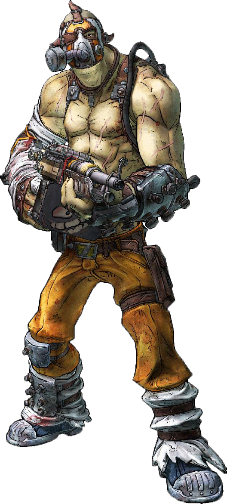

# Addicted Approach

For some, the consumption of substances is the entirety of their life. For berserkers of the Addicted Approach, substances cause their fury to burn stronger and deeper, granting significant benefits.

## Slythmonger Savvy
_**Addicted Approach:** 3rd level_ 
You gain proficiency in your choice of brewer's kit or spicer's kit. Additionally, you have advantage on saving throws to avoid the low or addiction to substances. Lastly, you can consume substances as a bonus action, and when you do so, you can also enter a rage as a part of this same bonus action.

## Freedom Through Slavery
_**Addicted Approach:** 3rd level_ 
While you are raging or experiencing the high of a substance, you have advantage on saving throws that would force you to act against your will, be frightened, or prevent you from attacking a creature. If you are both raging and experiencing the high of a substance, you are instead immune to effects that would force you to act against your will or would prevent you  from attacking a creature.

## Release the Beast
_**Addicted Approach:** 6th level_ 
While you are raging or experiencing the high of a substance, when you hit a creature with a melee weapon attack, you can expend a Hit Die to deal additional damage to the target. Roll the Hit Die, adding the result of the die to the damage roll. If you are both raging and experiencing the high of a substance, you also add your Constitution modifier to the damage roll.

## Seeing Sound
_**Addicted Approach:** 10th level_ 
While you are raging or experiencing the high of a substance, you have blindsight with a range of 10 feet. If you are both raging and experiencing the high of a substance, you instead have blindsight with a range of 30 feet. If you would already have blindsight, it instead increases by 5 feet or 15 feet, respectively.

## Fuel the Rampage
_**Addicted Approach:** 14th level_ 
While you are both raging and experiencing the high of a substance, having 0 hit points doesn't knock you unconscious. You still must make death saving throws, and you suffer the normal effects of taking damage while at 0 hit points. However, if you would die due to failing death saving throws, you don't die until your rage ends, and you die then only if you still have 0 hit points.
