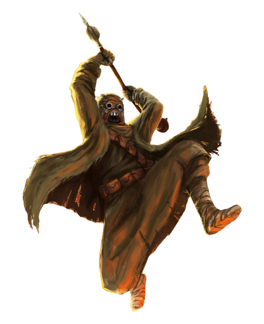

# Beastmaster Approach

Many berserkers feel a primal attunement to nature. For berserkers of the Beastmaster Approach, that attunement manifests itself in bestial marks and manifestations that grant the berserker newfound abilities.

## Bestial Fury
_**Beastmaster Approach:** 3rd level_ 
While raging, you have advantage on any Wisdom (Perception) or Wisdom (Survival) checks.

Additionally, once on each of your turns while raging, you can mark a creature you can see as your prey for the duration of your rage (no action required). When you do so, once per turn when you deal damage to the creature with a weapon attack, you deal an additional 1d4 damage of the same type. Once per turn when the creature deals damage to you with a weapon attack, you take an additional 1d4 damage of the same type. This die increases to d6 at 5th level, d8 at 9th level, d10 at 13th level, and d12 at 17th level. You can only have one creature marked in this way at a time.

## Pack Tactics
_**Beastmaster Approach:** 3rd level_ 
When you have advantage on an attack roll against a creature, another enemy of the creature is within 5 feet of it, that enemy isn't incapacitated, you can reroll one of the dice once.

## Animalistic Momentum
_**Beastmaster Approach:** 6th level_ 
You gain a your choice of a climbing or swimming speed equal to your walking speed. Additionally, you gain an effect while raging based on your choice of speed:
- If you chose a climbing speed, you can climb difficult surfaces, including upside down on ceilings, without needing to make an ability check.
- If you chose a swimming speed, you can use your bonus action to Dash or Disengage while in water.

## Lick Wounds
_**Beastmaster Approach:** 10th level_ 
Whenever you reduce a creature to 0 hit points while raging, you gain a number of temporary hit points equal to your berserker level, which last for the duration of your rage.

## Hunter's Call
_**Beastmaster Approach:** 14th and 17th level_ 
When you enter your rage, you can choose up to 5 allies that you can see within 30 feet of you. You gain 5 temporary hit points for each creature. For the duration of your rage, once on each of their turns, an affected ally can add your rage damage bonus to a weapon attack's damage roll.

You can use this feature five times. You gain an additional use at 17th level. You regain all expended uses when you finish a long rest.
