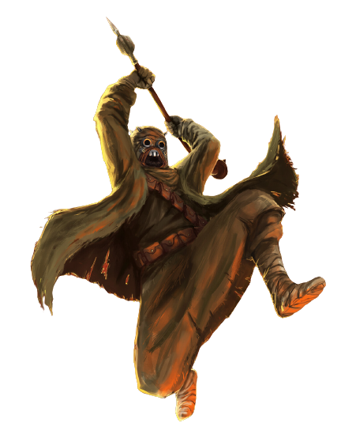

# Beastmaster Approach (Companion)

Many berserkers feel a primal attunement to nature. For berserkers of the Beastmaster Approach, that attunement manifests itself in a bond with a beast companion that accompanies a berserker on his journey.

## Bonus Proficiencies
_**Beastmaster Approach:** 3rd level_ 
You gain proficiency in Animal Handling.

## Beast Companion
_**Beastmaster Approach:** 3rd, 11th, and 17th level_ 
You learn to capitalize on a primal attunement to nature to forge a powerful bond with your own beast companion.

Create your beast companion as detailed in the Companions section of the Customization Options document for Expanded Content. 

In addition to its traits and features, your beast companion gains additional benefits while it is bonded to you:
- Your beast gains two additional traits. It gains one more additional trait when you reach 11th level in this class. For each beast trait in excess of your proficiency bonus, your number of available Hit Dice that can be spend to restore hit points is reduced by 1.

Lastly, while bonded and within 10 feet of you, your beast companion gains the benefits of one of your chosen instincts. If that instinct relies on raging, your beast companion gains the benefits of that instinct while you are raging.

At 11th level, your companion must be within 30 feet of you to benefit from this feature. At 17th level, your companion must be within 60 feet.

## Pack Tactics
_**Beastmaster Approach:** 3rd level_ 
When you have advantage on an attack roll against a creature your companion has dealt damage since the start of your last turn, you can reroll one of the dice once. When your companion has advantage on an attack roll against a creature you've dealt damage since the start of your last turn, it can reroll one of the dice once.

## Animalistic Momentum
_**Beastmaster Approach:** 6th, 11th, and 17th level_ 
Your bond with your beast companion strengthens, granting the following benefits while your beast companion is within 10 feet of you:
- If you or your beast have a climbing or swimming speed and the other doesn't, the other gains it with the same speed. If you both have the a climbing or swimming speed, you both use the larger speed of the two, which then increases by 5 feet.
- Whenever your beast deals damage to a hostile creature you can see on your turn, it counts as you taking a hostile action for the purposes of maintaining your rage.

This radius increases to 30 feet at 11th level 60 feet at 17th level.

## Lick Wounds
_**Beastmaster Approach:** 10th level_ 
Whenever your companion reduces a creature to 0 hit points while you are raging, it gains a number of temporary hit points equal to your berserker level, which last for the duration of your rage.

## Hunter's Call
_**Beastmaster Approach:** 14th and 17th level_ 
When you enter your rage, you can choose up to 5 allies that you can see within 30 feet of you. You gain 5 temporary hit points for each creature. For the duration of your rage, once on each of their turns, an affected ally can add your rage damage bonus to a weapon attack's damage roll.

You can use this feature five times. You gain an additional use at 17th level. You regain all expended uses when you finish a long rest.
