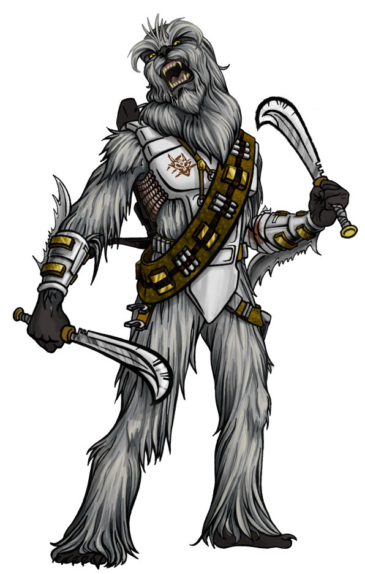

# Bloodstorm Approach

The Bloodstorm Approach is said to have originated from the ancient wookiee Hroufrasnooohn clan (which loosely translates to Bloodstorm in Galactic Basic), whose warriors performed gravity-defying feats with their flying vibroaxes through a combination of unorthodox techniques and a mystical belief in their own abilities. A berserker who follows this approach can hurl their devastating weapons at enemies with such power and skill that it completely blurs the line between melee and ranged combat.

## Furious Throw
_**Bloodstorm Approach:** 3rd level_ 
Your throwing techniques have become a perfect extension of your melee prowess. When you throw a weapon with which you are proficient, you can benefit from your class features that only apply to melee weapon attacks, such as Rage or Reckless Attack.

## Returning Attacks
_**Bloodstorm Approach:** 3rd level_ 
Any weapon you throw can ricochet back to you at your command. When you make a thrown weapon attack, you may have the weapon fly back to your hand immediately after the attack.

## Throw Anything
_**Bloodstorm Approach:** 6th level_ 
Your strength and mastery of throwing techniques has allowed you to throw vibroaxes as easily as others hurl vibrodaggers. When you are wielding a light- or vibro-weapon with which you are proficient, it gains the thrown property (range 20/60).

## Fling People
_**Bloodstorm Approach:** 10th level_ 
You learn to throw creatures as easily as you throw your weapons. When you successfully grapple a creature, you may immediately throw the creature.

### Throw Friend
If the creature is a willing ally and volunteers to be grappled, you throw the target into any unoccupied space within 60 feet. That creature may immediately use its reaction to make one melee weapon attack, adding your Strength modifier to the attack's damage roll.

### Throw Foe
If the creature is an opponent, you throw the target into any unoccupied space within 30 feet, where it takes damage equal to your Strength modifier and falls prone.

## Raging Whirlwind
_**Bloodstorm Approach:** 14th level_ 
You can send your weapon spinning into a gravity-defying whirlwind of pain. Once per rage as an action, you may throw a weapon with the thrown property to a point you choose within 60 feet. The weapon fills the air as a cyclone in a 10 foot radius sphere centered on that point. A creature takes damage equal to the thrown weapon's damage + your Strength modifier + your Rage Damage when it enter's the whirlwind's area for the first time on a turn or starts its turn there. This effect ends when you command the weapon to return to you (no action required) or your rage ends.
