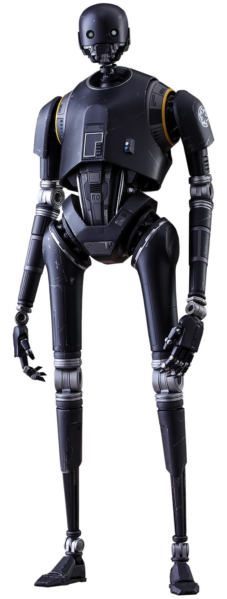

# Brawling Approach

Most berserkers require weapons. For berserkers of the Brawling Approach, however, everything is their weapon.

## Fists of Fury
_**Brawling Approach:** 3rd level_ 
You've learned to hone your rage through your fists. Your unarmed strike damage increases by one step (from 1 to d4, d4 to d6, or d6 to d8).

## Reckless Strikes
_**Brawling Approach:** 3rd level_ 
While you are raging, not wearing heavy armor, and not wielding a shield, when you hit a creature with an unarmed strike or improvised weapon, you can choose to forgo your rage damage to make the attack a reckless strike.

Some of your reckless strikes require your target to make a saving throw to resist the reckless strike's effects. The saving throw DC is calculated as follows:

___

**Reckless Strike save DC** = 8 + your proficiency bonus + your Strength modifier

___

You can use these features a combined number of times equal to your proficiency bonus, as shown in the berserker table. You regain all expended uses when you complete a short or long rest.

### Bracing Strike
You gain temporary hit points equal to your rage damage bonus. If the target is grappled by you, you instead gain temporary hit points equal to twice your rage damage bonus.

### Punishing Strike
Your target must make a Constitution saving throw. On a failed save, the creature is deafened until the start of its next turn. If the target is grappled by you, it is instead incapacitated until the start of its next turn.

### Staggering Strike
Your target must make a Strength or Dexterity saving throw (the target chooses the ability score to use). On a failed save, your target is pushed back 5 feet. If the target is grappled by you, it is instead knocked prone.

## Shattering Strikes
_**Brawling Approach:** 6th level_ 
Your rage causes your strikes to overcome the hardest of materials. While raging, you gain the following benefits:
- Your unarmed strikes and improved weapons count as enhanced for the purpose of overcoming resistance and immunity to unenhanced attacks and damage.
- Your unarmed strikes deal double damage against structures.

## Stop Hitting Each Other
_**Brawling Approach:** 10th level_ 
You can grapple creatures two sizes larger than you, instead of one. 

Additionally, you can use creatures you have grappled that are at least one size smaller than you as improvised weapons. When you do so, when you hit with an attack using a creature as a weapon, it takes damage equal to your Strength modifier. While raging, you can instead use creatures your size or smaller as improvised weapons.

## Enforcer
_**Brawling Approach:** 14th level_ 
When you would make an unarmed strike or attack with an improvised weapon with advantage, you can choose to forgo the advantage. If you do so, your critical hit range increases by 1 for that attack, and on a hit, you deal maximum damage instead of rolling.
