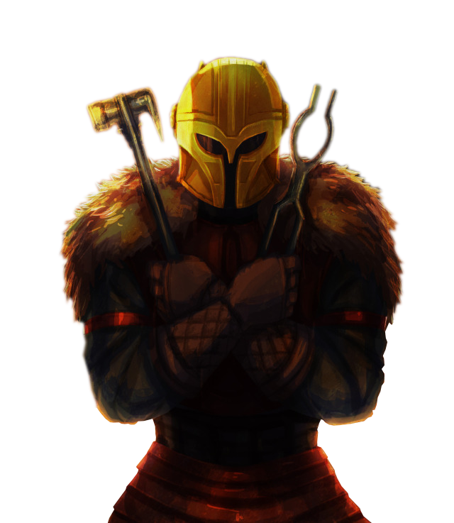

# Champion Approach

Some berserkers revel in battle for battle's sake. For berserkers of the Champion Approach, this revelry is the goal to which they constantly strive.

## Champion Superiority
_**Champion Approach:** 3rd level_ 
You learn maneuvers that are fueled by special dice called superiority dice. See chapter 13 for the maneuvers list.

### Maneuvers Known
You learn two maneuvers of your choice, and you earn more at higher levels, as shown in the Maneuvers Known column of the Champion Superiority table. Many maneuvers enhance an attack in some way. You can use only one maneuver per attack, and you may only use each maneuver once per turn.

Each time you learn new maneuvers, you can also replace one maneuver you know with a different one.

### Superiority Dice
You have two superiority dice, which are d4s, and you earn more at higher levels, as shown in the Superiority Dice Quantity column of the Champion Superiority table. This die changes as you gain berserker levels, as shown in the Superiority Dice Size column of the Champion Superiority table. A superiority die is expended when you use it. 

You regain all of your expended superiority dice when you finish a short or long rest.

### Maneuver Ability
Your maneuver ability varies based on the type of the maneuver you use. You use Strength, Dexterity, or Constitution for physical maneuvers (your choice), Intelligence, Wisdom, or Charisma for mental maneuvers (your choice), and an ability of your choice for general maneuvers. You use this ability whenever a maneuver refers to your maneuver ability. Additionally, you use this ability modifier when setting the saving throw DC for a maneuver you use.

___

**Maneuver save DC** = 8 + your proficiency bonus + your maneuver ability modifier
___

### Champion Superiority

|Level|Maneuvers Known|Superiority Dice Quantity|Superiority Dice Size|
|:--:|:--:|:--:|:--:|
| 3rd| 2|2| d4|
| 4th| 2|2| d4|
| 5th| 4|3| d6|
| 6th| 4|3| d6|
| 7th| 5|3| d6|
| 8th| 5|3| d6|
| 9th| 6|4| d8|
|10th| 6|4| d8|
|11th| 7|4| d8|
|12th| 7|4| d8|
|13th| 9|5|d10|
|14th| 9|5|d10|
|15th|10|5|d10|
|16th|10|5|d10|
|17th|11|6|d12|
|18th|11|6|d12|
|19th|12|6|d12|
|20th|12|6|d12|

## Reckless Maneuvers
_**Champion Approach:** 3rd level_ 
When you use your Reckless Attack feature, you have advantage on superiority die rolls that would be added to the attack or damage rolls of your affected attacks.

## The Thrill
_**Champion Approach:** 6th level_ 
You have advantage on ability checks and saving throws to avoid being charmed or frightened, and creatures can't have advantage on ability checks or saving throws to avoid being charmed or frightened by effects that you control.

## Battlefield Euphoria
_**Champion Approach:** 10th level_ 
While raging, when you score a critical hit with a melee weapon attack, and when you reduce a hostile creature to 0 hit points with a melee weapon attack, you recover an expended superiority die.

## Furious Influence
_**Champion Approach:** 14th level_ 
While raging, you gain the following benefits:
- You are resistant to psychic damage.
- When you affect an ally with a maneuver, they gain the benefit of one of your damage resistances until the start of your next turn.
