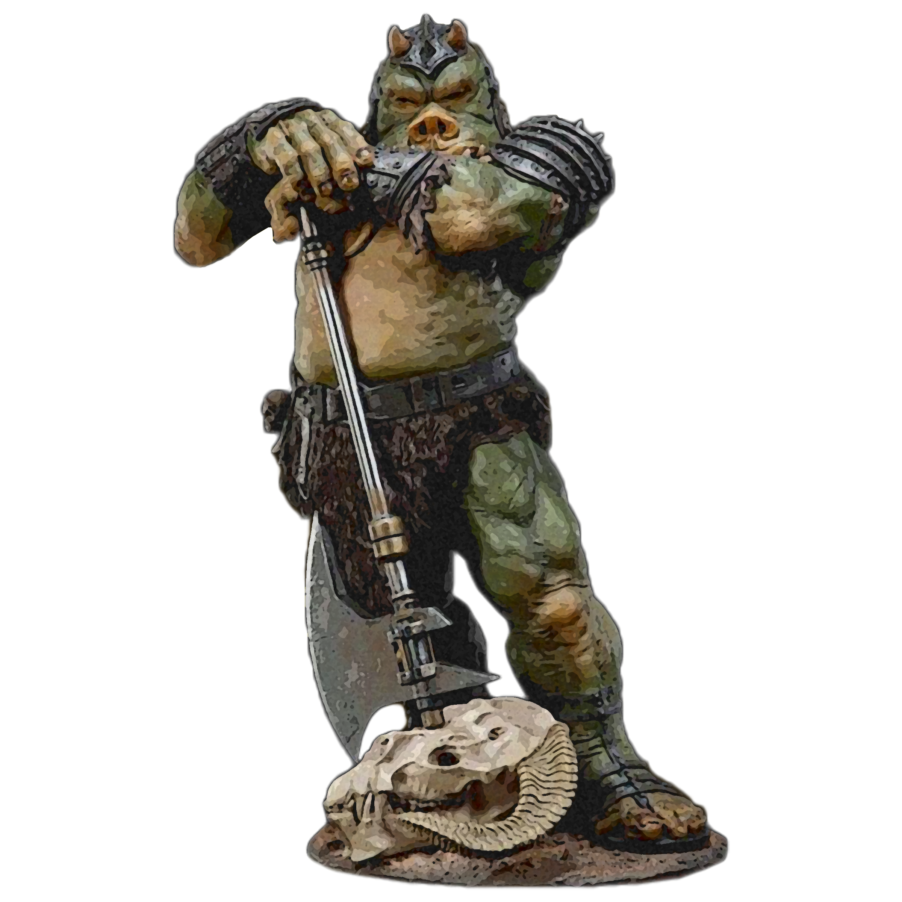

# Frenzied Approach

For some berserkers, rage is a means to an end—that end being violence. The Frenzied Approach is that of untrammeled fury, slick with blood. As you enter the berserker's rage, you thrill in the chaos of battle, heedless of your own health or well-being.

## Frenzy
_**Frenzied Approach:** 3rd level_ 
You can go into a frenzy when you enter your rage. If you do so, for the duration of your rage you can make a single melee weapon attack as a bonus action on each of your turns after this one.

The first time you use this feature, you suffer no ill effect. If you use this feature again before you finish a long rest, you suffer one level of exhaustion when your rage ends each time you use it.

When you finish a long rest, you reduce your exhaustion level by 2, instead of 1. Additionally, any effect that removes exhaustion reduces your exhaustion by 1 additional level.

## Maniacal Rage
_**Frenzied Approach:** 3rd level_ 
While raging, you have advantage on Charisma (Intimidation) checks.

## Mindless Rage
_**Frenzied Approach:** 6th level_ 
You can't be charmed or frightened while raging. If you are charmed or frightened when you enter your rage, the effect is suspended for the duration of the rage.

## Intimidating Presence
_**Frenzied Approach:** 10th level_ 
You can use your action to frighten someone with your menacing presence. When you do so, choose one creature that you can see within 30 feet of you. If the creature can see or hear you, it must succeed on a Wisdom saving throw (DC = 8 + your proficiency bonus + your Charisma modifier) or be frightened of you until the end of your next turn. On subsequent turns, you can use your action to extend the duration of this effect on the frightened creature until the end of your next turn. This effect ends if the creature ends its turn out of line of sight or more than 60 feet away from you. While raging, you add double your proficiency bonus to the save DC, instead of your normal proficiency bonus.

If the creature succeeds on its saving throw, it becomes immune to this feature for 24 hours.

## Retaliation
_**Frenzied Approach:** 14th level_ 
When you take damage from a creature that is within 5 feet of you, you can use your reaction to make a melee weapon attack against that creature.
