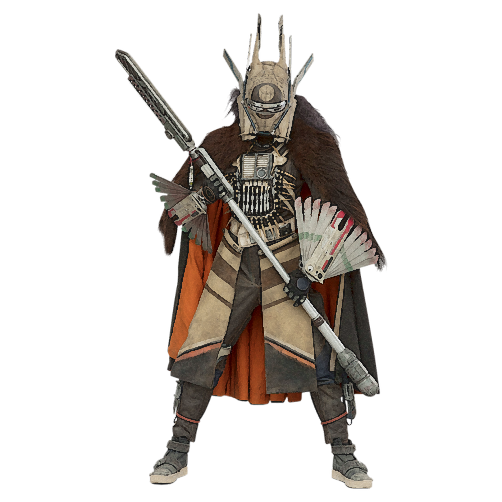

# Warchief Approach

For some berserkers, it is their duty or birthright to lead their tribe and kin to battle and victory. The Warchief Approach is one forged from alliances, bonds, and strategy. In combat, your rages are less mindless, and more focused. Ignoring the distractions of unimportant events, your attention hones in on the battlefield and how best to direct and control it. You guide your allies' strikes, and your presence is enough to wash away their fatigue.

## Savage Diplomat
_**Warchief Approach:** 3rd level_ 
Your path necessitates that you build relationships with others, for the betterment of your tribe or yourself. You gain proficiency in one of the following skills of your choice: Persuasion or Intimidation. You can choose to learn one language in place of the skill proficiency.

## Commanding Rage
_**Warchief Approach:** 3rd level_ 
You become more aware of your allies, and their intent when fighting at your side. While you are raging, when an ally within 10 feet of you makes an attack roll against an enemy, you can use your reaction to grant advantage to that attack and add your rage damage bonus to the damage roll, if the attack hits.

You can use this feature twice. You gain an additional use at 5th, 9th, 13th, and 17th level. You regain all expended uses when you complete a short or long rest.

## Inspiring Presence
_**Warchief Approach:** 6th level_ 
Your mere presence on the battlefield rallies your allies. When you rage, choose up to 3 allies that you can see within 30 feet of you. Each creature gains temporary hit points equal to half your berserker level + your Charisma modifier (minimum of +1).

## Raid Planning
_**Warchief Approach:** 10th level_ 
You learn to flare up your allies' drive for combat, urging them to follow you into the fray. During a long rest, you tell sagas, sing battle songs, and give inspiring speeches. At the end of the long rest choose up to 5 creatures that can hear and understand you (which can include yourself) to add your Charisma modifier (minimum of +1) to their next Initiative check, and a 10 foot bonus to their speed on their first turn of combat.

## War Chant
_**Warchief Approach:** 14th level_ 
You have memorized the litanies, songs, and chants of your people and their dedication to war. When you enter a rage on your turn, you can enter a commanding rage for one minute. When you do so, during this turn and at the start of each of your turns, you have a number of special reactions equal to your proficiency bonus you can only use for your Commanding Rage feature. When you use Commanding Rage with these special reactions, they do not count against your uses of that feature. You can only use one reaction per turn. Additionally, during this rage, when an enemy within 10 feet of you makes an attack roll against an ally, you can use your reaction to reduce the attack by an amount equal to your Charisma modifier.

Once you've used this feature, you must complete a long rest before you can use it again.
