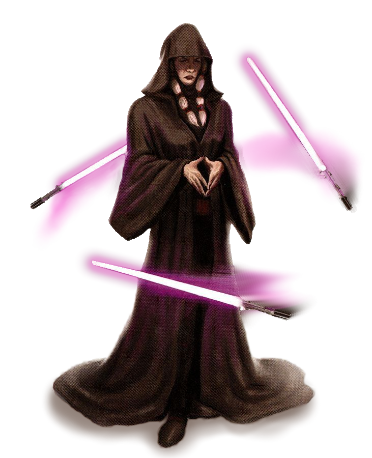

# Way of Manipulation

The power of the Force is both vast and diverse, with uses varying drastically based on their wielder. Those consulars who follow the Way of Manipulation learn to control their weapons with the Force, maneuvering them across the battlefield.

## Saber Storm
_**Way of Manipulation:** 3rd, 5th, 11th, and 17th level_ 
You learn to deftly control your weapons utilizing the Force. As an action, you can initiate your Saber Storm. When you do so, select a light- or vibro-weapon within 5 feet that is not worn or carried by a conscious creature other than you, and use the Force to cause it to levitate, acting as an extension of your will for 1 minute. When you activate this feature, you can cause the weapon to move up to 10 feet and make a melee force attack against a creature within 5 feet of it. On a hit, the target takes 1d8 + your forcecasting ability modifier damage. The type is of the normal damage dealt by the weapon. The weapon then returns to your side.

Your weapon moves with you, and while Saber Storm is active and you have a weapon animated, on each of your turns you can use an action to move a weapon up to 10 feet and repeat the attack against a creature within 5 feet of it. The weapon then returns to your side. Your Saber Storm ends early if you are incapacitated. At any time, you can end this feature and return the animated weapon to your hand.

Additionally, while your Saber Storm is active, and at least one animated weapon is within 5 feet of you, you gain the following benefits:
- You gain a bonus to your AC equal to your Wisdom or Charisma modifier (your choice, minimum of +1) if it doesn't already include that modifier.
- You gain a bonus to any Constitution saving throw you make to maintain your concentration on a power. The bonus equals your Wisdom or Charisma modifier (your choice, minimum of +1).

This feature can animate more than one weapon when you reach higher levels: two weapons at 5th level, three weapons at 11th level, and four weapons at 17th level. When you use your action to attack with your weapons, you can direct them at the same target or at different ones. Make a separate attack roll for each weapon.

At 5th level, the distance your weapon can travel increases to 20 feet. This distance increases to 30 feet at 11th level, and 40 feet at 17th level.

You can use this feature twice. You regain all expended uses of it when you finish a short or long rest.

## Deceptive Strike
_**Way of Manipulation:** 6th level_ 
When you cast a force power with a range of touch while Saber Storm is active, your animated weapon can move up to its range and deliver the power as if it had cast it. 

## Guarding Weapon
_**Way of Manipulation:** 10th level_ 
You can direct your animated weapons to absorb damage while your Saber Storm is activate. When you take damage, you can use your reaction to expend a number of force points up to your proficiency bonus to have your animated weapon intercept it, and reduce that damage to you by an amount equal to five times the number of points spent.

## Isolate
_**Way of Manipulation:** 14th level_ 
When you deal damage to a creature while Saber Storm is active, and that creature fails a Constitution saving throw to maintain concentration on a force power, you can steal and redirect the power. Until the end of your next turn, either you or the creature who failed the Constitution saving throw gain the effects of the power (your choice).

## Sapping Storm 
_**Way of Manipulation:** 18th level_ 
When you reduce a hostile creature to 0 hit points while Saber Storm is active, you gain temporary force points equal to your Wisdom or Charisma modifier (your choice, minimum of one). These temporary force points can not exceed your Wisdom or Charisma modifier (your choice), and when you would spend a force point while you have temporary force points, the temporary force points are spent first. When Saber Storm ends, you lose any remaining temporary force points.
