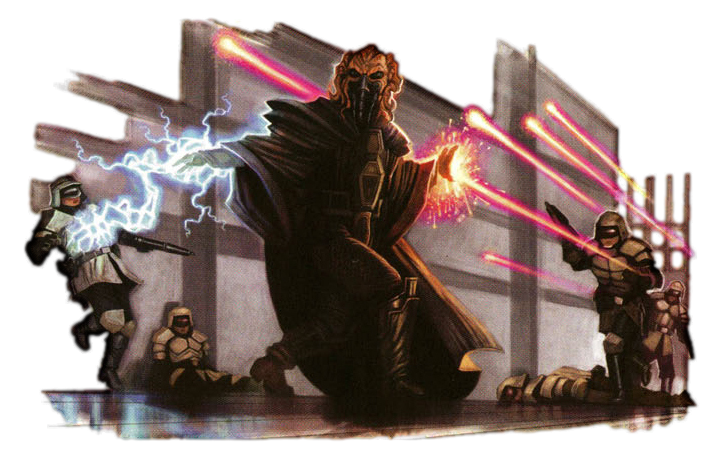

# Way of Negation

Some force users seek mastery over the fundamentals of energy manipulation, known as tutaminis. Those consulars who follow the Way of Negation harness this power to limit the havoc that other force-wielders might wreak.

## Force Deflection
_**Way of Negation:** 3rd, 5th, 9th, 13th, and 17th level_ 
When you fail a saving throw, you can use your reaction to gain a bonus to that saving throw equal to your Wisdom or Charisma modifier (your choice, minimum of +1).

You can use this feature twice. You gain an additional use at 5th, 9th, 13th, and 17th level. You regain all expended uses when you finish a long rest.

## Power Surge
_**Way of Negation:** 6th level_ 
You learn to simultaneously limit a creature's force powers and store that power within yourself to later strengthen your damaging force powers.

You can store a maximum number of power surges equal to your Wisdom or Charisma modifier (your choice, minimum of one). Whenever you successfully end a force power with a power such as *force suppression* or *sever force*, or use your Force Shield or Force Deflection features to successfully avoid an attack or succeed on a saving throw, you gain one power surge, as you redirect the flow of the Force into yourself. 

Once per turn, when you deal damage to a creature or object with a force power, you can spend one power surge to deal extra damage to that target. The extra damage is of the same type as the power's damage, and it equals half your consular level.

Whenever you finish a long rest, your number of power surges resets to one. If you end a short rest with no power surges, you gain one power surge.

## Enduring Focus
_**Way of Negation:** 10th level_ 
You can casually deflect attacks while channeling your power. While you are concentrating on a Force power, you have a +2 bonus to your AC and all saving throws.

Additionally, you can extend your Force Deflection to a creature within 5 feet of you when they fail a saving throw.

## Conflux
_**Way of Negation:** 14th level_ 
When you use your Force Deflection feature, you can cause a ripple in the Force to expand from you. Up to three creatures of your choice that you can see within 60 feet of you each take force damage equal to half your consular level.

## Tutaminis Mastery
_**Way of Negation:** 18th level_ 
When you use a Force-Empowered Casting option, you can spend a power surge to use it without spending additional force points. 
