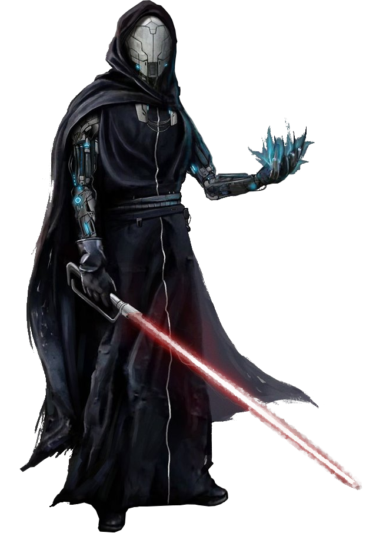

# Way of Technology

While many Forcewielders eschew the use of technology, other choose to embrace it. Those consulars who follow the Way of Technology pair their mastery of the Force with the versatility of technology, applying the knowledge in tandem to perform unseen feats.
 
## Fundamentals of Mechu-deru
_**Way of Technology:** 3rd, 5th, 9th, 13th, and 17th level_ 
You've dabbled in adapting your use of the Force, melding it with technology. You gain proficiency in the Technology skill, as well as simple blasters. When you cast a force power that calls for a melee weapon attack, and you are wielding a blaster with which you are proficient, you can instead make a ranged weapon attack.

Additionally, you've learned to manipulate the Force to be able to manipulate technology when it couldn't previously. When you cast a force power that could not affect droids or constructs, you can choose to have it affect droids or constructs. If it would affect multiple targets, you must expend additional uses of this feature for each additional target. You can use this feature twice. You gain an additional use at 5th, 9th, 13th, and 17th level. You regain all expended uses when you complete a long rest.

## Techcasting Secrets
_**Way of Technology:** 6th, 7th, 13th, and 17th level_ 
You've learned to mimic technological effects. Choose two tech powers of 1st level. The chosen powers count as universal force powers for you, but are not included in the number in the Powers Known column of the consular table.

At 7th level, you learn two additional tech powers of 1st or 2nd level. At 13th level, you learn two tech powers of 1st-3rd level, and at 17th level, you learn two tech powers of 1st-4th level. Whenever you gain a level in this class, you can choose one of the tech powers you know and replace it with another tech power of the same level.

## Ionized Weave
_**Way of Technology:** 10th level_ 
When you cast a damage-dealing force power that requires a force attack or saving throw, you can spend force points to cause that power to instead deal ion damage. The number of force points equals half the power's level (round down, minimum of one). If the power would call for a saving throw other than Dexterity, it instead calls for a Dexterity saving throw. 

## Force Circuitry
_**Way of Technology:** 14th level_ 
When you use your action to cast a force power, and you use your Fundamentals of Mechu-deru feature as a part of that casting, you can use your bonus action to cast one of the tech powers you know, as long as that power has a casting time of 1 action or bonus action.

## Mechu-deru Mastery
_**Way of Technology:** 18th level_ 
You can cast one 5th-level tech power of your choice at its base level. The power counts as a universal force power for you, and you do not require force points to cast this power. Once you've done so, you can't do so again until you complete a long rest.
