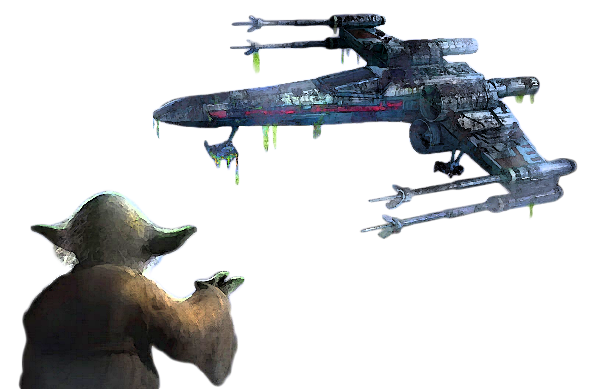

# Way of Telekinetics

The consular knows how to manipulate the essence of the surrounding elements with the power of the Force. Those consulars who follow the Way of Telekinetics create torrential gusts of telekinetic energy, forming a potent combination that can pummel even the toughest adversaries into submission.

## Staggering Stratagem
_**Way of Telekinetics:** 3rd level_ 
Your potency with the telekinetic power of the Force heightens. You can manipulate creatures of Large size or smaller with your force powers and Way of Telekinetics features. Additionally, once per turn, when you deal force or kinetic damage to a Large or smaller creature with a force power or class feature, you can choose to either push it up to 10 feet away from you or pull it up to 10 feet closer to you.

## Mighty Blast
_**Way of Telekinetics:** 6th, 11th, and 17th level_ 
Your force powers batter and blast your enemies with the strength of a hurricane. When you cast a force power of 1st level or higher that deals force or kinetic damage, one creature of your choice damaged by that power must make a Strength saving throw against your universal force save DC or be knocked prone. 

This feature can affect additional creatures when you reach higher levels: two creatures at 11th level and three creatures at 17th level.

## Size Matters Not
_**Way of Telekinetics:** 10th level_ 
You can manipulate creatures of Huge size or smaller with your force powers and Way of Telekinetics features.

Additionally, when you use your action to cast a force power, you can use a bonus action to fly up to 10 feet without provoking opportunity attacks.

## Repulsing Wave
_**Way of Telekinetics:** 14th and 17th level_ 
When you are dealt damage by a creature within 5 feet of you, you can use your reaction to deal force damage to the creature equal to your consular level + your Wisdom or Charisma modifier (your choice, minimum of +1). If the attacker is Huge or smaller, it must also make a Strength saving throw against your universal force save DC. On a failed save, the attacker is pushed in a straight line up to 20 feet away from you.

You can use this feature five times. You gain an additional use at 17th level. You regain all expended uses when you finish a short or long rest.

## My Ally is the Force
_**Way of Telekinetics:** 18th level_ 
You can manipulate creatures of Gargantuan size or smaller with your force powers and Way of Telekinetics features.

Additionally, whenever a force power you cast pushes or pulls a creature, you can increase the distance of that push or pull by an additional 20 feet.
