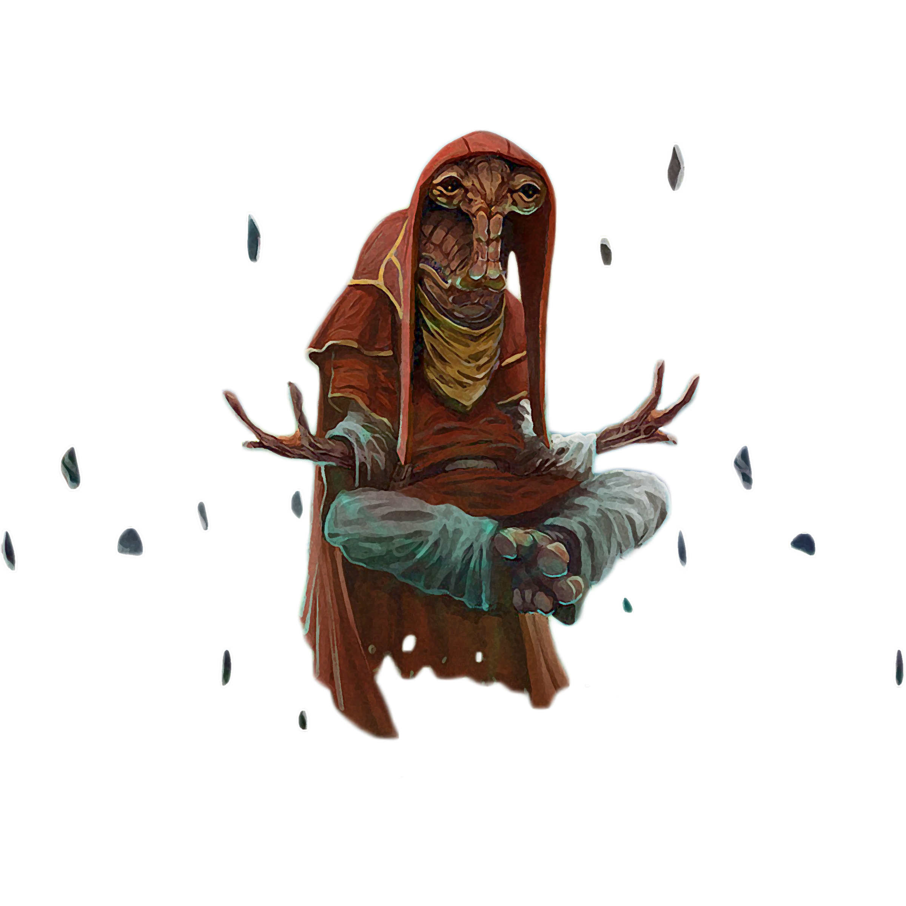

# Way of the Seer

The Force guides us in innumerable ways, often manifesting as visions. Those consulars who follow the Way of Seer attempt to harness these visions in an attempt to work towards the best possible future, as they see it.

## Force Visions
_**Way of the Seer:** 3rd level_ 
Glimpses of the future begin to press in on your awareness. When you finish a long rest, roll two d20s and record the numbers rolled. You can replace any attack roll, saving throw, or ability check made by you or a creature that you can see with one of these foretelling rolls. You must choose to do so before the roll, and you can replace a roll in this way only once per turn. Each foretelling roll can be used only once. When you finish a long rest, you lose any unused foretelling rolls.

## Powerful Mind
_**Way of the Seer:** 6th, 9th, 13th, and 17th level_ 
You can use your force abilities to read a creature's thoughts. You can then use your access to the creature's mind to command it.

As an action, choose one creature that you can see within 60 feet of you. That creature must make a Wisdom saving throw against your universal force save DC. If the creature succeeds on the saving throw, you can't use this feature on it again until you finish a long rest. If the creature fails its save, you can read its surface thoughts (those foremost in its mind, reflecting its current emotions and what it is actively thinking about) when it is within 60 feet of you. This effect lasts for 1 minute. During that time, you can use your action to end this effect and cast the *coerce mind* force power at its base level on the creature without expending force points. The target automatically fails its saving throw against the power. 

You can use this feature three times. You gain an additional use at 9th, 13th, and 17th level. You regain all expended uses when you finish a long rest.

## Visions of the Past
_**Way of the Seer:** 10th level_ 
You can call up visions of the past that relate to an object you hold or your immediate surroundings. You spend at least 1 minute in meditation, then receive dreamlike, shadowy glimpses of recent events. You can meditate in this way for a number of minutes equal to your Wisdom score and must maintain concentration during that time, as if you were casting a force power. Once you've used this feature, you can't use it again until you finish a short or long rest.

***Object Reading.*** Holding an object as you meditate, you can see visions of the object's previous owner. After meditating for 1 minute, you learn how the owner acquired and lost the object, as well as the most recent significant event involving the object and that owner. If the object was owned by another creature in the recent past (within a number of days equal to your Wisdom score), you can spend 1 additional minute for each owner to learn the same information about that creature.

***Area Reading.*** As you meditate, you see visions of recent events in your immediate vicinity (a room, street, tunnel, clearing, or the like, up to a 50-foot cube), going back a number of days equal to your Wisdom score. For each minute you meditate, you learn about one significant event, beginning with the most recent. Significant events typically involve powerful emotions, such as battles and betrayals, marriages and murders, births and funerals. However, they might also include more mundane events that are nevertheless important in your current situation.

## Shielded Thoughts
_**Way of the Seer:** 14th level_ 
Your thoughts can't be read by telepathy or other means unless you allow it. You also have resistance to psychic damage, and whenever a creature deals psychic damage to you, that creature takes the same amount of damage that you do. 

## Clarity of Vision
_**Way of the Seer:** 18th level_ 
The visions in your dreams intensify and paint a more accurate picture in your mind of what is to come. You roll three d20s for your Force Visions feature, rather than two. 
