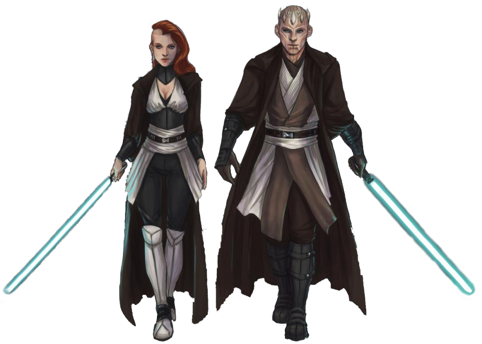

# Way of Tutelage  

With the Force, knowledge is most often passed from a master to an apprentice. Those consulars who follow the Way of Tutelage know the strength of working together exceeds that of working alone.

## Bonus Proficiencies
_**Way of Tutelage:** 3rd level_ 
You gain proficiency in your choice of Intimidation or Persuasion.

## Humanoid Companion
_**Way of Tutelage:** 3rd level_ 
You've taken an apprentice, gaining the services of your own humanoid companion.

Create your humanoid companion as detailed in the Companions section of the Customization Options document for Expanded Content. 

In addition to its traits and features, your companion gains additional benefits while it is bonded to you:
- Your companion gains two additional traits. It gains one more additional trait when you reach 11th level in this class. For each trait in excess of your proficiency bonus, your force point maximum is reduced by 2.

Lastly, while bonded and within 10 feet of you, when your companion is hit by an attack, you can use your reaction and expend a use of your Force Shield feature to shroud it in Force energy. If you do so, until the start of your next turn, both you and your companion gain the benefits of your Force Shield. This includes the triggering attack.

At 11th level, your companion must be within 30 feet of you to benefit from this feature. At 17th level, your companion must be within 60 feet.

## Strength Flows from the Force
_**Way of Tutelage:** 6th level_ 
When you cast a power that affects only your companion, you can choose to treat the power as if cast at your Max Power Level.

You can use this feature a number of times equal to your proficiency bonus, as shown in the consular table. You regain all expended uses when you finish a long rest.

## You Have That Power Too
_**Way of Tutelage:** 10th, 11th, and 17th level_ 
The bond between you and your companion has strengthened. When your companion is within 10 feet of you, and either you or your companion casts a force power that would affect only one of you, you can instead have it affect both.

At 11th level, your companion must be within 30 feet of you to benefit from this feature. At 17th level, your companion must be within 60 feet.

## Got Your Back
_**Way of Tutelage:** 14th and 17th level_ 
Once per turn, when your companion is within 10 feet of you, and both you and your companion have to make a saving throw to resist the same effect, either you or your companion can choose to have disadvantage on the save. If either of you do so, the other of the two of you gains advantage on the save. You can use this feature before or after you both make the saving throw, but you must do so before the GM says whether the save succeeds or fails.

At 17th level, your companion must be within 60 feet of you to benefit from this feature. 

## Now I Am The Master
_**Way of Tutelage:** 18th level_ 
Your companion has learned almost all that it can from you. As an action on its turn, your companion can take the lead, gaining the following benefits for 1 minute:
- It gains temporary hit points equal to twice its level.
- Once per turn, when it deals damage or restores hit points, it can roll an additional die.
- It gains resistance to kinetic and energy damage.

This effect ends early if your companion is incapacitated or dies. Once your companion has used this feature, it can't use it again until it finishes a long rest.
