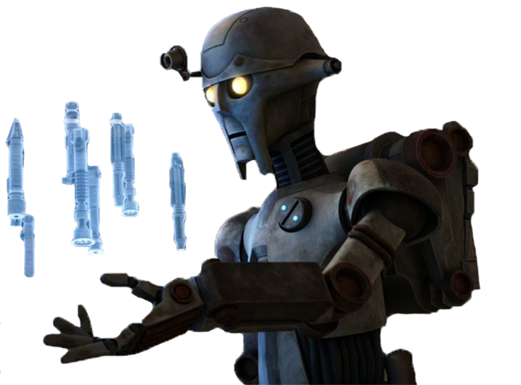

# Artificer Engineering

Those engineers who choose the Artificer Engineering discipline focus on building and modifying lightsabers, while tapping into the latent presence of the Force in these lightsaber crystals.

## Bonus Proficiencies
_**Artificer Engineering:** 3rd level_ 
You gain proficiency in artificer's implements, and with the lightsaber simple lightweapon. Additionally, when you engage in crafting with artificer's implements, the rate at which you craft doubles.

## Modified Lightsaber
_**Artificer Engineering:** 3rd and 9th level_ 
You learn to modify an unenhanced lightsaber utilizing your artificer knowledge. Over the course of a long rest, you can modify your lightsaber. You must have the lightsaber and artificer's implements in order to perform this modification.

Your modified lightsaber is enhanced, requires attunement, can only be used by you, and counts as a tech focus for your tech powers while you are attuned to it. Your modified lightsaber has 4 modification slots, and it gains more at higher levels, as shown in the Modification Slots column of the engineer table. For each modification installed in excess of your proficiency bonus, your tech point maximum is reduced by 1. Over the course of a long rest, you can install, replace, or remove a number of modifications up to your Intelligence modifier (minimum of one).

Some modification effects require saving throws. When you use such an effect from this class, the DC equals your tech save DC.

At 9th level, you can maintain two different modified lightsabers. The total modification slots are split across the two items.

## Force Resonance
_**Artificer Engineering:** 3rd level_ 
Once per round, when you hit a creature with your modified lightsaber, you can expend one use of your Potent Aptitude to deal an extra 2d6 damage to that target. The damage is the same type as your modified lightsaber's damage.

The damage increases when you reach certain levels in this class, increasing to 3d6 at 5th level, 5d6 at 11th level, and 8d6 at 17th level.

## Forcecasting Secrets
_**Artificer Engineering:** 6th, 7th, 13th, and 17th level_ 
Your study of kyber crystals has awakened a latent force sensitivity. Choose two force powers of 1st level. The chosen powers count as tech powers for you, but are not included in the number in the Powers Known column of the engineer table.

At 7th level, you learn two additional force powers of 1st or 2nd level. At 13th level, you learn two force powers of 1st-3rd level, and at 17th level, you learn two force powers of 1st-4th level. Whenever you gain a level in this class, you can choose one of the force powers you know and replace it with another force power of the same level.

## Disruptive Resonance
_**Artificer Engineering:** 14th level_ 
When you hit a creature that is concentrating on a power with your modified lightsaber, the creature has disadvantage on the Constitution saving throw to maintain concentration. Additionally, on a failed save, the creature immediately takes psychic damage equal to your engineer level + your Intelligence modifier.

## Resonating Recovery
_**Artificer Engineering:** 18th level_ 
Once per turn, when you reduce a hostile creature to 0 hit points, you regain a use of your Potent Aptitude. Your number of Potent Aptitude uses can not exceed your Intelligence modifier.

<!---  --->

## Artificer Modifications
If a modification has prerequisites, you must meet them to install it. You can install the modification at the same time that you meet its prerequisites.

### Additonal Beam Port
You install a second beam port into your modified lightsaber. Your modified lightsaber gains the double (1d8) property. You can only benefit from this property while wielding your modified lightsaber with two hands.

### Adegan Crystal
_**Prerequisite:** 5th level_ 
You gain a +1 bonus to damage rolls made with this weapon. This bonus increases to +2 at 9th level and +3 at 13th level.

### Advanced Blastsaber 
_**Prerequisite:** 15th level, Prototype Blastsaber_ 
You further fine tune your blastsaber. As an action, you can disable a single electronic device not being worn or held by another creature within 5 feet of you. The device is then disabled until it is rebooted.

Additionally, when you activate this conversion to alter the properties of your lightweapon, you create a projected barrier of ion energy in a 10-foot-radius sphere around you until the start of your next turn. Hostile creatures treat this area as difficult terrain. When a hostile creature enters the shielded area or starts its turn there, that creature takes 3d4 ion damage. Any electronics not being worn or held within the barrier's radius are disabled until rebooted.

### Advanced Brightsaber 
_**Prerequisite:** 15th level, Prototype Brightsaber_ 
You further fine tune your brightsaber. While activated, your modified lightsaber's bright light now automatically dispels illusions and can detect invisibility, as with truesight.

Additionally, when you activate this conversion to alter the properties of your lightweapon and use a bonus action to attempt to blind your target, it makes the saving throw with disadvantage.

### Advanced Disruptorsaber
_**Prerequisite:** 15th level, Prototype Disruptorsaber_ 
You further fine tune your disruptorsaber. While activated, your modified lightsaber lightly obscures the area within 5 feet of it.

Additionally, when you activate this conversion to alter the properties of your lightweapon and use a bonus action to attempt to knock your target prone, the next saving throw you make before the end of your next turn has advantage.

### Barrier 
_**Prerequisite:** 5th level_ 
On your turn, when you make an attack roll with your modified lightsaber, you can choose to forgo your proficiency bonus. If you do, you can use your reaction to erect a temporary barrier that lasts until the start of your next turn. While the barrier is activated, you have a bonus to AC against the first attack roll made against you equal to your proficiency bonus.

### Beam Gem Lens
_**Prerequisite:** 5th level_ 
You gain a +1 bonus to attack rolls made with this weapon. This bonus increases to +2 at 9th level and +3 at 13th level.

### Biometric Safety Measures
A security system is installed into the hilt of your lightweapon. When a creature other than you attempts to activate your lightweapon, the activation fails. Additionally, the creature attempting to activate must make on a Constitution saving throw or take lightning damage equal to engineer level, and become shocked until the start of its next turn. On a successful save the creature takes half damage and is not shocked. Regardless of success or failure, the creature drops your modified lightsaber.

### Blastsaber Conversion
_Incompatible with other conversions_ 
You heavily modify your lightweapon to allow you to make a ranged weapon attack. With this modification, you can make a ranged weapon attack with a range of 30/60. On a hit, it deals 1d6 energy damage.

Additionally, when you make your first attack on your turn, you can alter the properties of your modified lightsaber. Until the start of your next turn, the damage type of your modified lightsaber is changed to ion. 

You can use this trait a number of times equal to your Intelligence modifier (a minimum of once). You regain all expended uses when you complete a short or long rest.

### Brightsaber Conversion
_Incompatible with other conversions_ 
You modify your lightweapon, giving it a brighter glow. While activated, your modified lightsaber sheds bright light in a 20-foot radius and dim light for an additional 20 feet.

Additionally, when you make your first attack on your turn, you can alter the properties of your modified lightsaber. Until the start of your next turn, the damage type of your modified lightsaber is changed to fire.

You can use this trait a number of times equal to your Intelligence modifier (a minimum of once). You regain all expended uses when you complete a short or long rest.

### Burn Through
When you score a critical hit with your modified lightsaber, you have advantage on the next attack roll you make against that creature.

### Comfortable Handle
You make minor modifications to the ergonomics of your modified saber's hilt. Your modified lightsaber gains the finesse property.

### Crossguard
You add an energy guard at the base of your modified lightsaber's blade. While wielding your modified lightsaber, you gain a +1 bonus to your armor class against melee weapon attacks.

### Disruptorsaber Conversion
_Incompatible with other conversions_ 
You modify your lightweapon, causing it to eminate a sickly green light. Your modified lightsaber loses the luminous property.

Additionally, when you make your first attack on your turn, you can alter the properties of your modified lightsaber. Until the start of your next turn, the damage type of your modified lightsaber is changed to acid.

You can use this trait a number of times equal to your Intelligence modifier (a minimum of once). You regain all expended uses when you complete a short or long rest.

### Extended Beam
You install a series of beam focusing amplifiers into your modified lightsaber. Your modified lightsaber gains the reach property.

### Greatsaber Array
You augment the configuration of your modified lightsaber. Your modified lightsaber gains the two-handed property, and it's damage die increases to 1d12.

### Intense Beam
_**Prerequisite:** 11th level, Burn Through_ 
Your modified lightsaber's critical hit range increases by 1.

### Magnetic-Lock Grip
You insert a series of magnetically charged grips into your modified lightsaber's hilt. While wielding your modified lightsaber, you have advantage on ability checks and saving throws made to disarm or avoid being disarmed.

### Prototype Blastsaber 
_**Prerequisite:** 7th level, Blastsaber Conversion_ 
You fine tune your blastsaber. When you activate this conversion to alter the properties of your lightweapon, you can use your bonus action to cause your modified lightsaber to let loose a burst of energy. Creatures other than yourself within 5 feet of the target creature must succeed on a Dexterity saving throw. On a failed save, they take ion damage equal to your Intelligence modifier.

### Prototype Brightsaber 
_**Prerequisite:** 7th level, Brightsaber Conversion_ 
You fine tune your brightsaber. When you activate this conversion to alter the properties of your lightweapon, you can use your bonus action to attempt to blind the target of the attack. The creature must succeed on a Constitution saving throw or be blinded. 

### Prototype Disruptorsaber
_**Prerequisite:** 7th level, Disruptorsaber Conversion_ 
You fine tune your disruptorsaber. When you activate this conversion to alter the properties of your lightweapon, you can use your bonus action to attempt to knock the target of your attack prone. The creature must make a Strength saving throw or be knocked prone.

### Returning Weapon
You install a retractible chain in the hilt of your modified lightsaber. Your modified lightsaber gains the thrown property with a range of 20/60, and when you throw the weapon, it immediately returns to your hand.

