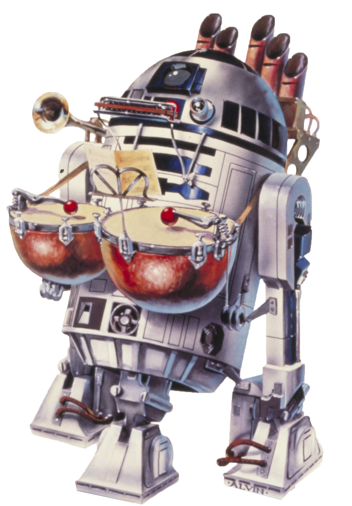

# Audiotech Engineering

Those engineers who choose the Audiotech Engineering discipline focus on using a specially modified instrument to use music to assist their allies and disrupt their enemies.

## Bonus Proficiencies
_**Audiotech Engineering:** 3rd level_ 
You gain proficiency in three musical instruments and audiotech's implements. Additionally, when you engage in crafting with audiotech’s implements, the rate at which you craft doubles.

## Modified Instrument
_**Audiotech Engineering:** 3rd level_ 
You learn to modify an instrument utilizing your audiotech knowledge. Over the course of a long rest, you can modify an instrument. You must have the instrument and audiotech's implements in order to perform this modification.

Your modified instrument is enhanced, requires attunement, can only be used by you, and counts as a tech focus for your tech powers while you are attuned to it. Your modified instrument has 4 modification slots, and it gains more at higher levels, as shown in the Modification Slots column of the engineer table. For each modification installed in excess of your proficiency bonus, your tech point maximum is reduced by 1. Over the course of a long rest, you can install, replace, or remove a number of modifications up to your Intelligence modifier (minimum of one).

Some modification effects require saving throws. When you use such an effect from this class, the DC equals your tech save DC.

## Potent Amplitude
_**Audiotech Engineering:** 3rd level_ 
As an action while wielding your modified instrument, you can begin performing an enhanced song, which lasts for 1 minute. While playing a song, you gain access to a new use for your Potent Aptitude, as determined by the song, listed below. You can end your song at any time, no action required.

Whenever you take damage while playing your song, you must make a Constitution saving throw to continue playing. The DC equals 10 or half the damage you take, which number is higher. If you take damage from multiple sources, you must make a separate saving throw for each source of damage.

When you cast a damage dealing tech power while playing your song that requires an attack roll or saving throw, you can cause that power to instead deal sonic damage. If you do so, instead of an attack roll or saving throw, the power instead requires a Constitution saving throw.

Your song ends early if you are incapacitated or die, or if you are no longer holding your modified instrument.

You can initiate playing an enhanced song twice. You regain all expended songs when you finish a short or long rest.

### Song of Battle
When an ally within 60 feet of you that can hear you deals damage to a creature, you can use your reaction to expend one use of your Potent Aptitude, adding the result of the die to the damage dealt.

### Song of Support
When an ally within 60 feet of you that can hear you makes a saving throw against a harmful effect, you can use your reaction to expend one use of your Potent Aptitude, adding the result of the die to their saving throw.

### Song of Disruption
When an enemy within 60 feet of you that can hear you makes a saving throw, you can use your reaction to expend one use of your Potent Aptitude, subtracting the result of the die from their saving throw.

## Concussive Blast
_**Audiotech Engineering:** 6th level_ 
You add your Intelligence modifier (a minimum of +1) to any damage you deal with tech powers and class features that deal sonic damage.

## Smooth Rhythm
_**Audiotech Engineering:** 14th level_ 
Whenever you use your Potent Aptitude while your playing an enhanced song, you can roll a d6 and use it instead of expending a Potent Aptitude Dice.

## Legendary Coda
_**Audiotech Engineering:** 18th level_ 
You've gained mastery over your modified instrument. As an action, you can end your enhanced song in a triumphant blast of power with an effect determined by the song you are playing.

Once you've used this feature, you must complete a long rest before you can use it again.

### Battle Crescendo
Choose up to 10 creatures of your choice that you can see and that can hear your song. Each must make a Constitution saving throw. On a failed save, a target takes 14d6 sonic damage and is stunned for 1d4+1 turns. On a success, it takes half damage and isn't stunned. If a creature is killed by this power, its head explodes.

### Support Crescendo
Choose up to 10 creatures of your choice that you can see and that can hear your song. Once in the next minute, each creature can, as a free action in response to taking damage, choose to halve that damage. Additionally, if the damage would reduce them to 0 hit points, they are instead reduced to 1.

### Disruption Crescendo
Choose up to 10 creatures of your choice that you can see and that can hear your song. Each creature must succeed on a Constitution saving throw or be paralyzed for 1d4+1 turns. If a creature affected by this feature is damaged in any way, the effect ends for that creature.

<!---  --->

## Audiotech Modifications
If a modification has prerequisites, you must meet them to install it. You can install the modification at the same time that you meet its prerequisites.

### Advanced Battle Enhancement
_**Prerequisite:** 15th level, Prototype Battle Enhancement_ 
While playing your Song of Battle, your tech powers and class features ignore resistance to sonic damage, and immunity to sonic damage is instead treated as resistance from any creature within range of your song that can hear you.

Additionally, when you use your Battle Song Enhancement feature, you create a fourth burst.

### Advanced Disruption Enhancement
_**Prerequisite:** 15th level, Prototype Disruption Enhancement_ 
While playing your Song of Disruption, any hostile creature within range of your song that can hear you must make a Constitution saving throw at the end of each of its turns to maintain concentration on the power.

### Advanced Support Enhancement
_**Prerequisite:** 15th level, Prototype Support Enhancement_ 
While playing your Song of Support, allies add your Intelligence modifier to their death saving throws (minimum of +1). If this amount would increase the roll of the d20 to 20 or greater, the creature regains 1 hit point.

### Battle Song Enhancement
_**Prerequisite:** 5th level_ 
While playing your Song of Battle, as an action, you can send forth busts of directed sonic energy, make two ranged power attacks. These attacks can target the same creature different ones. Make separate attack rolls for each burst. The attack has a range equal to the radius of your song, and deals 1d8 sonic damage on a hit. 

### Disruption Song Enhancement
_**Prerequisite:** 5th level_ 
While playing your Song of Disruption, as an action, you can choose a number of creatures concentrating on a power equal to your Intelligence modifier (a minimum of one) within range of your song that can hear you, and force them to make a Concentration saving throw. If you cause at least one creature to lose concentration on a power using this feature, you can use your reaction to make all creatures that lost concentration take damage equal to your Intelligence modifier.

### Enthralling Performance
_**Prerequisite:** 13th level, Hypnotic Melody_ 
For the duration of an enhanced song you play, whenever any creature that can hear your song tries to attack you for the first time on a turn, the attacker must make a Charisma saving throw. On a failed save, it can't attack you on this turn, and it must choose a new target for its attack or the attack is wasted. On a successful save, it can attack you on this turn, but it has disadvantage on any saving throw it makes against your powers or features on your next turn.

Once you've used this feature, you must complete a long rest before you can use it again.

### Finding My Way
_**Prerequisite:** Rush_ 
While you are playing an enhanced song, when a creature would make a melee attack roll against you, you can use your reaction to move 5 feet without provoking opportunity attacks, imposing disadvantage on the roll. 

You can use this feature twice. You gain an additional use at 5th, 9th, 13th, and 17th level. You regain all expended uses when you complete a short or long rest.

### Hypnotic Melody
As an action while wielding your modified instrument, you can begin to play a song woven with subtle hypnotic influence. Choose a number of creature up to your Intelligence modifier. If those creatures listen to this song for a full minute, they must succeed on a Wisdom saving throw or become charmed by you for 1 minute. Creatures that succeed the saving throw are not aware that you attempted to influence them, nor are creatures that failed their saving throw once the power ends.

Once you've used this feature, you can't use it again until you finish a short or long rest.

### Inaudible Casting
_**Prerequisite:** 7th level, Simple Melodies_ 
When you cast a tech power or make use of a feature that requires playing your modified instrument, you can choose to do so quietly. Creatures have disadvantage on Intelligence (Investigation) and Wisdom (Perception) checks that rely on sound to determine you cast a tech power.

### Long Range Noise
_**Prerequisite:** 13th level_ 
The radius of your songs increases to 120 feet. Additionally, any tech power you cast with your modified instrument that deals sonic damage and has a range of 10 feet or greater gains a range of 120 feet.

### Magnifying Device
_**Prerequisite:** 5th level_ 
While using your instrument as a tech focus, you gain a +1 bonus to tech attack rolls. This bonus increases to +2 at 9th level and +3 at 13th level.

### Overwhelming Soundwaves
_**Prerequisite:** 15th level_ 
While playing, creatures of your choice treat a 15-foot-radius sphere around you as difficult terrain. Additionally, as an action, you can cause each affected creature to make a Constitution saving throw, taking 3d8 sonic damage on a failed save.

### Prototype Battle Enhancement
_**Prerequisite:** 9th level, Battle Song Enhancement_ 
While playing your Song of Battle, when you cast a tech power or use a class feature that affects other creatures within the radius of your song, you can choose a number of them equal to 1 + the power's level. The chosen creatures automatically succeed on their saving throws against the power, and they take no damage if they would normally take half damage on a successful save.

Additionally, when you use your Battle Song Enhancement feature, you create a third burst.

### Prototype Disruption Enhancement
_**Prerequisite:** 9th level, Disruption Song Enhancement_ 
While playing your Song of Disruption, when a creature you can see that can hear you attempts to cast a power, you can use your reaction to cast the *tech override* power at 3rd level. When you cast this power using this feature, the power works against both tech and force powers, and when you make the techcasting ability check as a part of this casting, you your proficiency bonus to the check.

Once you've used this feature, you must complete a short or long rest before you can use it again.

### Prototype Support Enhancement
_**Prerequisite:** 9th level, Support Song Enhancement_ 
While playing your Song of Support, when you use your Song of Support's Potent Amplitude feature, the target instead takes no damage if they succeed on the saving throw, and only half damage if they fail.

### Restful Melody
Over the course of a short rest, you can play a rejuvenating song to assist in the recovery of your allies. If you or any friendly creatures who can hear your performance regain hit points at the end of the short rest, each of those creatures regains an extra 1d6 hit points.

The extra hit points increase when you reach certain levels in this class: to 1d8 at 9th level, to 1d 10 at 13th level, and to 1d12 at 17th level.

### Rush
While you are playing an enhanced song, your speed increases by 10 feet, and opportunity attacks made against you have disadvantage.

### Sharp Noise
As an action while wielding your modified instrument, choose a creature you can see. If it can hear you, it must succeed on a Constitution saving throw or take 1d4 sonic damage and have disadvantage on its next attack roll before the end of its next turn.

This feature's damage increases by 1d4 when you reach 5th level (2d4), 11th level (3d4), and 17th level (4d4).

### Shock Mount
_**Prerequisite:** 5th level_ 
While using your instrument as a tech focus, you gain a +1 bonus to your tech save DC. This bonus increases to +2 at 9th level and +3 at 13th level.

### Simple Melodies
When you are holding your modified instrument, and not actively playing a song, any tech power that you could cast that could have its damage type altered by your Potent Amplitude feature can be cast as if used with Potent Amplitude. 

You can use this feature twice. You gain an additional use at 5th, 9th, 13th, and 17th level. You regain all expended uses when you complete a short or long rest.

### Sonar Pulse
As an action while wielding your modified instrument, you can release a wave of sound that provides feedback on your surroundings. For the next minute, you have advantage on Wisdom (Perception) and Intelligence (Investigation) checks to search for hidden doors, traps, or invisible creatures.

Once you've used this feature, you can't use it again until you finish a short or long rest.

### Song Flow
_**Prerequisite:** 11th level_ 
While playing an enhanced song, you can use your bonus action to change from one song to another.

### Support Song Enhancement
_**Prerequisite:** 5th level_ 
While playing your Song of Support, when you cast a tech power that restores hit points or grants temporary hit points, the amount restored or granted is increased by an amount equal to your Intelligence modifier (minimum of +1).

### Weapon Integration
You can integrate a single weapon that weighs no more than 8 lb. into your instrument. While integrated, that weapon gains the hidden property. 
