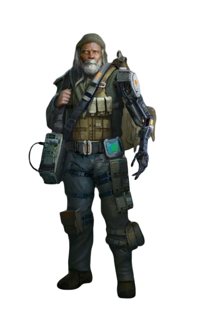

# Biotech Engineering

Those engineers who choose the Biotech Engineering discipline focus on the skill of modifying and upgrading the body through the use of cybernetic limbs and implants.

## Bonus Proficiencies
_**Biotech Engineering:** 3rd level_ 
You gain proficiency in biotech's implements. Additionally, when you engage in crafting with biotech's implements, the rate at which you craft doubles.

## Modified Self
_**Biotech Engineering:** 3rd level_ 
You've learned to make modifications to your body, cybernetically augmenting yourself. Over the course of a long rest, you can modify yourself with cybernetic augmentations. You must have biotech's implements in order to perform this modification.

While you have at least one cybernetic augmentation installed, your body counts as a tech focus for your tech powers. Additionally, you have 4 modification slots, and you gain more at higher levels, as shown in the Modification Slots column of the engineer table. For each modification installed in excess of your proficiency bonus, your tech point maximum is reduced by 1. Over the course of a long rest, you can install, replace, or remove a number of modifications up to your Intelligence modifier (minimum of one).

Some modification effects require saving throws. When you use such an effect from this class, the DC equals your tech save DC.

## Quick-Release Stimulant
_**Biotech Engineering:** 3rd level_ 
When you are dealt damage by an attack while you have at least one cybernetic augmentation installed, you can use your reaction and expend one use of your Potent Aptitude to reduce the damage you take. The damage is reduced by an amount equal to 1d10 + your Constitution modifier + your engineer level. If you reduce the damage to 0, you can gain temporary hit points equal to the remaining damage reduction.

## Overclock Body
_**Biotech Engineering:** 6th level_ 
You've learned to use your body as a conduit for your tech powers. When you cast a tech power, you can choose to pay up to half the cost of the tech power using your hit points instead of your tech points. When you do so, your maximum hit points are reduced by the same amount until you complete a long rest.

## More Machine Than Man
_**Biotech Engineering:** 14th level_ 
While you have temporary hit points, when you are subjected to an effect that allows you to make a saving throw to take only half damage, you instead take no damage if you succeed on a saving throw, and only half damage if you fail.

## Focused Augmentation
_**Biotech Engineering:** 18th level_ 
You add your Intelligence modifier to Constitution saving throws you make to maintain concentration.

Additionally, when you cast a power that requires concentration and would affect only one target, you can target an additional creature with that power.

<!---  --->

## Biotech Modifications
If a modification has prerequisites, you must meet them to install it. You can install the modification at the same time that you meet its prerequisites.

### Active Camouflage Core
_**Prerequisite:** 13th level_ 
As an action, you can activate this augmentation to cast the *infiltrate* tech power targeting yourself. Intelligence is your tech casting ability for this power, and if you cast it using this augmentation, it does not require concentration.

### Anti-Dazzle Ocular Implant
This augmentation replaces your eyes.

You are immune to the blinded condition, and you can enable or disable your ability to see anytime. Additionally, your eyes are equipped with a holorecorder device. You can perfectly recall anything you've seen in the last 7 days.

### Auto-Defibrillator 
_**Prerequisite:** 5th level, Hardy Torso Prothesis_ 
The Constitution score of your Hardy Torso Prosthesis increases by 2. Additionally, when you are reduced to 0 hit points but not killed outright, you can drop to 1 hit point instead. You can’t use this feature again until you finish a long rest.

### Brawny Arm Prosthesis
This augmentation replaces an arm.

When you make an ability check, attack roll, or saving throw using Strength using only this arm, your Strength score is treated as 15. When you make an ability check, attack roll, or saving throw using Strength using more than just this arm, you take the average of the arm's Strength score and your own.

You can choose this modification multiple times.

### Celerity Leg Prosthesis
This augmentation replaces both legs.

When determining your bonus to AC and saving throws from Dexterity, your Dexterity score is treated as 15. If your Dexterity score is already equal to or greater than 15, it has no effect on you.

Additionally, you can substitute this score for your own whenever you make an ability check or attack roll that uses your legs. 

### Detachable Eye
This augmentation replaces an eye.

As an action, you can remove or replace this eye. While removed, the eye sprouts eight small legs, has a speed of 15 feet, an AC of 10, and 1 hit point. If it dies, you can't use it again until you complete a long rest. As an action on each of your turns, you can move the eye up to its speed as long as it is within 30 feet of you. You can see through both the detached eye and your remaining eye at the same time, or you can use your action to see through only one eye or the other.

You can choose this modification multiple times.

### Detachable Hand
This augmentation replaces a hand.

As an action, you can attach or detach this hand. While detached, the hand has a speed of 15 feet, an AC of 10, and 1 hit point. If it dies, you can't use it again until you complete a long rest. As an action on each of your turns, you can control the hand as long as it is within 30 feet of you. You can use the hand to manipulate an object, open an unlocked door or container, stow or retrieve an item from an open container, or pour the contents out of a container. You can move the hand up to its speed each time you use it.

You can choose this modification multiple times.

### Fadecasting Inhibitor
_**Prerequisite:** 5th level_ 
While using your body as a tech focus, you gain a +1 bonus to the tech save DC of powers you cast that requires a Strength or Constitution saving throw. This bonus increases to +2 at 9th level and +3 at 13th level.

### Hardy Torso Prosthesis
This augmentation replaces your torso.

Your Constitution score becomes 13. Additionally, you have advantage on saving throws against poison.

### Harpoon Hand
This augmentation replaces a hand.

You modify your hand, granting it the ability to transform into a harpoon. With this hand, you can make a ranged weapon attack with a range of 30/60. On a hit, it deals 1d6 kinetic damage. This attack can target a surface, object, or creature.

A creature struck by this attack is impaled by the harpoon. As an action, a creature can attempt to remove the harpoon. Removing the harpoon requires a Strength check. While the harpoon is stuck in the target, you are connected to the target by a 60 foot cable.

While the harpoon is deployed, you can use your bonus action to activate the reel, pulling yourself to the location if the target is larger than you. A creature or object your size or smaller is pulled to you. Alternatively, you can opt to release the cable (no action required).

Once you've used this feature, you can't use your hand again until you recover and reinsert it as an action.

You can choose this modification multiple times.

### Integrated Subdermal Armor
_**Prerequisite:** 5th level_ 
When you aren't wearing armor, your AC becomes 13 + your Dexterity modifier.

### Iridonian Grav-lev Hand
This augmentation replaces a hand.

Your unarmed strikes with this arm deal 1d4 ion damage, and your carrying capacity and the weight you can push, drag, or lift doubles. Additionally, you deal double damage to energy-based structures with your unarmed strikes.

You can choose this modification multiple times.

### Magnetic Forearm Enhancement
This augmentation replaces a forearm.

Unarmed strikes with this hand have the reach property.

You can choose this modification multiple times.

### Mighty Prowess Enabler 
_**Prerequisite:** 5th level, Brawny Arm Prothesis_ 
The Strength score of your Brawny Arm Prosthesis increases by 2. Additionally, you are considered proficient with any weapon you wield with this arm. If the weapon requires two hands to use, and you are not already proficient with it, you only add half your proficiency bonus to attack rolls you make with it, unless you wield it with two of these arms. 

You can choose this modification multiple times, but only once per arm.

### Nighthawk Ocular Implant
This augmentation replaces your eyes.

You can activate or deactivate this implant as a bonus action. While active, you gain darkvision to a range of 120 feet.

### Powered Harpoon Hand
_**Prerequisite:** 9th level, Harpoon Hand_ 
While your harpoon hand is deployed, when you cast a tech power with a range of touch, your hand can deliver the power as if it had cast it.

### Rendcasting Inhibitor
_**Prerequisite:** 5th level_ 
While using your body as a tech focus, you gain a +1 bonus to the tech save DC of powers you cast that requires a Dexterity or Intelligence saving throw. This bonus increases to +2 at 9th level and +3 at 13th level.

### Skills Enhancement Package
_**Prerequisite:** 13th level_ 
When you make an ability check using a skill you are proficient in, you can roll a d4 and add the result to your total.

### Sound Dampeners
This augmentation replaces your ears.

You are immune to the deafened condition, and you can enable or disable your ability to hear anytime. Additionally, your ears are equipped with a personal translator that allows you to understand up to 15 different languages, however, you cannot speak them. The languages can be changed out while interfaced with a protocol droid or appropriate computer.

### Surveillance Implant
This augmentation replaces your face.

This implant includes a headcomm with a scrambler that automatically encodes messages sent to a specified recipient commlink or receiver.

### Survival and Surveillance Implant
_**Prerequisite:** 9th level_ 
This augmentation replaces your eyes and face.

This implant contains several tools for long-term survival and reconnaissance. As a bonus action, you can activate one of the below modes that enable you to use several of these tools at once. Activating a different mode deactivates any currently active mode. 
- **Communications Mode:** This communications suite includes a headcomm with a scrambler that automatically encodes messages sent to a specified recipient commlink or receiver. While this mode is active, you cannot be deafened.
- **Interceptor Mode:** This is a jamming and electronic warfare suite that includes a comm jammer, a holotrace device and pocket scrambler.
- **Respirator Mode:** This includes a basic respirator that grants advantage on saving throws made to avoid being poisoned and resistance to poison damage. 

### Swift Gait Attuner 
_**Prerequisite:** 5th level, Celerity Leg Prothesis_ 
The Dexterity score of your Celerity Leg Prosthesis increases by 2. Additionally, you gain proficiency in Dexterity saving throws.

### Vector Amplifier
_**Prerequisite:** 5th level_ 
While using your body as a tech focus, you gain a +1 bonus to melee tech attack rolls. This bonus increases to +2 at 9th level and +3 at 13th level.

### Vector Rangefinder
_**Prerequisite:** 5th level_ 
While using your body as a tech focus, you gain a +1 bonus to ranged tech attack rolls. This bonus increases to +2 at 9th level and +3 at 13th level.

### Voice Synthesizer
_**Prerequisite:** 5th level_ 
This augmentation replaces your throat.

This augmentation allows you to synthesize and perfectly mimic any voice that you have heard in the last month, and the synthesizer can translate verbal communications between up to 5 languages. The languages can be changed out while interfaced with a protocol droid or appropriate computer. Additionally, you can add your Intelligence modifier to any Charisma (Deception) check made to lie to another creature.

### Weapon Integration
This augmentation replaces a forearm.

You can integrate a single weapon that weighs no more than 8 lb. into your forearm. While integrated, you can use a bonus action to hide or reveal the weapon, which can only be used while revealed. While hidden, the weapon has the hidden property. While revealed, the weapon has the fixed property.

You can choose this modification multiple times.

### Withercasting Inhibitor
_**Prerequisite:** 5th level_ 
While using your body as a tech focus, you gain a +1 bonus to the tech save DC of powers you cast that requires a Wisdom or Charisma saving throw. This bonus increases to +2 at 9th level and +3 at 13th level.
