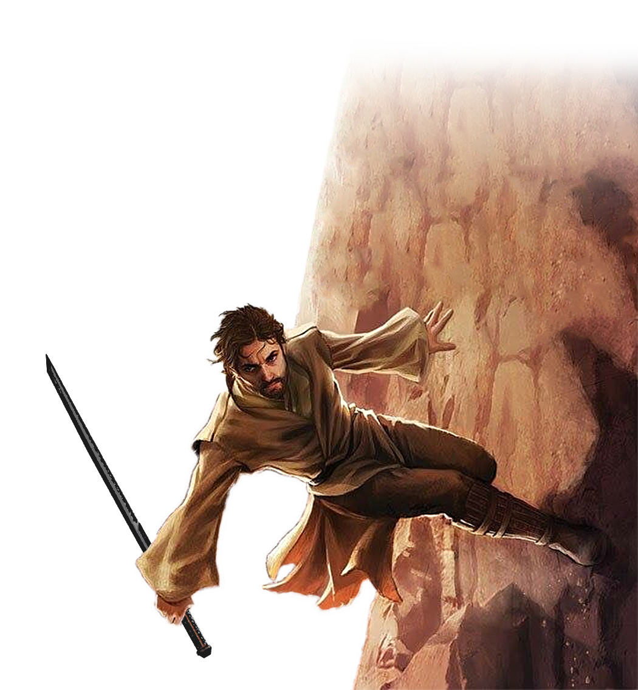

# Adept Specialist

Those fighters who choose to become Adept Specialists tap into a latent Force-sensitivity to augment their martial prowess, blending the two to accelerate their bodies and blows. An adept speeds across the battlefield, attacking opponents in a flurry of blows before dashing off again.

## Forcecasting
_**Adept Specialist:** 3rd level_ 
You have learned powers, fragments of knowledge that imbue you with an abiding force ability. See chapter 10 for the general rules of forcecasting and chapter 11 for the force powers list.

### Force Powers Known
You learn 4 force powers of your choice, and you learn more at higher levels, as shown in the Force Powers Known column of the Adept Specialist Forcecasting table. You may not learn a force power of a level higher than your Max Power Level, and you may learn a force power at the same time you learn its prerequisite.

### Force Points
You have a number of force points equal to your fighter level, as shown in the Force Points column of the Adept Specialist Forcecasting table, + your Wisdom or Charisma modifier (your choice). You use these force points to cast force powers. You regain all expended force points when you finish a long rest.

### Max Power Level
Many force powers can be overpowered, consuming more force points to create a greater effect. You can overpower these abilities to a maximum level, which increases at higher levels, as shown in the Max Power Level column of the Adept Specialist Forcecasting table.

You may only cast force powers at 4th-level once. You regain the ability to do so after a long rest.

### Forcecasting Ability
Your forcecasting ability varies based on the alignment of the powers you cast. You use your Wisdom for light side powers, Charisma for dark side powers, and Wisdom or Charisma for universal powers (your choice). You use this ability whenever a power refers to your forcecasting ability. Additionally, you use this ability modifier when setting the saving throw DC for a force power you cast and when making an attack roll with one.

___

**Force save DC** = 8 + your proficiency bonus + your forcecasting ability modifier

___

**Force attack modifier** = your proficiency bonus + your forcecasting ability modifier

___

### Adept Forcecasting

| Level | Force Powers Known | Force Points | Max Power Level |
|:---:|:---:|:---:|:---:|
| 3rd| 4| 3|1st|
| 4th| 6| 4|1st|
| 5th| 7| 5|1st|
| 6th| 8| 6|1st|
| 7th|10| 7|2nd|
| 8th|11| 8|2nd|
| 9th|12| 9|2nd|
|10th|13|10|2nd|
|11th|14|11|2nd|
|12th|15|12|2nd|
|13th|17|13|3rd|
|14th|18|14|3rd|
|15th|19|15|3rd|
|16th|20|16|3rd|
|17th|22|17|4th|
|18th|23|18|4th|
|19th|24|19|4th|
|20th|25|20|4th|

## Growing Momentum
_**Adept Specialist:** 3rd, 5th, 9th, 13th, and 17th level_ 
You can cast the *burst of speed* force power targeting yourself at 1st-level without expending force points. At 10th level, when you do so, your speed increases by an additional 10 feet. At 18th level, when you do so, your speed increases by an additional 10 feet.

You can use this feature twice. You gain an additional use at 5th, 9th, 13th, and 17th level. You regain any expended uses when you finish a long rest.

## Whirling Weapons
_**Adept Specialist:** 7th level_ 
Your constant blur of motion and attacks becomes an unending barrage as you build momentum. Once on your turn when you miss with a weapon attack you can make another weapon attack, no action required. 

## &emsp;&emsp;Focused Breathing
_**Adept Specialist:** 10th level_ 
You learn to recover some of your expended power quickly. When you use your Second Wind you also regain a number of force points equal to your Wisdom or Charisma modifier (your choice, a minimum of one). 

## Unstoppable Force
_**Adept Specialist:** 15th level_ 
You learn to completely ignore many of the most devastating impediments of combat. You can expend a use of Indomitable to gain the effect of the *freedom of movement* force power until the end of your next turn. 

## Instant Acceleration
_**Adept Specialist:** 18th level_ 
You reach the pinnacle of your training, moving faster than eyes or most sensors can track. When you use Action Surge feature, you can teleport up to 30 feet to an unoccupied space you can see. You can teleport before or after the additional action.
