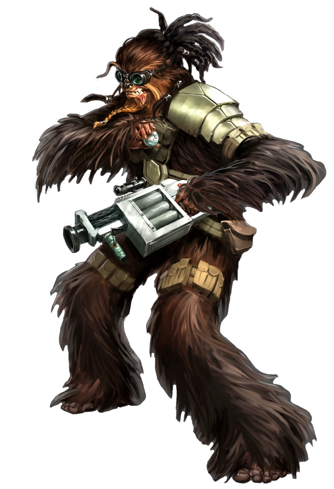

# Demolitions Specialist

Those fighters who choose to become Demolitions Specialists are experts in using explosives in combat. They have an explosive for every situation, whether it be breaching a fortified bunker, taking down a walker, or simply demonstrating that in combat, standing too close to your squadmates can be fatal.

## Bonus Proficiencies
_**Demolitions Specialist:** 3rd level_ 
You gain proficiency in demolitions kit. Additionally, when you would install a breaching charge, you can do so in half the time.

## Explosive Charge
_**Demolitions Specialist:** 3rd, 7th, and 15th level_ 
You learn to create a number of small explosives known as charges. Over the course of a short or long rest, you can create a number of charges equal to your Intelligence modifier. You must have a demolitions kit in order to create these charges. Your charges can only be used by you, and they lose their potency at the end of your next short or long rest.

Once per turn, when you would make a ranged weapon attack, you can instead throw one of your charges. Your charges have a range equal to 30 feet + your Strength modifier x 5. You can throw a charge at a point you can see within range. Each creature within 5 feet must make a Dexterity saving throw (DC = 8 + your proficiency bonus + your Intelligence modifier). A creature takes 2d4 + your Intelligence modifier kinetic damage on a failed save, or half as much on a successful one. 

The damage of your charges increases to 3d4 at 7th level and 4d4 at 15th level.

## Cause and Effect
_**Demolitions Specialist:** 7th level_ 
You learn to throw grenades as a bonus action. Additionally, when a creature fails a saving throw against a charge or grenade, you can expend a superiority die to apply one of your maneuvers. You can only use this feature once per grenade.

## Volatile Reflexes
_**Demolitions Specialist:** 10th level_ 
When a creature within 5 feet of you makes a melee attack against you, you can use your reaction and throw a charge behind the target. If the target fails its saving throw against the charge, you impose disadvantage on the attack roll made against you.

## Backup Plans
_**Demolitions Specialist:** 15th level_ 
When you roll initiative and have no charges remaining, you can create 2 charges. Additionally, whenever you create a charge, you can change the damage type to acid, energy, fire, ion, lightning, or sonic.

## Bombard
_**Demolitions Specialist:** 18th level_ 
When a creature fails its saving throw against a charge or grenade thrown by you, it has disadvantage on the next Dexterity saving throw it makes before the end of your next turn.
