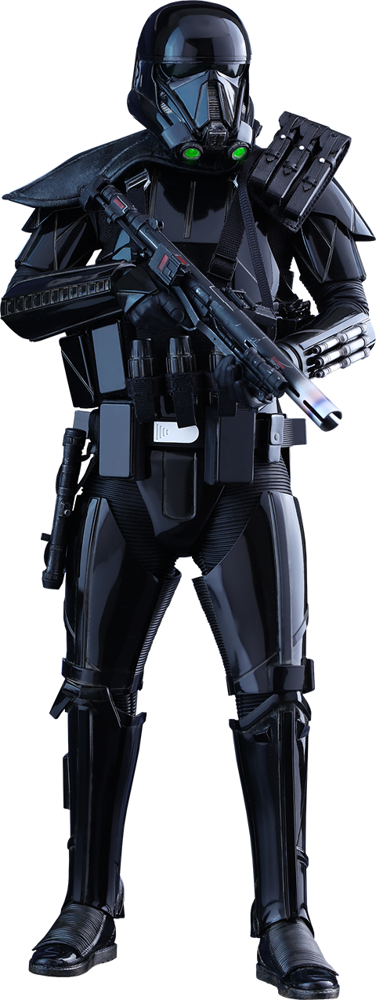

# Enhancement Specialist

Those fighters who choose to become Enhancement Specialists learn to apply their technological prowess to their blasters. With their deep understanding of both their weapon and how to manipulate its ammunition on the fly, they can often turn the tides of a battle with a single shot.

## Studied Shooter
_**Enhancement Specialist:** 3rd level_ 
You learn specialized theory typical for practitioners of the enhancement trade. You gain proficiency in your choice of the Lore or Technology skills. Additionally, you learn your choice of the *encrypted message* or *minor hologram* tech power. Intelligence is your techcasting ability for these powers.  

## Special Ammunition
_**Enhancement Specialist:** 3rd level_ 
You learn ammunition enhancements that are fueled by amplified shots to unleash special enhanced effects.

### Ammunition Enhancements
You know two ammunition enhancements of your choice, which are detailed under "Ammunition Enhancements" below, and you earn more at higher levels. Many ammunition enhancements boost an attack in some way. Once per turn when you fire a shot from a blaster as part of the Attack action, you can apply one of your Ammunition Enhancement options to that shot,

You gain an additional Ammunition Enhancement option of your choice when you reach certain levels in this class: 7th, 10th, 15th, and 18th level. Each option also improves when you become an 18th-level fighter.

Each time you learn new ammunition enhancements, you can also replace one ammunition enhancement you know with a different one.

### Amplified Shots
You have two amplified shots, which you use to activate your ammunition enhancements. An amplified shot is expended when you use it. When you fire an amplified shot, your weapon is treated as enhanced for overcoming resistance and immunity to unenhanced attacks and damage. You decide to use the option when the shot hits a creature, unless the option doesn't involve an attack roll. You regain all of your amplified shots when you finish a short or long rest.

### Saving Throws
Some of your ammunition enhancements require your target to make a saving throw to resist the maneuver's effects. The saving throw DC is calculated as follows:

___

**Ammunition save DC** = 8 + your proficiency bonus + your Dexterity modifier

___

## Ammunition Enhancements
The ammunition enhancements are presented in alphabetical order.

### Carbonite Shot
When this shot strikes its target, shards of carbonite wrap around the target. The creature hit by the shot takes an extra 2d6 cold damage, it gains 1 slowed level, and it takes 2d6 kinetic damage the first time on each turn it moves 1 foot or more without teleporting. The target or any creature that can reach it can use its action to remove the carbonite with a successful Strength (Athletics) check against your Special Ammunition save DC. Otherwise, the carbonite lasts for 1 minute or until you use this option again.

The cold damage and kinetic damage both increase to 4d6 when you reach 18th level in this class.

### Coercing Shot
You enhance your shot with chemicals that confuse the target. The creature hit by the shot takes an extra 2d6 poison damage, and choose one of your allies within 30 feet of the target. The target must succeed on a Wisdom saving throw, or it is charmed by the chosen ally until the start of your next turn. This effect ends early if the chosen ally attacks the charmed target, deals damage to it, or forces it to make a saving throw.

The poison damage increases to 4d6 when you reach 18th level in this class.

### Explosive Shot
You fire a shot set to explode on impact. The shot detonates after your attack. Immediately after the shot hits the creature, the target and all other creatures within 10 feet of it take 2d6 fire damage each.

The fire damage increases to 4d6 when you reach 18th level in this class.

### Hallucinogen Shot
You enhance your shot with hallucinogenic chemicals. The creature hit by the shot takes an extra 2d6 psychic damage, and it must succeed on a Wisdom saving throw or be unable to see anything farther than 5 feet away until the start of your next turn.

The psychic damage increases to 4d6 when you reach 18th level in this class.

### Piercing Shot
You enhance your shot with armor-piercing properties. When you use this option, you don't make an attack roll for the attack. Instead, the shot shoots forward in a line, which is 1 foot wide and 30 feet long, before disappearing. The shot passes through objects, ignoring cover. Each creature in that line must make a Dexterity saving throw. On a failed save, a creature takes damage as if it were hit by the shot, plus an extra 1d6 damage of the weapon's type. On a successful save, a target takes half as much damage.

The extra damage increases to 2d6 when you reach 18th level in this class.

### Quell Shot
You fire a shot enhanced with a debilitating poison. The creature hit by the shot takes an extra 2d6 poison damage. The target must also succeed on a Constitution saving throw, or the damage dealt by its weapon attacks is halved until the start of your next turn.

The poison damage increases to 4d6 when you reach 18th level in this class.

### Seeking Shot
You apply a tracing signal to your shot. When you use this option, you don't make an attack roll for the attack. Instead, choose one creature you have seen in the past minute. The shot flies toward that creature, moving around corners if necessary and ignoring three-quarters cover and half cover. If the target is within the weapon's range and there is a path large enough for the shot to travel to the target, the target must make a Dexterity saving throw. Otherwise, the shot disappears after traveling as far as it can. On a failed save, the target takes damage as if it were hit by the shot, plus an extra 1d6 kinetic damage, and you learn the target's current location. On a successful save, the target takes half as much damage, and you don't learn its location.

The kinetic damage increases to 2d6 when you reach 18th level in this class.

## Enhanced Shot
_**Enhancement Specialist:** 7th level_ 
You gain the ability to enhance your shots. Whenever you fire an unenhanced shot from a blaster, you can make it enhanced for the purpose of overcoming resistance and immunity to unenhanced attacks and damage.

## Redirected Shot
_**Enhancement Specialist:** 10th level_ 
You learn how to direct an errant shot toward a new target. When you make an attack roll with an enhanced shot and miss, you can use a bonus action to reroll the attack roll against a different target within 60 feet of the original target.

## Ever-Ready Shot
_**Enhancement Specialist:** 15th level_ 
Your enhanced ammunition is available whenever battle starts. If you roll initiative and have no uses of Special Ammunition remaining, you regain one use of it.

## Ammunition Upgrades
_**Enhancement Specialist:** 18th level_ 
Your ammunition enhancements improve.
