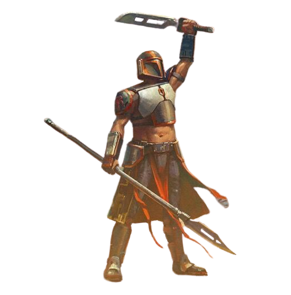

# Exhibition Specialist

Those fighters who choose to become Exhibition Specialists can't help but show off. Even where there isn't an audience, these warriors take command of the battlefield as though it were a stage.

## Bonus Proficiencies
_**Exhibition Specialist:** 3rd level_ 
You gain proficiency in one Charisma skill of your choice.

## In The Spotlight
_**Exhibition Specialist:** 3rd level_ 
You can overwhelm an opponent with your unique blend of skill and style. As a bonus action, you can choose one creature you can see within 30 feet of you. The target is marked for 1 minute. While the target is marked, you gain the following benefits:
- You can add half your Charisma modifier (minimum of one) to any weapon damage roll you make against the marked target that doesn't already include that modifier.
- Your critical hit range against the marked target increases by 1.
- If the marked target is reduced to 0 hit points, you regain hit points equal to your fighter level + your Charisma modifier (minimum of 1).

This effect ends early if you're incapacitated or die. Once you've used this feature, you can't use it again until you finish a short or long rest. 

## Showoff
_**Exhibition Specialist:** 3rd, 5th, 9th, 13th, and 17th level_ 
You're a master at dazzling your friends and enemies alike. When you would make a Strength, Dexterity, Constitution, or Charisma  check, you can roll a d4 and add it to the roll. On a success, you can immediately choose a number of creatures within 30 feet of you that can see you up to your Charisma modifier (no action required, minimum of one). Each creature must succeed on a Wisdom saving throw (DC = 8 + your proficiency bonus + your Charisma modifier) or be charmed by you. This effects ends on a target after 1 minute, if it takes any damage, if you attack it, or if it witnesses you attacking or damaging any of its allies. If a target succeeds on this saving throw, the target has no hint you tried to charm it.

This die increases to 1d6 at 5th level, 1d8 at 9th level, 1d10 at 13th level, and 1d12 at 17th level.

Once you've used this feature, you must complete a short or long rest before you can use it again.

## Glory Kill
_**Exhibition Specialist:** 7th level_ 
As you defeat your enemies in combat, you can weaken the morale of other foes or bolster the resolve of your allies alike. When you score a critical hit or reduce a creature to 0 hit points, you can choose one or more creatures that you can see within 30 feet of you, up to a number equal to your Charisma modifier (minimum of one creature). Each of the chosen 

creatures are affected by one of the following effects of your choice:
- The creature gains temporary hit points equal to 1d6 + your Charisma modifier (minimum of 1 temporary hit point).
- The creature must succeed on a Wisdom saving throw (DC = 8 + your proficiency bonus + your Charisma modifier) or be frightened of you until the start of your next turn.

## Relentless Competitor
_**Exhibition Specialist:** 10th level_ 
Once on each of your turns, you can regain a use of your Action Surge (no action required). If you do so, you immediately suffer one level of exhaustion.

## Glorious Defense
_**Exhibition Specialist:** 15th level_ 
Your glory on the battlefront can misdirect attacks. When a creature you can see hits you with an attack roll, you can use your reaction to gain a bonus to AC against that attack, potentially causing it to miss you. The bonus equals your Charisma modifier (minimum of +1). If the attack misses, you can make one weapon attack against the attacker as part of this reaction.

## The Beauty of Violence
_**Exhibition Specialist:** 18th level_ 
You've perfected a fighting style that allows you to stylishly dominate the field of battle. When you mark a creature with your In The Spotlight feature, you can enhance it. For the duration of the mark, you gain the following additional benefits:
- You can add your full Charisma modifier, instead of half, to any weapon damage roll you make against the marked target that doesn't already include that modifier.
- You can add half your Charisma modifier (minimum of one) to any weapon attack roll you make against the marked target that doesn't already include that modifier.
- If the marked target is reduced to 0 hit points, you can use your reaction to mark a new creature within 30 feet of you. The duration of the new mark is equal to the remaining duration of the existing mark.

This effect ends early if you're incapacitated or die. Once you've used this feature, you can't use it again until you finish a long rest. 
