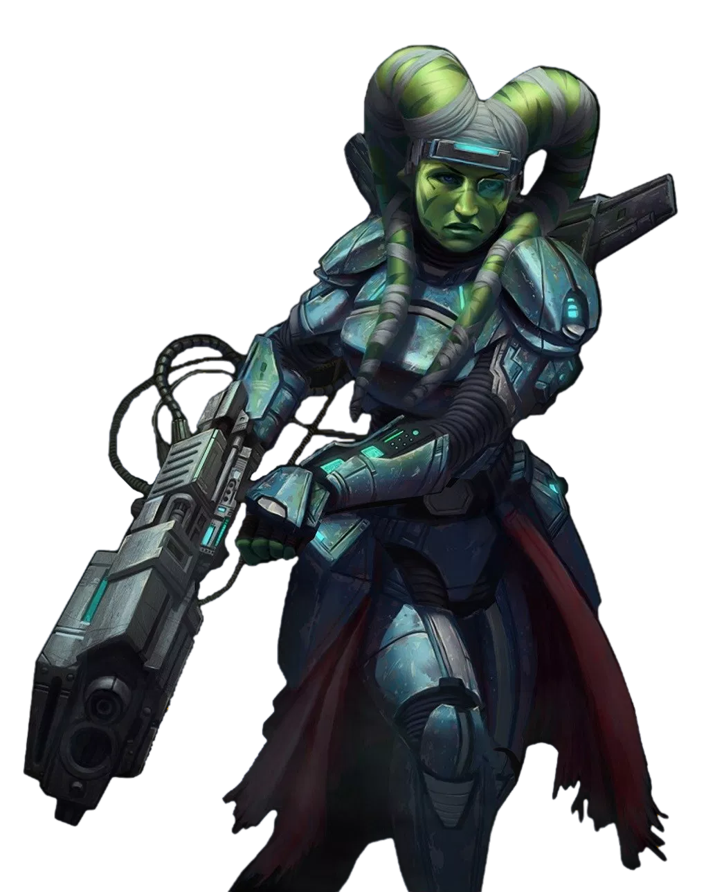

# Heavy Weapons Specialist

Some manned instruments of war require their user to have superior physical prowess to overcome their weight and encumbrance. Those fighters who choose to become Heavy Weapons Specialists use their powerful bodies, and powerful armaments, to overwhelm their foes.

## Rock Steady
_**Heavy Weapons Specialist:** 3rd level_ 
You have learned to use the heft of your weapon to root yourself in place. At the end of each of your turns, if you move less than half your speed while wielding a weapon with the heavy or strength properties, you have advantage on saving throws to avoid being restrained, moved, or knocked prone. This advantage lasts until the end of your next turn.

## My Little Friend Says Hello There
_**Heavy Weapons Specialist:** 3rd level_ 
You know how to use the sheer size of your weapon to strike fear in those around you. You can add your Strength modifier to any Charisma (Intimidation) check you make while wielding a weapon with the heavy or strength properties.

## Maximum Output
_**Heavy Weapons Specialist:** 7th level_ 
When you take the Attack action while wielding a weapon with the heavy or strength properties, you can forgo one or more attacks. If you do so, the first time you deal damage with the weapon before the start of your next turn, you deal additional damage of the same type as the weapon's damage. If this instance would deal damage to multiple creatures, you can only apply this additional damage to one of them. For each attack you forgo, you deal additional damage equal to 1d12 + half your fighter level. If you miss with the first attack roll you make before the end of your next turn, or one target succeeds on the saving throw against your weapon's burst or rapid property, you instead deal normal weapon damage.

## Straight Through
_**Heavy Weapons Specialist:** 10th level_ 
When you score a critical hit on your turn while wielding a weapon with the heavy or strength properties, you can make one weapon attack against a creature within 5 feet of the target using your reaction.

## Overwhelm
_**Heavy Weapons Specialist:** 15th level_ 
When you use your Second Wind while wielding a weapon with the heavy or strength properties, if you hit with the first attack roll you make, or if one creatures fails the saving throw against your weapon's burst or rapid property, before the end of your next turn, you treat the hit as a critical hit. If you miss with the first attack roll you make before the end of your next turn, or one target succeeds on the saving throw against your weapon's burst or rapid property, you instead deal normal weapon damage.

## Pure Performance
_**Heavy Weapons Specialist:** 18th level_ 
At 18th level, attack rolls you make while wielding a weapon with the heavy or strength properties can't suffer from disadvantage.
