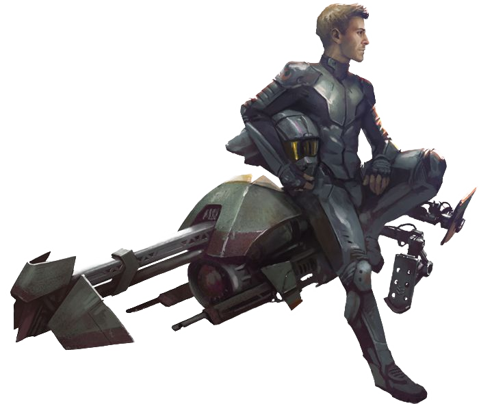

# Mounted Specialist

Those fighters who choose to become Mounted Specialists excel at mounted combat. Mounted Specialists are most dangerous from the seat of a speeder or saddle of a varactyl, though they can hold their own from the ground. Their versatility often has them leading the charge or protecting the team.

## Bonus Proficiencies
_**Mounted Specialist:** 3rd level_ 
You gain proficiency in Animal Handling or Piloting.

## Born to the Saddle
_**Mounted Specialist:** 3rd level_ 
Your mastery as a rider becomes apparent. You have advantage on saving throws made to avoid falling off your mount. If you fall off your mount and descend no more than 10 feet, you can land on your feet if you're not incapacitated.

Finally, mounting or dismounting a creature or vehicle costs you only 5 feet of movement, rather than half your speed.

## Unwavering Mark
_**Mounted Specialist:** 3rd level_ 
You can menace your foes, foiling their attacks and punishing them for harming others. When you hit a creature with a melee weapon attack, you can mark the creature until the end of your next turn. This effect ends early if you are incapacitated or you die, or if someone else marks the creature. While it is within 5 feet of you, a creature marked by you has disadvantage on any attack roll that doesn't target you.

Additionally, if a creature marked by you deals damage to anyone other than you, you can make a special melee weapon attack against the marked creature as a bonus action on your next turn. You have advantage on the attack roll, and if it hits, the attacks weapon deals extra damage to the target equal to half your fighter level.

Regardless of the number of creatures you mark, you can make this special attack a number of times equal to your Strength modifier (minimum of once), and you regain all expended uses when you finish a long rest.

## Warding Maneuver
_**Mounted Specialist:** 7th, 9th, 13th, and 17th level_ 
You learn to fend off strikes directed at you, your mount, or other creatures nearby. If you or a creature you can see within 5 feet of you is dealt damage by an attack, you can roll 1d8 as a reaction if you're wielding a melee weapon or a shield. Roll the die, and add the number rolled to the target's AC against that attack. If the attack still hits, the target has resistance against the attack's damage.

You can use this feature three times. You gain an additional use at 9th, 13th, and 17th level. You regain all expended uses of it when you finish a long rest.

## Hold the Line
_**Mounted Specialist:** 10th level_ 
You become a master of locking down your enemies. Creatures provoke an opportunity attack from you when they move 5 feet or more while within your reach, and if you hit a creature with an opportunity attack, the target gains 4 slowed levels until the end of the current turn.

## Ferocious Charger
_**Mounted Specialist:** 15th level_ 
You can run down your foes, whether you're mounted or not. If you move at least 10 feet in a straight line right before attacking a creature and you hit it with the attack, that target must succeed on a Strength saving throw (DC = 8 + your proficiency bonus + your Strength modifier) or be knocked prone. You can use this feature only once on each of your turns.

## Vigilant Defender
_**Mounted Specialist:** 18th level_ 
You respond to danger with extraordinary vigilance. In combat, you get a special reaction that you can take once on every creature's turn, except your turn. You can use this special reaction only to make an opportunity attack, and you can't use it on the same turn that you take your normal reaction.
