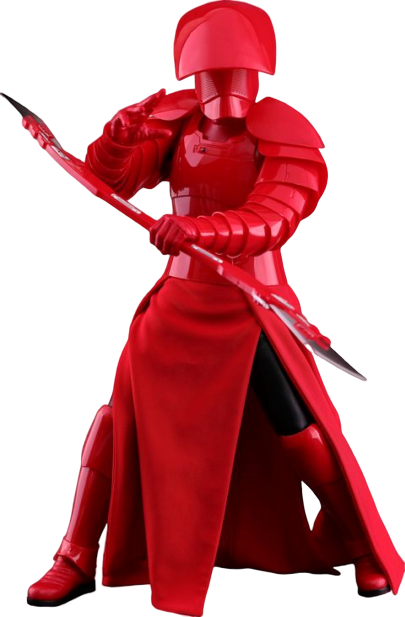

# Praetorian Specialist

Those fighters who choose to become Praetorian Specialists seek perfection of both body and mind. These warriors master the art of warfare, and are often sought as bodyguards for the galaxy's elite. They are engines of destruction and resilience, able to fight on to their last breath.

## Bonus Proficiency
_**Praetorian Specialist:** 3rd level_ 
You gain proficiency in one of the following skills of your choice: Insight, Lore, Performance, or Persuasion. Alternatively, you learn one language of your choice.

## Fighting Spirit
_**Praetorian Specialist:** 3rd level_ 
Your intensity in battle can shield you and help you strike true. As a bonus action on your turn, you can give yourself advantage on all weapon attack rolls until the end of the current turn. When you do so, you also gain 5 temporary hit points. The number of hit points increases when you reach certain levels in this class, increasing to 10 at 10th level and 15 at 15th level.

You can use this feature three times. You regain all expended uses when you finish a long rest.

## Resilient Retainer
_**Praetorian Specialist:** 7th level_ 
Your discipline and attention to detail allow you to excel in social situations. You gain proficiency in Persuasion.

Additionally, your self-control also causes you to gain proficiency in Wisdom saving throws. If you already have this proficiency, you instead gain proficiency in Intelligence or Charisma saving throws (your choice).

## Tireless Spirit
_**Praetorian Specialist:** 10th level_ 
When you roll initiative and have no uses of Fighting Spirit remaining, you regain one use.

## Rapid Strike
_**Praetorian Specialist:** 15th level_ 
You learn to trade accuracy for swift strikes. If you take the Attack action on your turn and have advantage on an attack roll against one of the targets, you can forgo the advantage for that roll to make an additional weapon attack against that target, as part of the same action. You can do so no more than once per turn.

## Strength Before Weakness
_**Praetorian Specialist:** 18th level_ 
Your fighting spirit can delay the grasp of death. If you take damage that reduces you to 0 hit points, you can use your reaction to delay falling unconscious, and you can immediately take an extra turn. While you have 0 hit points during that extra turn, taking damage causes death saving throw failures as normal, and three death saving throw failures can still kill you. When the extra turn ends, you fall unconscious if you still have 0 hit points.

Once you've used this feature, you can't use it again until you finish a long rest.
