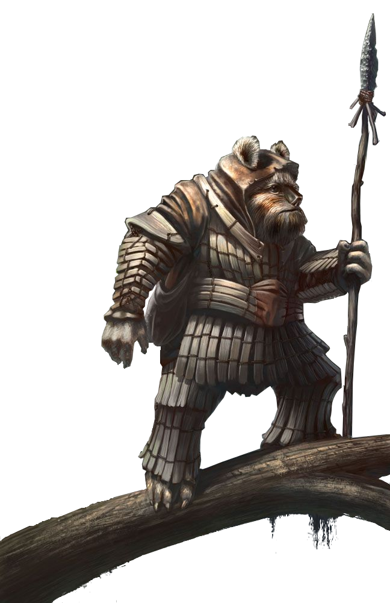

# Totem Specialist

Those fighters who become Totem Specialists tap into a primal attunement to the Force, applying tribal ceremony to create powerful talismans that enhance their abilities.

## Bonus Proficiencies
_**Totem Specialist:** 3rd level_ 
You gain proficiency with your choice of artist's implements or jeweler's implements.

## Totem Creation
_**Totem Specialist:** 3rd level_ 
You've learned to create powerful talismans infused with the Force. Your totems can take the form of sigils painted directly onto your equipment, or adornments attached to it, as you see fit. Regardless of the form they take, only you can benefit from them. You learn two totems of your choice, which are detailed under "Totems" below. When you complete a long rest, you can replace one totem you know with a different one.

When you finish a long rest, you can touch a number of weapons, armor, or shields equal to the number of totems you know, affixing a different totem to each object. Your totem remains affixed until you finish a long rest, and an object can only bear one totem at a time. You must be wielding or wearing the object to benefit from a totem affixed to it.

Each totem can be invoked to grant an effect. Once you've invoked a totem in this way, you can't do so again until you complete a short or long rest.

## Totem Options
The totems are listed in alphabetical order. If a totem requires a saving throw, the DC = 8 + your proficiency bonus + your Wisdom or Charisma modifier (your choice). 

### Totem of the Acklay
This totem evokes the ferocity of an acklay, granting you advantage on Intelligence (Nature) checks and Charisma (Intimidation) checks.

Additionally, you can invoke the totem as a bonus action. For 10 minutes, your carrying capacity and the weight you can push, drag, or lift doubles, and your Strength score increases by 2. This increase can cause your score to exceed 20. 

### Totem of the Hawk
This totem is inspired by the visage of a hawk, granting you advantage on Intelligence (Investigation) checks, and darkvision out to a range of 60 feet. If you already have darkvision, its range increases by 30 feet.

Additionally, when a creature you can see ends its turn within 30 feet of you, you can use your reaction to invoke the totem and force the creature to make a Constitution saving throw by emitting a powerful sound. Unless the save succeeds, the creature is dazed, suffering from the charmed condition, for 1 minute. While charmed in this way, the creature has a speed of 0 and is incapacitated. The effect ends if the charmed creature takes any damage or if someone else uses an action to shake the creature out of its haze. Once you invoke the totem, you can't do so again until you finish a short or long rest. A deaf creature automatically succeeds on its saving throw.

### Totem of the Loth-wolf
This totem emulates the near etherealness of a loth-wolf, granting you advantage on Dexterity (Sleight of Hand) checks and Charisma (Deception) checks.

Additionally, when you or a creature you can see within 30 feet of you is hit by an attack roll, you can use your reaction to invoke the totem and cause that attack to target a different creature within 30 feet of you (other than the attacker) that you can see, using the same roll. This ability can transfer the attack regardless of the attack's range. 

### Totem of the Rancor
This totem bestows a resilience reminiscent of a mighty rancor, granting you advantage on saving throws against being poisoned and resistance to poison damage.

Additionally, you can invoke the totem as a bonus action, gaining resistance to energy and kinetic damage for 1 minute. 

### Totem of the Sarlacc
This totem channels the experience of an ancient sarlacc, granting you expertise in any one tool in which you are proficient.

Additionally, when you hit a creature with a weapon attack, you can invoke the totem to summon the tentacles of the creature: The target must succeed on a Strength saving throw or be restrained for 1 minute. While restrained by the tentacles, the target takes 2d6 acid damage at the start of each of its turns. The target can repeat the saving throw at the end of each of its turns, tearing free on a success.

### Totem of the Vornskr
With this totem you are able to access the Force-enhanced senses of the vornskr, granting you advantage on Wisdom (Survival) checks, and you can't be surprised as long as you are not incapacitated.

Additionally, you can invoke the totem as a bonus action to enter a state of hyper awareness for 1 minute or until you're incapacitated. Until the state ends, when you or another creature you can see within 60 feet of you makes an attack roll, a saving throw, or an ability check, you can use your reaction to cause the roll to have advantage or disadvantage. 

## Totemic Might 
_**Totem Specialist:** 3rd level_ 
You can channel the power of your Force awareness temporarily. As a bonus action, you can gain the following benefits for 1 minute. You can invoke a totem as a part of this same bonus action.
- Your carrying capacity and the weight you can push, drag, or lift doubles. If it would already double, it instead triples.
- You have advantage on Strength checks and Strength saving throws.
- Your weapon attacks deal an extra 1d6 damage.

This effect ends early if you are incapacitated or die. You can use this feature twice. You regain all expended uses of it when you finish a long rest.

## Guardian Spirit
_**Totem Specialist:** 7th level_ 
You learn to invoke your totems to protect your allies. When another creature you can see within 60 feet of you is hit by an attack roll, you can use your reaction to grant a bonus to the creature's AC against that attack. The bonus equals 1 + your Wisdom or Charisma modifier (your choice, minimum of +2).

## Primal Avatar
_**Totem Specialist:** 10th level_ 
You learn a third totem. Additionally, the bonus damage of your Totemic Might feature increases to 1d8. Lastly, you have advantage on Lore checks you make about tribal cultures.

## Spirit Guide
_**Totem Specialist:** 15th level_ 
You can invoke each of your totems twice, instead of once. You regain all expended uses when you finish a short or long rest.

## Blessing of the Tree of Light
_**Totem Specialist:** 18th level_ 
You learn how to share your totem's power with your allies. When you use your Totemic Might feature, you can choose one willing creature you can see within 60 feet of you. The chosen creature also gains the benefits of your Totemic Might feature. If you are incapacitated or killed, this effect immediately ends for both of you.
