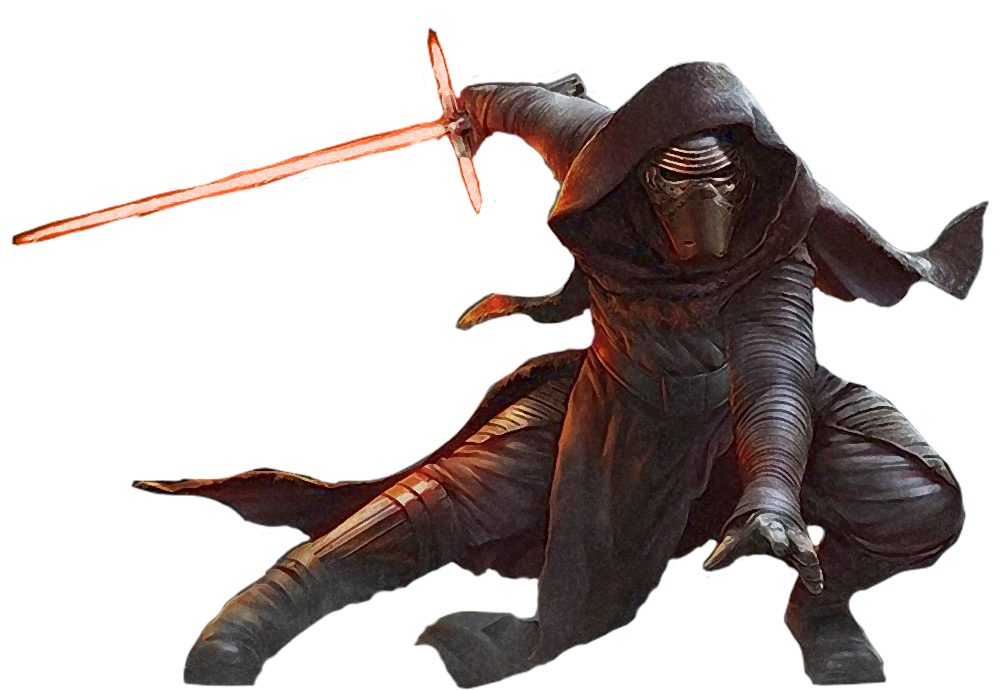

# Juyo/Vaapad Form

Juyo/Vaapad Form, also known as Ferocity Form, revels in the satisfaction of battle and victory. Those guardians who focus on Juyo/Vaapad Form channel their emotions into their fighting, making heavy, sweeping strikes.

## Bonus Proficiencies
_**Juyo/Vaapad Form:** 3rd level_ 
You gain proficiency in heavy armor.

## Form Basics
_**Juyo/Vaapad Form:** 3rd level_ 
You gain your choice of the Juyo or Vaapad lightsaber form, detailed in Chapter 6 of the Player's Handbook. If you already know the chosen form, you can instead choose another lightsaber form.

## The Way of the Vornskr
_**Juyo/Vaapad Form:** 3rd level_ 
As a bonus action, you can take a savage stance, designating one creature you can see within 10 feet of you as your prey for 1 minute. You have advantage on attack rolls against the creature. If the target drops to 0 hit points, you can use a bonus action on a subsequent turn to mark a new creature.

This effect ends early if you are incapacitated or die. Once you've used this feature, you can't use it again until you complete a long rest.

## Channel the Force
_**Juyo/Vaapad Form:** 3rd level_ 
You gain one of the following Channel the Force options. Choose Snap Aggression for Juyo or Assertive Defense for Vaapad.

### Snap Aggression
If you are surprised at the start of combat and aren't incapacitated, you can expend a use of your Channel the Force to act normally on your first turn.

### Assertive Defense
When you reduce the damage dealt by a force power to 0 using the *saber reflect* power, and you're wielding a lightweapon or vibroweapon, you can expend a use of your Channel the Force to reflect the attack at a target within range, regardless of what type the damage is.

<!---  --->

## Fury
_**Juyo/Vaapad Form:** 7th level_ 
You gain one of the following features. Choose Relentless for Juyo or Punishing Charge for Vaapad.

### Relentless 
You have advantage on initiative checks, and gain a 10 foot bonus to your speed on your first turn of combat.

### Punishing Charge 
When a hostile creature you can see or hear within 30 feet of you casts a force power, you can use your reaction to move up to half your speed. You must end this move closer to the enemy than you started. If you end this movement within 5 feet of the creature, and the triggering force power required a ranged attack roll, they have disadvantage on the roll.

## Vengeance
_**Juyo/Vaapad Form:** 15th level_ 
You gain one of the following features. Choose Devastating Critical for Juyo or Their Power, My Strength for Vaapad.

### Devastating Critical
When you score a critical hit with a melee weapon attack, you gain a bonus to that weapon's damage roll equal to your guardian level.

### Their Power, My Strength
When you are dealt damage by a force power, you can reduce that damage by an amount equal to your guardian level (no action required).

You can use this feature five times. You gain an additional use at 17th level. You regain all expended uses when you complete a short or long rest.

## Master of Ferocity
_**Juyo/Vaapad Form:** 20th level_ 
You are a paragon of extraordinary martial prowess. Your Strength and Dexterity scores increase by 2. Your maximum for those scores increases by 2. Additionally, you can use your action to gain the following benefits for 1 minute:
- You have resistance to all damage.
- When you take the Attack action on your turn, you can make one additional attack as part of that action.
- Your critical hit range with weapons increases by 1.

This effect ends early if you are incapacitated or die. Once you've used this feature, you can't use it again until you complete a long rest.
