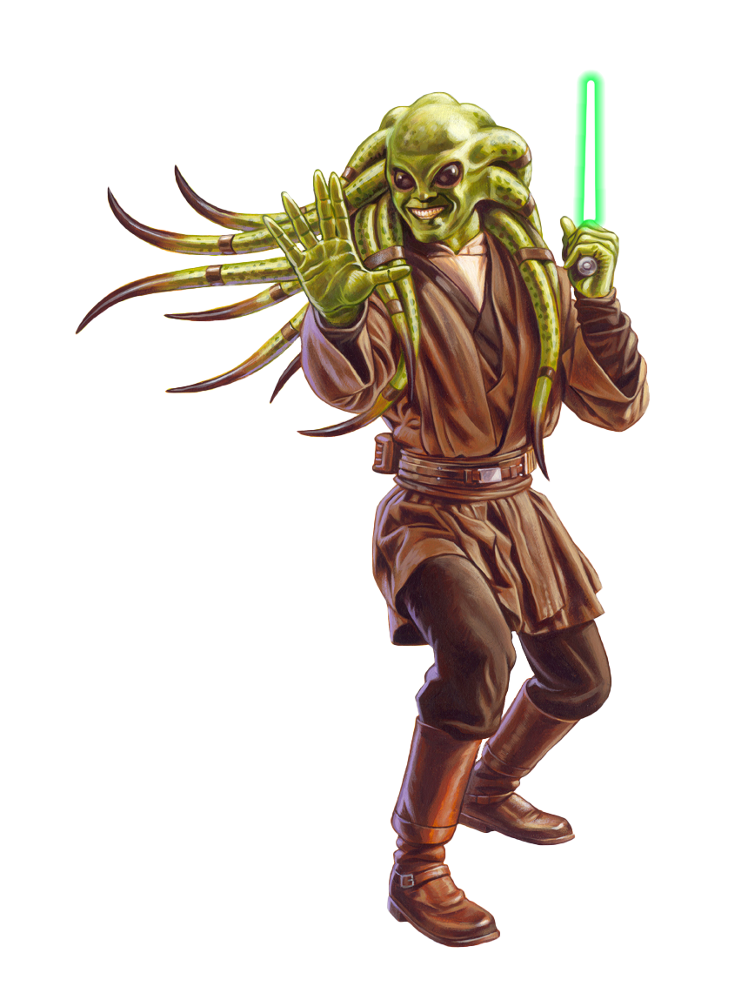

# Shii-Cho Form

Shii-Cho Form, also known as Determination Form, uses wild, unpredictable attacks designed to distract and disarm their foes. Those guardians who focus on Shii-Cho Form make seemingly random, yet deliberate, attacks to knock their opponents off-balance.

## Form Basics
_**Shii-Cho Form:** 3rd level_ 
You gain the Shii-Cho lightsaber form, detailed in Chapter 6 of the Player's Handbook. If you already know this form, you can instead choose another lightsaber form.

## The Way of the Sarlaac
_**Shii-Cho Form:** 3rd level_ 
As a bonus action, you can enter a frenetic stance for one minute. While in this stance, the first time you hit a creature with a melee weapon attack on your turn, it has disadvantage on the next melee attack roll it makes against you before the start of your next turn. Additionally, if that creature is within 5 feet of you, it must make a Strength saving throw (DC = 8 + your proficiency bonus + your Strength or Dexterity modifier). On a failed save, it is pushed back 5 feet, and you can immediately move into the space it just vacated without provoking opportunity attacks.

This effect ends early if you are incapacitated or die. Once you've used this feature, you can't use it again until you finish a long rest.

## Channel the Force
_**Shii-Cho Form:** 3rd level_ 
You gain the following Channel the Force option.

### Disarming Slash
When you hit a creature with a melee weapon attack, you can expend a use of your Channel the Force (no action required)  to attempt to disarm the target, forcing it to drop one item of your choice that it's holding. The creature must make a Strength saving throw against your universal force save DC. On a failed save, it drops the object you choose. If you are within 5 feet of the target, and you have a free hand, you can catch the item. Otherwise, the object lands at its feet.

## Unpredictable Motion
_**Shii-Cho Form:** 7th level_ 
While you are wielding a light- or vibro-weapon, opportunity attacks against you are made at disadvantage.

## Sarlaac Sweep
_**Shii-Cho Form:** 15th level_ 
When a creature moves to within 5 feet of you, you can use your reaction to make a melee weapon attack against that creature. If the attack hits, you can attempt to damage another creature within 5 feet of the original target and within your reach. If the original attack roll would hit the second creature, it takes damage equal to your Strength or Dexterity modifier (your choice). The damage is of the same type dealt by the original attack.

## Master of Determination
_**Shii-Cho Form:** 20th level_ 
The erratic fluidity of your movement confounds even the most determined of foes. Your Strength or Dexterity and Wisdom or Charisma scores (your choice) increase by 2. Your maximum for these scores increases by 2. Additionally, you can use your action to gain the following benefits for 1 minute:
- You have resistance to kinetic, energy, and ion damage from weapons.
- Attack rolls made against you can't have advantage.
- When more than one creature is within 5 feet of you, you gain a bonus to your Armor Class equal to the number of creatures within 5 feet of you, up to your Wisdom or Charisma modifier (your choice, minimum of one).
- When you use your Sarlaac Sweep feature, you have advantage on the attack roll, and you can apply the bonus damage to every creature within 5 feet of you.

This effect ends early if you are incapacitated or die. Once you've used this feature, you can't use it again until you finish a long rest.
