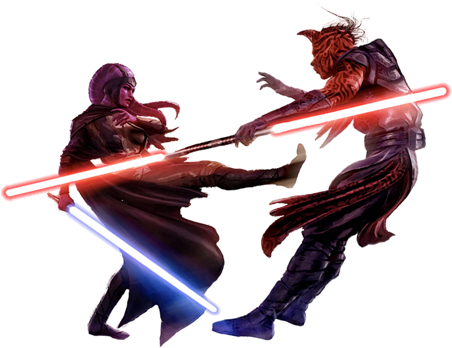

# Sokan Form

Sokan Form, also known as Persistence Form, uses determined movements followed by swift strokes to keep their opponents' footing unsteady. Those guardians who focus on Persistence Form make use of the terrain, trying to maneuver their opponents into vulnerable areas before dispatching them.

## Bonus Proficiencies
_**Sokan Form:** 3rd level_ 
You gain proficiency in heavy armor.

## Form Basics
_**Sokan Form:** 3rd level_ 
You gain the Sokan lightsaber form, detailed in Chapter 6 of the Player's Handbook. If you already know this form, you can instead choose another lightsaber form.

## The Way of the Varactyl
_**Sokan Form:** 3rd level_ 
As a bonus action, you can enter an unyielding stance for one minute. While in this stance, you have advantage on ability checks and saving throws to shove, trip, and avoid being moved, and you ignore difficult terrain. Additionally, once per turn, when you hit with a melee weapon attack, you can attempt to shove the target up to 10 feet away from you (no action required).

This effect ends early if you are incapacitated or die. Once you've used this feature, you can't use it again until you complete a long rest.

## Channel the Force
_**Sokan Form:** 3rd level_ 
You gain the following Channel the Force option.

### High Ground Defense
When an opponent within 5 feet of you makes a melee attack against you, you can use your reaction and expend a use of your Channel the Force to move to another space within 5 feet of that creature without provoking opportunity attacks, imposing disadvantage on the roll. If the attack misses, you can attempt to shove the creature up to 10 feet away from you as a part of that same reaction.

## Unwavering Self
_**Sokan Form:** 7th and 15th level_ 
If you fail a Strength, Dexterity, or Constitution saving throw, you can reroll the die. You must use the new roll.

Once you've used this feature, you must complete a long rest before you can use it again. At 15th level you can use this feature twice between long rests.

## Unhindered Charge
_**Sokan Form:** 15th level_ 
Wen you move at least 10 feet before making a melee weapon attack, you deal additional damage equal to your Strength modifier.

## Master of Persistence
_**Sokan Form:** 20th level_ 
You are an unrelenting force on the field of battle. Your Strength and Wisdom or Charisma scores (your choice) increase by 2. Your maximum for these scores increases by 2. Additionally, you can use your action to gain the following benefits for 1 minute:
- You have resistance to kinetic, energy, and ion damage from weapons.
- You ignore effects that would reduce your speed.
- Once per turn, when you push a creature, you can move up to 10 feet as a part of this push without provoking opportunity attacks. If you end this movement within 5 feet of that creature, you can make one melee weapon attack (no action required).

This effect ends early if you are incapacitated or die. Once you've used this feature, you can't use it again until you complete a long rest.
