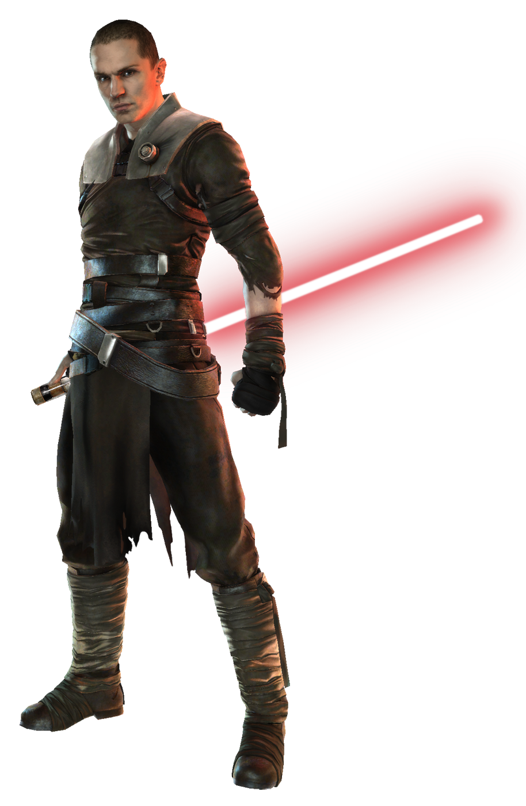

# Trakata Form

Trakata Form, also known as Deception Form, capitalizes on a lightweapon's ability to quickly be toggled on and off. Those guardians who focus on Trakata Form perform dazzling tricks with their lightweapon, confusing their opponents before dispatching them.

## Form Basics
_**Trakata Form:** 3rd level_ 
You gain the Trakata lightsaber form, detailed in Chapter 6 of the Player's Handbook. If you already know this form, you can instead choose another lightsaber form.

## The Way of the Monkey-Lizard
_**Trakata Form:** 3rd level_ 
As a bonus action, you can enter a confusing stance for one minute. As a part of this bonus action, and as a bonus action on each of your turns, when you take the Dodge action, you can make one melee weapon attack against a creature within range. Additionally, when you make this melee weapon attack, you can flourish your weapon to attempt to distract your target. Make a Dexterity (Sleight of Hand) check contested by a Wisdom (Perception) check of the target of your attack. On a success, you make this attack roll with advantage.

This effect ends early if you are incapacitated or die. Once you use this feature, you can't use it again until you finish a long rest.

## Channel the Force
_**Trakata Form:** 3rd level_ 
You gain the following Channel the Force option.

### Unbalancing Block
When you are hit with a melee weapon attack, and you are wielding a lightweapon with which you are proficient, you can use your reaction and expend a use of your Channel the Force to add your Wisdom or Charisma modifier (your choice, minimum of +1) to your AC for that attack, potentially causing the attack to miss you.

## Duplicitous Force
_**Trakata Form:** 7th level_ 
When you make a Dexterity (Sleight of Hand) check, you gain a bonus to that check equal to your Wisdom or Charisma modifier (your choice, minimum of one).

## Pass the Blade
_**Trakata Form:** 15th level_ 
When a creature misses you with an attack, you gain temporary hit points equal to your Wisdom or Charisma modifier (your choice, minimum of one), and you add your Wisdom or Charisma modifier (your choice, minimum of one) to the first melee weapon attack and damage rolls you make against that creature before the end of your next turn. 

## Master of Deception
_**Trakata Form:** 20th level_ 
Your skill with a lightweapon is both mesmerizing and confounding. Your Dexterity and Wisdom or Charisma scores (your choice) increase by 2. Your maximum for these scores increases by 2. Additionally, you can use your action to gain the following benefits for 1 minute:
- You have resistance to kinetic, energy, and ion damage from weapons.
- Your attack rolls can't suffer from disadvantage.
- Whenever a creature misses you with a melee attack, it takes 5 energy damage.
- Whenever a creature hits you with a melee attack, it takes damage equal to half of the damage you take from the attack.

This effect ends early if you are incapacitated or die. Once you use this feature, you can't use it again until you finish a long rest.
