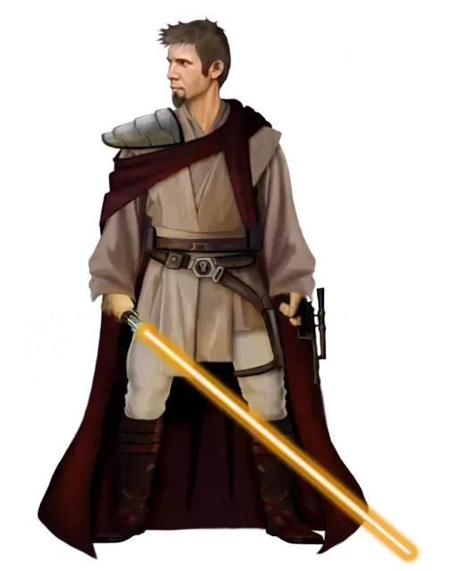

# Ysannanite Form

Ysannanite Form, also know as the Unorthodox Form, pairs the use of lightsaber with blasters, seamlessly blending the two weapons to perform impressive feats. Those guardians who focus on the Ysannanite Form are able to cut enemies down as efficiently with blaster as with blade.

## Bonus Proficiencies
_**Ysannanite Form:** 3rd level_ 
You gain proficiency in simple blasters and martial blasters that lack the two-handed property.

## Form Basics
_**Ysannanite Form:** 3rd level_ 
You gain the Ysannanite lightsaber form, detailed in the Lightsaber Forms section of the Customization Options document for Expanded Content. If you already know this form, you can instead choose another lightsaber form.

## The Way of the Yerdua
_**Ysannanite Form:** 3rd level_ 
As a bonus action, you can take a meditative stance for 1 minute, granting you supreme accuracy as you guide your shots to their target through the Force. While in this stance, you add your Wisdom or Charisma modifier (your choice, minimum of +1) to one ranged weapon attack and damage roll you make each turn. Additionally, when making a ranged weapon attack while you are within 5 feet of a hostile creature, you do not have disadvantage on the attack roll. 

This effect ends early if you are incapacitated or die. Once you've used this feature, you can't use it again until you finish a long rest.

## Channel the Force
_**Ysannanite Form:** 3rd level_ 
You gain the following Channel the Force option.

### Force-Empowered Shots
Once per turn, when you hit a creature with a ranged weapon attack, you can expend a use of your Channel the Force and expend force points to deal additional damage to the target, which is the same type as the weapon's damage. The additional damage is 1d8 for each point spent in this way. You can't deal more additional damage than the amount shown in the Focused Strikes column of the guardian table.

## Improved Force-Empowered Shots
_**Ysannanite Form:** 7th level_ 
Your familiarity with blaster weapons has granted you greater insight into their function and usage. Once on each of your turns, drawing or stowing a blaster no longer requires your object interaction. Additionally, you no longer require a free hand to reload.

At 11th level, once per turn, when you hit a creature with a ranged weapon attack, the creature takes an extra 1d8 damage. If you also use your Force-Empowered Shots with an attack, you add this damage to the extra damage of your Force-Empowered Shots. The damage is the same type as the weapon's damage.

## Phasestorm
_**Ysannanite Form:** 15th level_ 
You can use your action to dart across the battlefield, striking up to six such creatures that you can see within 30 feet. You immediately move to each creature in succession without provoking opportunity attacks, after which you return to the space in which you started. Each creature must make a Dexterity saving throw (DC = 8 + your bonus to attacks with your weapon). A creature takes normal weapon damage on a failed save, or half as much on a successful one. If you are wielding separate weapons in each hand with which you are proficient, a creature makes this save with disadvantage, and takes additional damage equal to your Wisdom or Charisma modifier (your choice, minimum of one) on a failed save if the damage doesn't already include that modifier.

Once you've used this feature, you must complete a short or long rest before you can use it again.

## Master of the Unorthodox
_**Ysannanite Form:** 20th level_ 
You've mastered the unity between blaster and blade. Your Dexterity and Wisdom or Charisma scores (your choice) increase by 2. Your maximum for these scores increases by 2. Additionally, you can use your action to gain the following benefits for 1 minute:
- You have resistance to kinetic, energy, and ion damage from weapons.
- When you hit a creature with a ranged weapon attack, you have advantage on the next melee weapon attack you make against that creature. When you hit a creature with a melee weapon attack, you have advantage on the next ranged weapon attack you make against that creature.
- When you roll below half the maximum on a damage die, you can treat the roll as if you'd rolled half the maximum on the damage die. You can only affect a number of dice up to half your Wisdom or Charisma modifier (your choice, minimum of one) in this way.

This effect ends early if you are incapacitated or die. Once you use this feature, you can't use it again until you finish a long rest.
