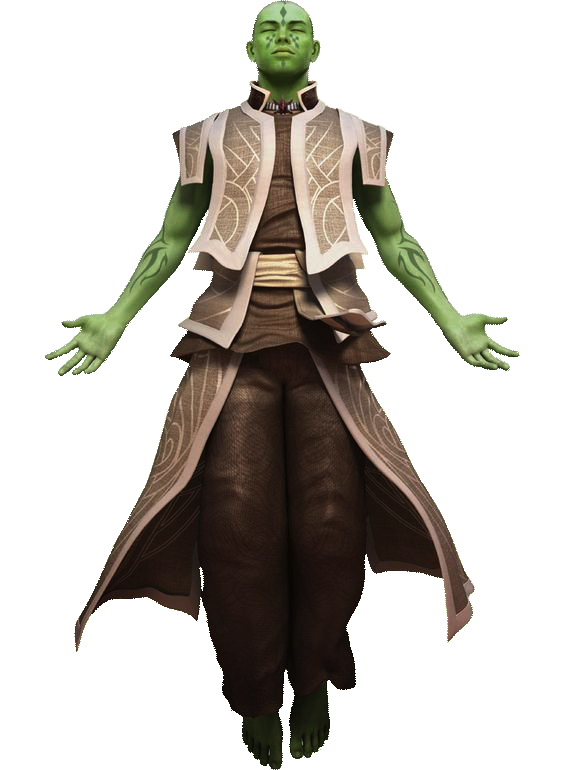

# Jal Shey Order

Monks of the Jal Shey order, driven by the pursuit of knowledge, maintain one of the most well-respected and heavily guarded repositories of history and knowledge across the galaxy: the Archives of the Jal Shey. Here, young folk of all species seeking the clarity of truth and the strength of knowledge pledge to learn the arts of seeking enlightenment by understanding the world around them, and mastering the techniques to defend it. To become a Jal Shey monk is to give one's self to the quest for unveiling the deepest mysteries of the galaxy, to bring light to the secrets of the dark, and guard the most powerful and dangerous of truths.
  
## Mystical Erudition
_**Jal Shey Order:** 3rd level_ 
You've undergone extensive training in lore from the Jal Shey's collected knowledge. You learn one language of your choice, and you gain proficiency in your choice of Lore, Medicine, Nature, or Technology. You learn an additional language and an additional skill proficiency from the above list at 11th level.

Additionally, you can strike multiple pressure points to extract crucial details about your foe. Whenever you hit a creature with an unarmed strike, you can learn learn certain information about its capabilities. The GM tells you if the creature has one of the following characteristics of your choice:
- Condition immunities
- Damage vulnerabilities
- Damage resistances
- Damage immunities

## Extort Truth
_**Jal Shey Order:** 6th level_ 
You can hit a series of hidden nerves on a creature with precision, temporarily causing them to be unable to mask their true thoughts and intent. When you hit a creature with a melee weapon attack, you can have the attack deal no damage and spend 1 focus point to force them to make a Charisma saving throw against your focus save DC. On a failed save, the creature is unable to speak a deliberate lie for 1 minute and all Charisma checks directed at the creature are made with advantage for the duration. 

On a success or failure, a creature is aware that you attempted to influence them. They can choose to avoid answering questions to which they would normally respond with a lie. 

## Preternatural Counter
_**Jal Shey Order:** 6th level_ 
Your quick mind and study of your foe allows you to use their failure to your advantage. When a creature within 5 feet of you misses you with a melee attack, you can use your reaction to make an unarmed strike against that creature.

## Mercurial Mind
_**Jal Shey Order:** 11th level_ 
You've honed your awareness and reflexes through mental aptitude and pattern recognition. Once per turn, if you've already used your reaction, you can spend 1 focus point to take an additional reaction. You can only take one reaction per turn.

## Debilitating Barrage
_**Jal Shey Order:** 17th level_ 
You've gained the knowledge to temporarily inhibit a creature's fortitude by striking a series of pressure points. Whenever you hit a creature with an unarmed strike, you can spend 3 focus points to cause the creature to become vulnerable to a damage type of your choice. This effect lasts for 1 minute or until they take damage of the chosen type.
