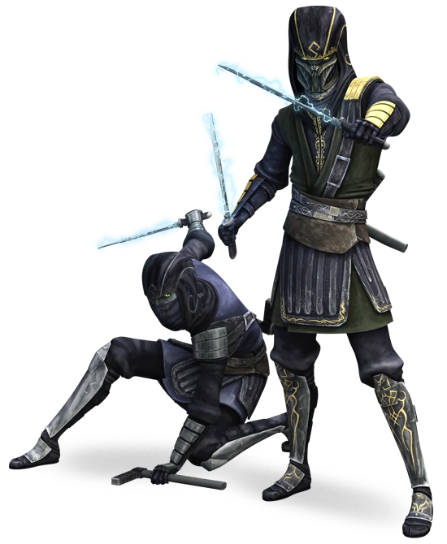

# Kage Order

Monks of the Kage Order, known as Kage warriors, have mastered fighting in darkness, using that which others fear as a weapon against them. Kage warriors learn tricks to create darkness where none exists, fighting using their intuition rather than relying on sight.

## Darkness Charges
_**Kage Order:** 3rd, 5th, 9th, 13th, and 17th level_ 
You learn to create a number of small charges that create enhanced darkness. Over the course of a short or long rest, you can create two charges. You can create an additional charge at 5th, 9th, 13th, and 17th level. Your charges can only be used by you, and they lose their potency at the end of your next short or long rest.

Once per turn, when you would make a weapon attack or unarmed strike, you can instead throw one of your charges. Your charges have a range equal to 30 feet + your Strength modifier x 5. You can throw a device at a point you can see within range. The charges create a pocket of darkness in a 10-foot radius sphere centered on that point. The darkness spreads around corners. It lasts for 1 minute or until an enhanced source of bright light dispells it.

## Disruptive Shock
_**Kage Order:** 6th level_ 
Once per turn, when you hit a creature with a melee weapon attack when you have advantage, or it fails a saving throw against an effect that you control, you can choose to roll a Martial Arts die and deal additional psychic damage equal to the amount rolled.

You can use this feature a number of times equal to your proficiency bonus, as shown in the monk table. You regain any expended uses when you finish a short or long rest.

## One With Darkness
_**Kage Order:** 11th level_ 
You have learned to become one with the shadows. When you are in an area of dim light or darkness, you can use your action to become invisible. You remain invisible until you make an attack, cast a power, otherwise take a hostile action, or are in an area of bright light.

## Opportunist
_**Kage Order:** 17th level_ 
You can exploit a creature's momentary distraction when it is hit by an attack. Whenever a creature within 5 feet of you is hit by an attack made by a creature other than you, you can use your reaction to make a melee attack against that creature.
