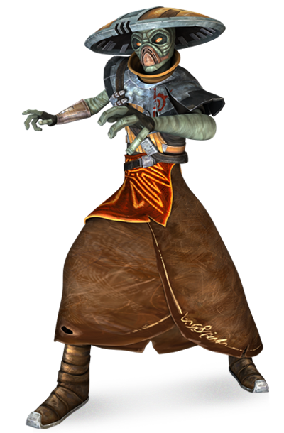

# Kyuzo Order

Monks of the Kyuzo Order turn weapon throwing into a true art form. Inspired by the skill of native kyuzo wielding their war helmets as both shield and weapon, these monks utilize any thrown object they can find to defend themselves and others while they attack enemies from angles both surprising and devastating.

## Intercept
_**Kyuzo Order:** 3rd level_ 
You gain proficiency in vibroweapons with the thrown property and they become monk weapons for you. Additionally, when you throw an improvised weapon, you are considered proficient in it, and it uses your Martial Arts die instead of its 1d4. 

Additionally, you've learned to use thrown weapons to intercept projectiles traveling towards your allies. When you are wielding a weapon with which you are proficient, and a creature within your weapon's normal thrown range is hit by a ranged attack, you can use your reaction to throw your weapon to intercept the projectile. When you do so, the damage the creature takes from the attack is reduced by 1d10 + your Dexterity modifier + your monk level. If the weapon has the returning property, it then returns to your hand.

## Scattering Stance
_**Kyuzo Order:** 6th level_ 
When you take the Dodge action, until the start of your next turn you gain a number of special reactions equal to your proficiency bonus that you can only use for your Intercept feature. You can only take one reaction per turn.

## Curved Throw
_**Kyuzo Order:** 11th level_ 
You can curve your throws behind cover. When you make an attack roll with a weapon with the thrown property, you can spend 1 focus point to cause the target to gain no benefit from shields or cover, unless that cover is full cover.

## Relentless Assault
_**Kyuzo Order:** 17th level_ 
When you make multiple weapon attacks with thrown weapons against the same target on your turn, each attack after the first gains a +1 bonus to its attack roll, cumulatively, to a maximum bonus of +6.
