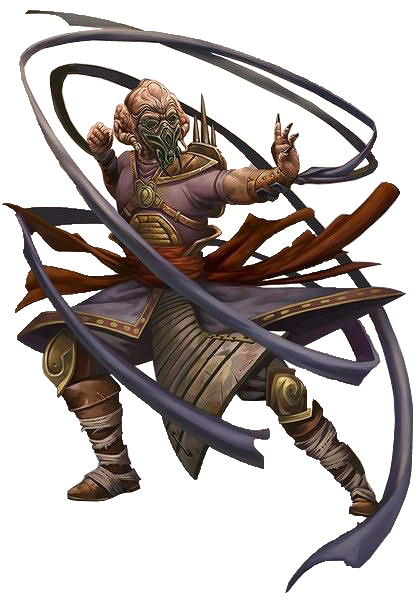

# Teras Kasi Order

Monks of the Teras Kasi Order are the ultimate masters of unarmed martial arts combat. They learn techniques to draw focus from the defeat of their enemies, resist the mental assaults of the Force, and unleash powerful rushes of strikes to subdue their foes.

## Forredari Stance
_**Teras Kasi Order:** 3rd level_ 
Your honed focus allows you to enter a stance of mental fortification and power. You can use your bonus action to enter this stance. When you do so, you unleash a flurry of blows on creatures of your choice that you can see within 10 feet of you. Each creature in the area must make a Dexterity saving throw (DC = 8 + your bonus to attacks with the weapon) or take the weapon's normal damage.

This stance lasts for 1 minute. While you are in this stance, you gain the following benefits:
- **Death Weave.** When you reduce a creature to 0 hit points, you gain temporary hit points equal to your focus ability modifier + half your monk level.
- **Gundark Slap.** Once on each of your turns, when you hit a creature with an unarmed strike or a monk weapon, you can choose to make it unable to take reactions until the end of your next turn.
- **Sleeping Krayt.** You can use your focus ability modifier instead of Strength whenever you would make a Strength check or a Strength saving throw. Additionally, you have advantage on saving throws against being charmed or frightened.

These effects end early if you are incapacitated or die. Once you've used this feature, you can't use it again until you finish a long rest.

While you have no remaining uses of this feature, you can instead expend 1 focus point to use it. When you do so, your maximum focus points are reduced by 1 until you complete a long rest.

## Steel Hands Form
_**Teras Kasi Order:** 6th level_ 
You can draw upon your focus to utilize an array of practiced techniques to strike your opponents with precision and power. You can use your bonus action to enter this stance, and when you do so, you can also enter your Forredari Stance as a part of this same bonus action. This form lasts for 1 minute. While you are in this stance, you gain the following benefits:

- **Charging Wampa.** Once per round, when you are forced to make a saving throw against a force power, your movement speed increases by 10 feet until the end of your next turn.
- **Nexu Grin.** When a creature you can see within 10 feet of you casts a force power that requires a force attack roll against you or an an allied creature, you can use your reaction and expend 1 focus point to impose disadvantage on the attack roll. If the attack misses, and the higher of the two d20 rolls would also miss, the creature cannot cast that force power again until it completes a short or long rest.
- **Screaming Squill.** Once per turn, when you hit a creature that is concentrating on a force power and it makes a Constitution saving throw to maintain concentration, the DC for the check equals your focus save DC, unless the DC for the Constitution saving throw would be higher.

These effects end early if you are incapacitated or die. Once you've used this feature, you can't use it again until you finish a long rest.

While you have no remaining uses of this feature, you can instead expend 1 focus point to use it. When you do so, your maximum focus points are reduced by 1 until you complete a long rest.

## Matter Over Mind
_**Teras Kasi Order:** 11th level_ 
You tap into the greater power of your focus. While both your Forredari Stance and your Steel Hands Form are active, you gain the following benefits:
- **Dancing Dragonsnake.** When you take force, lightning, or necrotic damage, you can use your reaction to deflect it. When you do so, the damage you take is reduced by 1d10 + your focus ability modifier + your monk level.
- **Aryx Slash.** Once on each of your turns, when you hit a target with an unarmed strike or monk weapon, you can roll a Martial Arts die and deal additional psychic damage equal to the amount rolled.
- **Piercing Gaze.** When you would make an Insight check against a creature you know to wield the Force, you can use your focus ability modifier for the roll, and you are considered to have expertise in the Insight skill. If you would already have expertise in the check, you instead have advantage on the roll. 

## Spitting Rawl
_**Teras Kasi Order:** 17th level_ 
You have learned to harness your strikes in a blistering fury. On your turn, when a creature takes damage from you three times, you can make up to three additional unarmed strikes against the creature (no action required). The first additional unarmed strike costs 1 focus point and deals 1d12 additional psychic damage on a hit, and each unarmed strike after the first costs 1 additional focus point and deals 1d12 additional psychic damage on a hit, cumulatively.
