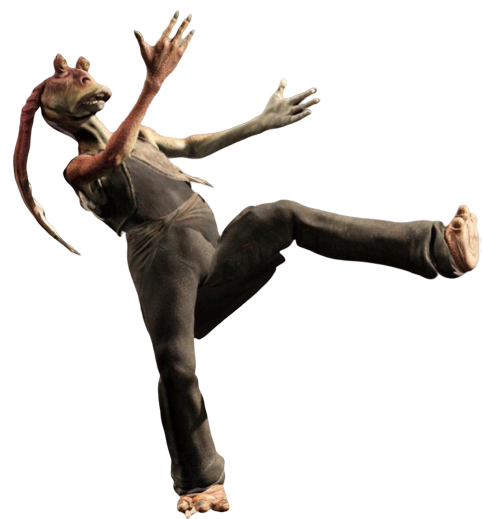

# Trickster Order

Monks of the Trickster Order embody the archetypal role of the "trickster"— one who seemingly bumbles their way into good fortune. They employ a unique fighting style composed of slips, trips, and falls to confuse and frustrate their enemies to no end. Whether your movements are actual foibles on your part or calculated strokes, they will surely leave others guessing long after your time is past.

## Bumbling Technique
_**Trickster Order:** 3rd level_ 
Your martial arts technique mixes combat training with the precision of a dancer and the antics of a jester. You gain proficiency in Performance.

Additionally, you learn how to twist and turn quickly. Whenever you use your bonus action to make an unarmed strike, creatures you hit can't make opportunity attacks against you, and your speed increases by 10 feet until the end of your turn.

## Clumsy Sway
_**Trickster Order:** 6th level_ 
You can move in sudden, swaying ways. You gain the following benefits.

***Leap to Your Feet.*** When you're prone, you can stand up by spending 5 feet of movement, rather than half your speed.

***Redirect Attack.*** When a creature misses you with a melee attack roll, you can spend 1 focus point as a reaction to cause that attack to hit one creature of your choice, other than the attacker, that you can see within 5 feet of you.

## Luck of the Fool
_**Trickster Order:** 11th level_ 
You always seem to get a lucky bounce at the right moment. When you make an ability check, an attack roll, or a saving throw and have disadvantage, you can spend 2 focus points to instead have advantage for that roll.

## Comic Frenzy
_**Trickster Order:** 17th level_ 
You gain the ability to make an overwhelming number of attacks against a group of enemies. When you use your Flurry of Blows, you can make up to three additional attacks with it (up to a total of five Flurry of Blows attacks), provided that each Flurry of Blows attack targets a different creature this turn.
