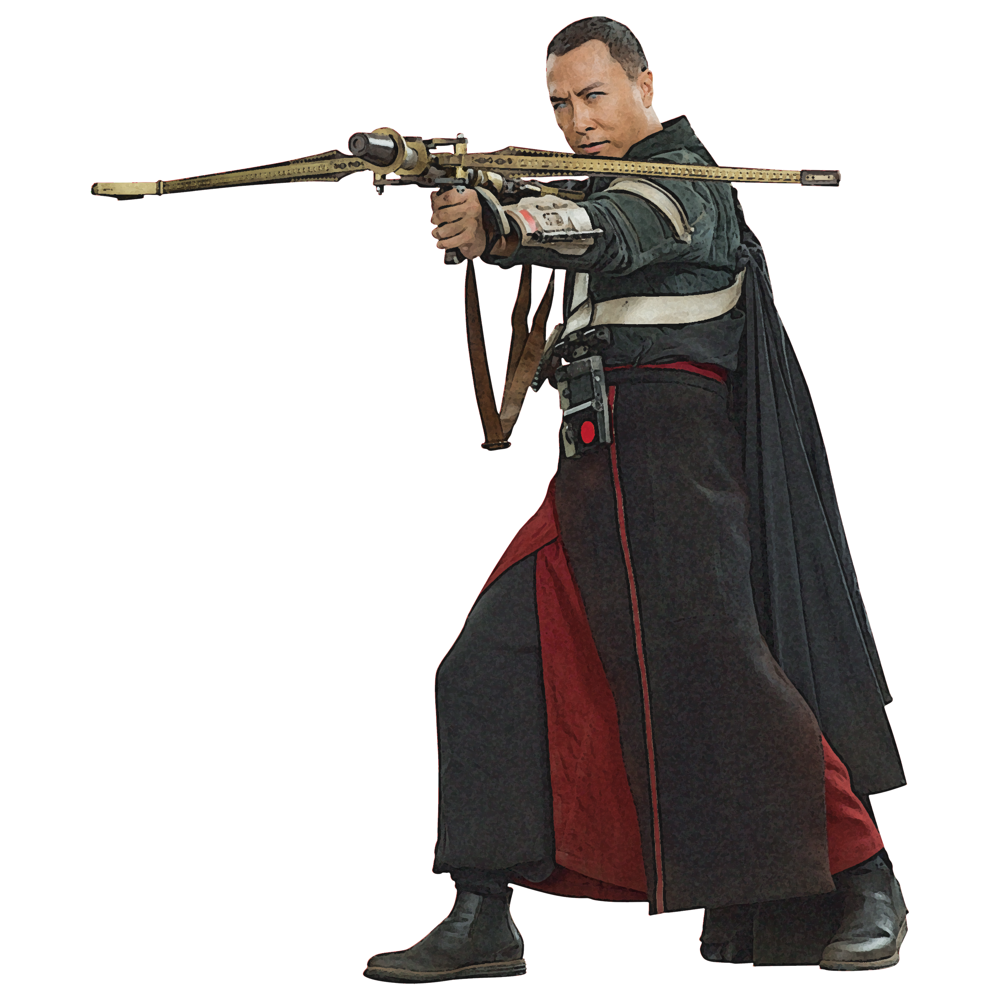

# Whills Order  

Monks of the Whills Order hold the secrets of the Force sacred, and dedicate their lives to defending ancient  knowledge of the Force and its artifacts. They master the use of ranged weapons, often crafting their own weapons in respectful admiration of the Jedi tradition of crafting lightweapons.

## Flurry of Light
_**Whills Order:** 3rd level_ 
You gain proficiency in blaster pistols, blaster rifles, ion pistols, ion rifles, and the lightbow, which are your Whills weapons and are monk weapons for you. When you are wielding a Whills weapon, you gain the following benefits:
- Your Whills weapons count as melee weapons for you, and when you make a melee weapon attack with them, you deal kinetic damage equal to your Martial Arts Damage Die.
- When you would make an unarmed strike using your Martial Arts bonus action or as a part of your Flurry of Blows, you can instead attack with a Whills weapon you are wielding. You roll a d4 in place of the normal damage of your Whills weapon when attacking in this way. This die changes as you gain monk levels, as shown in the Martial Arts column of the monk table.
- When you would make a ranged weapon attack with a Whills weapon, you can instead reload the weapon.

## The Force is With You
_**Whills Order:** 6th level_ 
As you channel the Force through you, you gain the following benefits:
- You can use your Stunning Strike feature when you hit with a ranged weapon attack while you are wielding a Whills weapon. 
- You can spend up to 3 focus points to reduce partial cover by one step (from three-quarters to half or half to one-quarter). If you reduce the target below one-quarter cover, you ignore cover bonuses entirely. At 17th level, you can spend 3 focus points to ignore total cover, as long as your target is not hidden from you. 
- When you hit a creature with a Whills weapon, that creature has disadvantage on opportunity attacks against you until the start of your next turn.

## One With the Force
_**Whills Order:** 11th level_ 
You learn how to enter a trance, preparing to unleash yourself upon your enemy. While in this trance, you can still talk and move. If you stay in the trance for at least one minute, when you roll initiative, you can make a ranged weapon attack on a number of creatures up to your focus ability modifier (a minimum of one) within 30 feet of you when you were in this trance.

Once you've used this feature, you must complete a short or long rest before you can use it again.

## Guided Strikes
_**Whills Order:** 17th level_ 
Your first ranged weapon attack and your first melee weapon attack each turn deal additional damage equal to your focus ability modifier (a minimum of +1).
