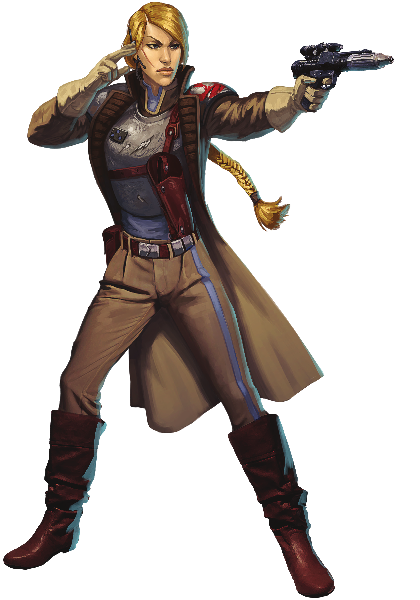

# Bolstering Practice

Those operatives who choose the Bolstering Practice use precise strikes and brilliant use of small unit tactics to overwhelm enemies through superior teamwork.

## Articulate Authority
_**Bolstering Practice:** 3rd, 5th, 9th, 13th, and 17th level_ 
When you use your Cunning Action feature to take the Dash, Disengage, or Hide actions, a number of friendly creatures up to your Charisma modifier within 30 feet of you who can hear you and who can understand you can use their reaction to gain an effect, determined by the action you took:
- **Dash:** The creature can move up to half their speed. They must end this movement within 30 feet of you.
- **Disengage:** The creature can move up to 5 feet. If this movement would provoke an opportunity attack, the opportunity attack is made with disadvantage.
- **Hide:** The creature has advantage on the first attack roll they make before the end of their next turn against a creature you successfully hide from.

You can use this feature twice. You gain an additional use at 5th, 9th, 13th, and 17th level. You regain all expended uses when you finish a short or long rest.

## Fireteam Commander
_**Bolstering Practice:** 3rd level_ 
You learn a number of squad maneuvers you can use to assist allies or exploit enemies. When you deal Sneak Attack damage to a creature, you may choose to forgo two of your Sneak Attack dice to make the attack a squad maneuver.

### Fortifying Strike
You inspire a friendly creature within 60 feet of you who can see or hear you and roll two Sneak Attack dice. That ally immediately gains temporary hit points equal to the amount of rolled.

### Reaffirming Strike
You use the authority your attacks carry to help your ally focus on the task at hand. Choose a creature within 60 feet of you who can see or hear you and that is currently charmed or frightened by the creature you would deal Sneak Attack damage to. The condition immediately ends on that creature.

### Bolstering Strike
You choose a friendly creature within 60 feet of you who can see or hear you. Once before the start of your next turn, if that creature hits the creature against which you forwent two Sneak Attack damage dice, they deal additional damage to the target equal to the maximum of the two Sneak Attack dice.

## Open Opportunity
_**Bolstering Practice:** 9th level_ 
Once per turn, when you take the Attack action and hit a creature without applying your Sneak Attack damage to it, you can forgo your Sneak Attack damage for the turn and use your bonus action to throw the creature off balance. The next ally to hit that creature before the start of your next turn may add your Sneak Attack dice to the damage of their attack. 

## Ambush Tactics
_**Bolstering Practice:** 13th level_ 
When attempting to move stealthily as a group, you may choose a number of creatures equal to your Charisma modifier. Those creatures may add their proficiency to any Dexterity (Stealth) checks they make as long as they remain within 60 feet of you and they do not already add their proficiency bonus.

Additionally, each ally other than you that surprises a creature and hits it with an attack on their first turn in combat rolls two dice equal to the size of your Sneak Attack dice, dealing additional damage of the same type to the creature. 

## Squad Goals
_**Bolstering Practice:** 17th level_ 
You have such skill at maintaining the faith of your allies that the very sight of you in danger can spur them into action. When you are hit by an attack, up to six allies within 60 feet of you that can see or hear you and see the creature that hit you can make one weapon attack against that creature (no action required).

Once you've used this feature, you must complete a short or long rest before you can use it again.
