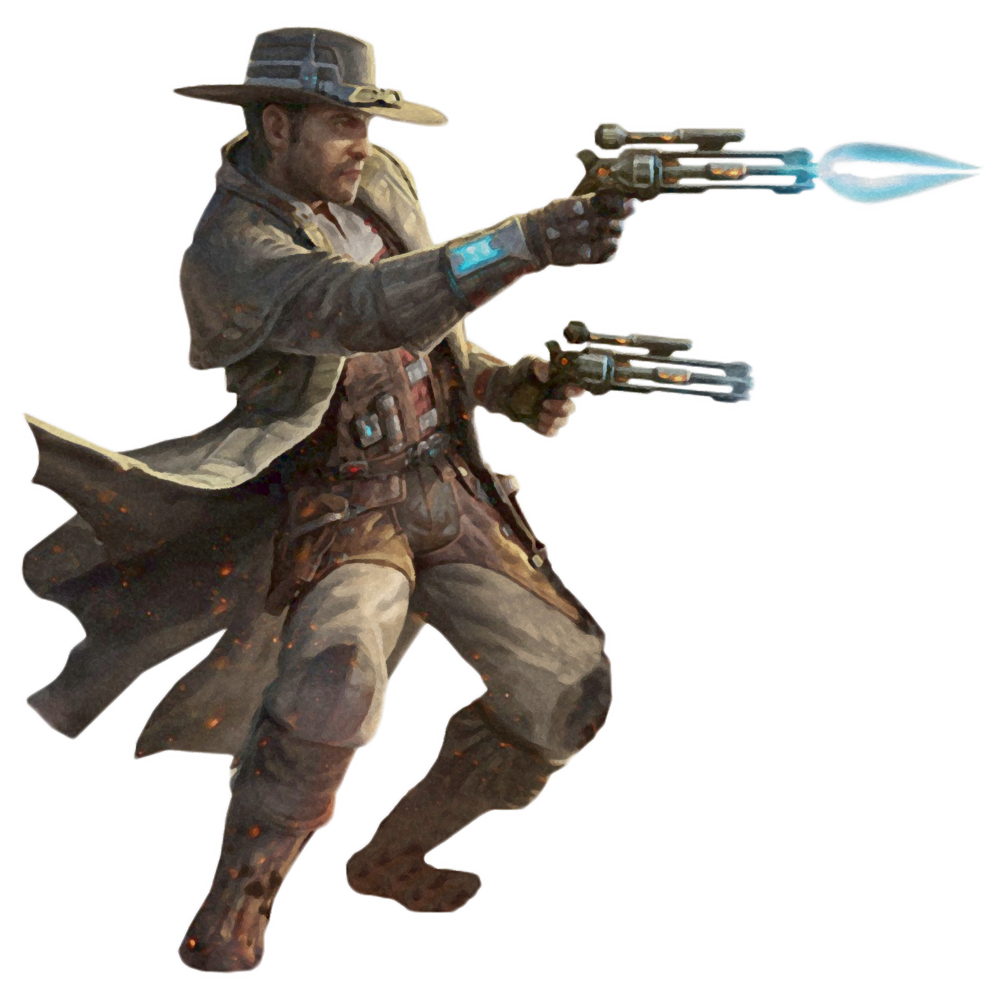

# Gunslinger Practice

Those operatives who choose the Gunslinger Practice are the masters of the trick shot. The Gunslinger and his blaster are the perfect team, utilizing knowledge of their enemies' vulnerabilities to take advantage of every opportunity.

## Dive For Cover
_**Gunslinger Practice:** 3rd, 5th, 9th, 13th, and 17th level_ 
You learn to quickly move into cover when under fire. Once per round, when you are the target of a ranged attack, or you are subjected to an effect that allows you to make a Dexterity saving throw, and there is cover within 10 feet of you, you can move up to 10 feet (no action required). You must end this movement in cover.

You can use this feature twice. You gain an additional use at 5th, 9th, 13th, and 17th level. You regain all expended uses when you complete a long rest.

## Trick Shooter
_**Gunslinger Practice:** 3rd level_ 
You learn a number of trick shots you can use to debilitate enemies and impress allies. When you deal Sneak Attack damage to a creature, you may choose to forgo two of your Sneak Attack dice to make the attack a trick shot. 

Some of your trick shots require your target to make a saving throw to resist the trick shot's effects. The saving throw DC is calculated as follows: 

___

**Trick Shot save DC** = 8 + your proficiency bonus + your Dexterity modifier

___

### Blinding Shot
You attempt to blind the target. The target must make a Constitution saving throw or be blinded until the end of your next turn. 

### Brutal Shot
You attempt to knock the target prone. The target must make a Strength saving throw or be knocked prone.  

### Hampering Shot
You attempt to hobble the enemy's movement. The target must make a Dexterity saving throw. If it fails, it gains 1 slowed level and it has disadvantage on Dexterity saving throws until the end of its next turn.

## Spinning Flourish
_**Gunslinger Practice:** 9th level_ 
You can flourish your weapon in an intimidating or charming manner. As an action, you can cause one creature within 60 feet to make a Wisdom saving throw (DC = 8 + your proficiency bonus + your Dexterity modifier). On a failed save, the target is charmed or frightened by you (your choice) until the end of your next turn. 

## Ricochet Shot
_**Gunslinger Practice:** 13th level_ 
You learn how to work all the angles. Once per turn, when you take the Attack action and miss with a ranged weapon attack, you can repeat the attack against a different target within 10 feet of the original target (no action required).

## Quickdraw
_**Gunslinger Practice:** 17th level_ 
You learn to perform miracles with just a blaster and some nerve. On your first turn in combat, if you aren't surprised, you can use your action to attack creatures that have not yet acted. Choose up to six such creatures that you can see, making a ranged weapon attack against each. On a hit, you deal normal weapon damage and can apply a single trick shot to each attack made this way. 

Once you've used this feature, you must complete a short or long rest before you can use it again.
