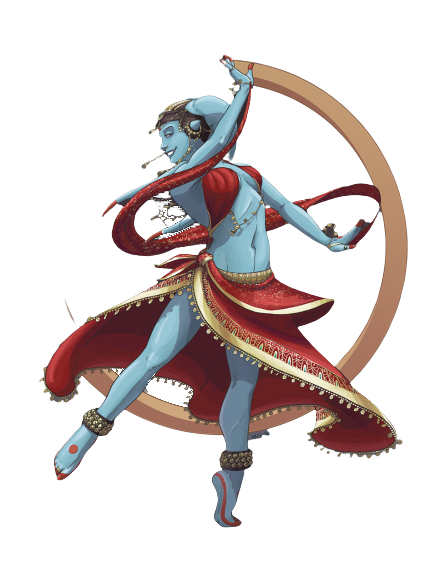

# Performance Practice

Some operatives choose to master finesse and timing through performance art. Those operatives who choose the Performance Practice become skilled performers who prove especially deadly in close combat, able to find the rhythm of an attacker's strikes as easily as any song.

## Artful Dancer
_**Performance Practice:** 3rd level_ 
Your training with music and dancing grants you certain benefits. You gain proficiency in the Performance skill and one musical instrument of your choice.

Additionally, while you are not wearing armor or wielding a medium or heavy shield, you can add half your Charisma modifier to your AC as long as it doesn't already include that modifier.

## Dazzling Steps
_**Performance Practice:** 3rd level_ 
You learn to conduct impressive displays of grace and speed in combat. While you aren't wearing medium or heavy armor or wielding a medium or heavy shield, and you take the Attack action on your turn and attack with a weapon with either the light or finesse properties, your walking speed increases by 10 feet until the end of the turn, and if you deal Sneak Attack damage, you may choose to forgo two of your Sneak Attack dice to make the attack a dazzling step.

Some of your dazzling steps require your target to make a saving throw to resist the dazzling step's effects. The saving throw DC is calculated as follows:

___

**Dazzling Step save DC** = 8 + your proficiency bonus + your Charisma modifier

___

### Defensive Step
You defend yourself from further attack. Roll two Sneak Attack dice. You gain temporary hit points that last until the start of your next turn equal to the amount rolled.

### Mobile Step
You twist and twirl around the target. The target must make a Strength saving throw. A Huge or larger creature automatically succeeds. On a failed save, it is pushed back 5 feet, and you can immediately move into the space it just vacated without provoking opportunity attacks.

### Offensive Step
Choose another creature that you can see within your reach. The creature must make a Dexterity saving throw. On a failed save, roll two Sneak Attack dice. The creature takes damage equal to the amount rolled. This damage is of the same as your weapon's damage.

## Flexible Body
_**Performance Practice:** 9th level_ 
You are able to use your acrobatic talent to gain the upper hand in combat. You can use the bonus action granted by your Cunning Action to shove or trip a creature. When you do so, you can make a Dexterity (Acrobatics) check instead of a Strength (Athletics) check. 

Additionally, you now ignore difficult terrain, you can move through space occupied by hostile creatures, and you can squeeze through smaller spaces without expending extra movement.

## Dance of Death
_**Performance Practice:** 13th level_ 
You can use your action to make a weapon attack against any number of creatures within 5 feet of you, with a separate attack roll for each target. You can choose to deal Sneak Attack damage to each creature you hit, but you can only roll half your number of Sneak Attack dice per creature.

Once you've used this feature, you must complete a short or long rest before you can use it again.

## Master of Dance
_**Performance Practice:** 17th level_ 
Your confidence when putting on a show has extended into combat. You add your Charisma modifier to initiative checks. Additionally, any creature who fails a saving throw against your Dazzling Step save DC has disadvantage on the first attack roll they make against you each turn until the end of your next turn.
