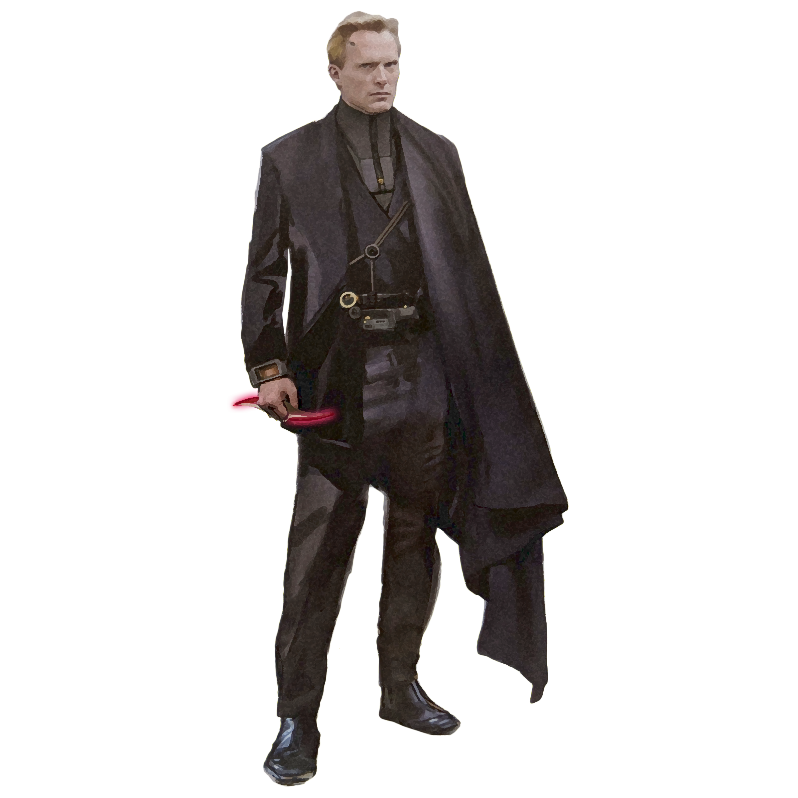

# Ruffian Practice

Those operatives who choose the Ruffian Practice use rough-and-tumble tactics to handle any fight, big or small. They incite chaos and make devious moves that keep their enemies reeling.

## Rakish Audacity
_**Ruffian Practice:** 3rd level_ 
Your unmistakable confidence propels you into battle. You can add your Charisma modifier to your initiative rolls.

Additionally, you don't need advantage on your attack roll to use your Sneak Attack if no creature other than your target is within 5 feet of you, as long as the target of the attack is within 5 feet of you. All the other rules for the Sneak Attack class feature still apply to you.

Finally, during your turn, if you make a melee attack against a creature, that creature can't make opportunity attacks against you for the rest of your turn.

## Nimble Step
_**Ruffian Practice:** 3rd level_ 
You learn to fluidly strike and maneuver through combat. When you deal Sneak Attack damage to a creature, you may choose to forgo two of your Sneak Attack Dice in order to maneuver across the battlefield.

Some of your fancy footworks require your target to make a saving throw to resist the debilitating strike's effects. The saving throw DC is calculated as follows: 

___

**Nimble Step save DC** = 8 + your proficiency bonus + your Dexterity modifier.

___

### Blade Defense
You attempt to determine your target's next strike. Roll two Sneak Attack dice, and the target must make a Charisma saving throw. On a failed save, your AC increases by the higher amount rolled on the dice against the first attack it makes against you before the start of your next turn. On a successful save, your AC instead increases by the lower amount.

### Disarming Strike
You attempt to disarm a creature with your attack. The target must succeed on a Strength saving throw or be forced to drop one item of your choice that it's holding. If you have a free hand, you can catch the item. Otherwise, it lands at your feet.

### Fancy Footwork
Roll two Sneak Attack dice. Your speed increases by 5 x the greater result of the two dice, and you ignore difficult terrain until the end of your current turn.

## Panache
_**Ruffian Practice:** 9th level_ 
Your charm becomes extraordinarily beguiling. As an action, you can make a Charisma (Persuasion) check contested by a creature's Wisdom (Insight) check. The creature must be able to hear you, and the two of you must share a language.

If you succeed on the check and the creature is hostile to you, it has disadvantage on attack rolls against targets other than you and can't make opportunity attacks against targets other than you. This effect lasts for 1 minute, until one of your companions attacks the target or affects it with a power, or until you and the target are more than 60 feet apart.

If you succeed on the check and the creature isn't hostile to you, it is charmed by you for 1 minute. While charmed, it regards you as a friendly acquaintance. This effect ends immediately if you or your companions do anything harmful to it.

## Elegant Maneuver
_**Ruffian Practice:** 13th level_ 
You can use a bonus action on your turn to gain advantage on the next Dexterity (Acrobatics) or Strength (Athletics) check you make during the same turn.

## Master Duelist
_**Ruffian Practice:** 17th level_ 
Your mastery of the blade lets you turn failure into success in combat. If you miss with an attack roll, you can roll it again with advantage. Once you do so, you can't use this feature again until you finish a short or long rest.
