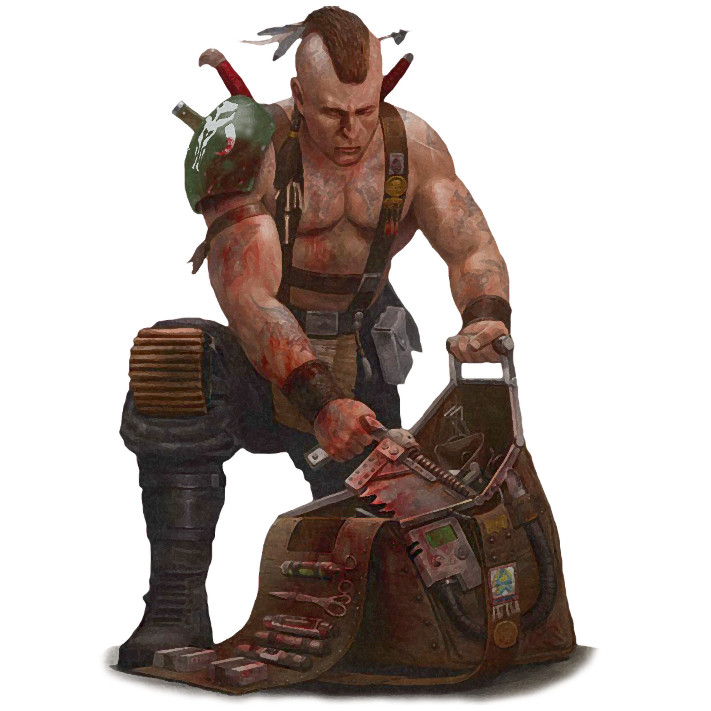

# Sawbones Practice

Those operatives who choose the Sawbones Practice have studied the humanoid body on a more intimate level than other operatives. While others may know where best to stab in order to kill, you also know how to repair the wounds you inflict, as well as how to make them even deeper. You delve into the secrets of the body, learning as much medical knowledge as you can get your hands on, regardless of how dirty the work becomes.

## General Practice
_**Sawbones Practice:** 3rd level_ 
You gain proficiency in Medicine, and you can use your Intelligence modifier instead of your Wisdom modifier for checks made with it.

Additionally, you can expend one use of a traumakit to help revitalize your wounded allies during a short rest. If you or any friendly creatures within 30 feet of you regain hit points at the end of the short rest by spending one or more Hit Dice, each of those creatures regains an extra 1d6 hit points.

The extra hit points increase when you reach certain levels in this class: to 1d8 at 9th level, to 1d10 at 13th level, and to 1d12 at 17th level.

## Debilitating Strike
_**Sawbones Practice:** 3rd level_ 
You learn to apply your anatomical knowledge in direct combat, in order to hinder your targets. When you deal Sneak Attack damage to a creature, you may choose to forgo two of your Sneak Attack Dice in order to hinder the creature, provided they have the appropiate physiology.

Some of your debilitating strikes require your target to make a saving throw to resist the debilitating strike's effects. The saving throw DC is calculated as follows: 

___

**Debilitating Strike save DC** = 8 + your proficiency bonus + your Intelligence modifier.

___

### Bleeding Wound
You attempt to create a lingering wound in the target for one minute. The target must make a Constitution saving throw. On a failed save, at the start of each of the target's turns, it takes true damage equal to one Sneak Attack die and repeats this saving throw, ending the effect on a success. 

### Crippling Pain
You attempt to cause distracting pain in the target. The target must make a Constitution saving throw. On a failed save, it has disadvantage on attack rolls until the end of your next turn. 

### Hampering Shot
You attempt to hamper the target's movement. The target must make a Constitution saving throw. On a failed save, it gains 1 slowed level and it makes Dexterity saving throws with disadvantage until the end of its next turn.

## Swift Surgery
_**Sawbones Practice:** 9th level_ 
You know how to quickly patch up wounds, given the right tools. You are able to use a traumakit or administer a medpac as a bonus action, and when you use a traumakit to stabilize a dying creature, that creature also regains a number of hit points equal to your Intelligence modifier.

## Dosage Control
_**Sawbones Practice:** 13th level_ 
Your knowledge of medicine allows you to partition and ration healing supplies very effectively, without impacting its potency. Over the course of 1 hour, which can be done during a rest, you can carefully measure and mark out dosages of a medpac within reach. The medpac can now be used twice before it is consumed.

At your DM's discretion, you may be able to use this feature on other pacs, stims, or adrenals, most likely involving an ability check to succeed.

## Self-Sustain
_**Sawbones Practice:** 17th level_ 
You have advantage on death saving throws.

Additionally, when you are stabilized, you regain 1 hit point. Once you've used this feature, you can't use it again until you finish a short or long rest.
