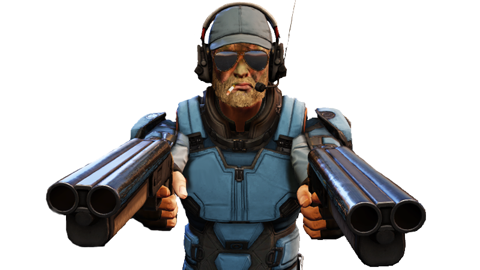

# Scrapper Practice

Those operatives who choose the Scrapper Practice don't have the time or patience for the fair fight. They utilize close-quarters blaster combat blended with underhanded tactics to surprise and disable their foes.

## Back Blast
_**Scrapper Practice:** 3rd level_ 
You gain proficiency in all blasters with the burst or rapid property that lack the two-handed property. Additionally, when a creature fails a saving throw against the burst or rapid property of a weapon you control and with which you are proficient, you can apply your Sneak Attack damage to one creature dealt damage in this way as long as that creature didn't have advantage on the save.

When you reach 9th level in this class, when multiple creatures fail a saving throw against the burst property of a weapon you control and with which you are proficient, you can divide your Sneak Attack dice amongst the targets as you see fit.

## Upper Hand
_**Scrapper Practice:** 3rd level_ 
You learn to use underhanded tactics to gain the upper hand. When you deal Sneak Attack damage to a creature, you may choose to forgo two of your Sneak Attack Dice in order to perform an upper hand technique.

Some of your upper hand techniques require your target to make a saving throw to resist the technique's effects. The saving throw DC is calculated as follows: 

___

**Upper Hand save DC** = 8 + your proficiency bonus + your Charisma modifier

___

### Brutal Hit
You attempt to knock the target prone while within 15 feet of it. The target must make a Strength saving throw or be knocked prone.

### Low Blow
You attempt to stun the target while within 15 feet of it. The target must make a Constitution saving throw or be stunned until the start of its next turn.

### Shank Shot
You attempt to hamper the target while within 15 feet of it. The target must make a Dexterity saving throw. If it fails, it gains 1 slowed level and makes Dexterity saving throws with disadvantage until the end of its next turn.

## Sleight of Foot
_**Scrapper Practice:** 9th level_ 
When a creature moves to within 5 feet of you, you can use your reaction to move up to half your speed away from the creature without provoking opportunity attacks. You must end this movement further from the creature than you started.

## Hostile Negotiations
_**Scrapper Practice:** 13th level_ 
You gain proficiency in Intimidation or Persuasion. Additionally, while you are wielding a weapon with which you are proficient, you can't have disadvantage on Charisma (Intimidation) and Charisma (Persuasion) checks, and if the target would make a contested check, they can't have advantage on it.

## Double Tap
_**Scrapper Practice:** 17th level_ 
You can deal Sneak Attack damage twice per turn, but you can't deal more than your total Sneak Attack dice to a single target per turn.
