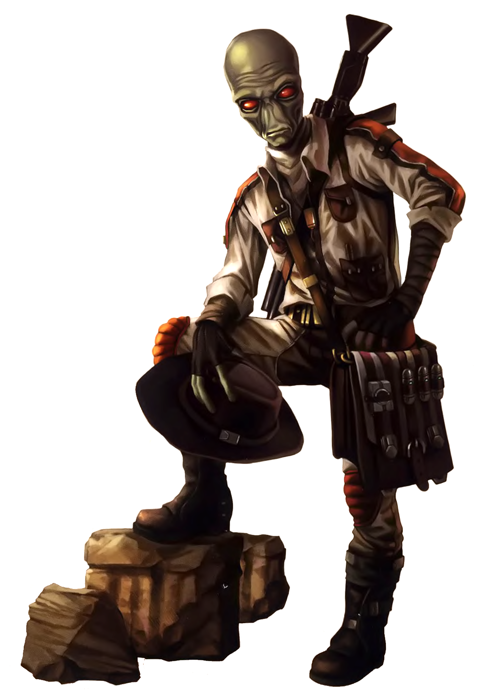

# Archaeologist Pursuit

Archaeologists are those who study the remnants of historical civilizations. Those scholars who choose the Archaeologist Pursuit are driven by a desire to uncover the past, forming a connection to the lives of those that came before, and unlocking within themselves a connection not just to history, but to the Force itself.

## Studious Excavator
_**Archaeologist Pursuit:** 3rd level_ 
You gain proficiency with archaeologist kits and in the Lore skill. Additionally, you can't have disadvantage on checks you make with them.

## Forcecasting
_**Archaeologist Pursuit:** 3rd level_ 
You have learned powers from your studies of civilizations that were also once close to the Force. See chapter 10 for the general rules of forcecasting and chapter 11 for the force powers list.

### Force Powers Known
You learn 4 force powers of your choice, and you learn more at higher levels, as shown in the Force Powers Known column of the Archaeologist Pursuit Forcecasting table. You may not learn a force power of a level higher than your Max Power Level, and you may learn a force power at the same time you learn its prerequisite.

### Force Points
You have a number of force points equal to your scholar level, as shown in the Force Points column of the Archaeologist Pursuit Forcecasting table, + your Intelligence, Wisdom, or Charisma modifier (your choice). You use these force points to cast force powers. You regain all expended force points when you finish a long rest.

### Max Power Level
Many force powers can be overpowered, consuming more force points to create a greater effect. You can overpower these abilities to a maximum level, which increases at higher levels, as shown in the Max Power Level column of the Archaeologist Pursuit Forcecasting table.

You may only cast force powers at 4th-level once. You regain the ability to do so after a long rest.

### Forcecasting Ability
Your forcecasting ability varies based on the alignment of the powers you cast. You use your Intelligence or Wisdom for light side powers (your choice), Intelligence or Charisma for dark side powers (your choice), and Intelligence, Wisdom, or Charisma for universal powers (your choice). You use this ability whenever a power refers to your forcecasting ability. Additionally, you use this ability modifier when setting the saving throw DC for a force power you cast and when making an attack roll with one.

___

**Force save DC** = 8 + your proficiency bonus + your forcecasting ability modifier

___

**Force attack modifier** = your proficiency bonus + your forcecasting ability modifier

___

#### Archaeologist Forcecasting

| Level | Force Powers Known | Force Points | Max Power Level |
|:---:|:---:|:---:|:---:|
| 3rd| 4| 3|1st|
| 4th| 6| 4|1st|
| 5th| 7| 5|1st|
| 6th| 8| 6|1st|
| 7th|10| 7|2nd|
| 8th|11| 8|2nd|
| 9th|12| 9|2nd|
|10th|13|10|2nd|
|11th|14|11|2nd|
|12th|15|12|2nd|
|13th|17|13|3rd|
|14th|18|14|3rd|
|15th|19|15|3rd|
|16th|20|16|3rd|
|17th|22|17|4th|
|18th|23|18|4th|
|19th|24|19|4th|
|20th|25|20|4th|

## Archaic Diagnostics
_**Archaeologist Pursuit:** 3rd level_ 
When you analyze a hostile creature, you can use maneuvers that require a weapon attack when you cast a force power that requires a force attack and you can use maneuvers that require a hit with a weapon attack when a creature fails a saving throw against a force power you cast.

## Force Carving
_**Archaeologist Pursuit:** 6th level_ 
You have unlocked more control over the Force, allowing you to choose wisely who it affects. When you cast a force power that affects other creatures that you can see, you can choose a number of them equal to 1 + the power's level. The chosen creatures automatically succeed on their saving throws against the power, and they take no damage if they would normally take half damage on a successful save.

## Psychometric Analysis
_**Archaeologist Pursuit:** 9th level_ 
Your strength in the Force and your ability to read the objects around you intensifies. You can use your Critical Analysis to analyze an object of Huge size or smaller that you can see within range. When you do so, you learn whether or not the object is enhanced, cursed, and how old it is. 

Additionally, you can end your Critical Analysis on the object (no action required) to ask it a single question and receive an answer, usually in the form of an auditory or visual hallucination. For example, touching the rusted, broken remains of a lightsaber and asking how it got there may result in a brief vision of a disgruntled Jedi Knight casting it to the ground on that spot. An object “questioned” in this way can only provide information relating to its past. The GM has the final say on what objects can be questioned, and to what extent.

You can use this feature four times. You gain an additional use at 13th and 17th level. You regain all expended uses when you complete a long rest.

## Knowledge is Power
_**Archaeologist Pursuit:** 17th level_ 
You gain the ability to steal the knowledge of how to cast a power from another forcecaster. When a hostile creature casts a force power that affects a friendly creature within range of your Critical Analysis feature, and you use your reaction target that friendly creature with your Critical Analysis feature, you can force the creature casting the power to make a Wisdom or Charisma saving throw (your choice) against your universal force save DC. On a successful save, the power is cast as normal.

On a failed save, you negate the power's effects, and you steal the knowledge of that power if it is at least 1st level and of a level you can cast. For the next 8 hours, you know the power and can cast it using your force points. The creature cannot cast that power again until the 8 hours have passed.

Once you've used this feature, you cannot use it again until you finish a long rest.

___

## Archaeologist Discoveries
When you select this pursuit, you gain access to new discoveries which reflect your studies into historical civilations. Whenever you learn a new discovery, you can choose from any of the following as well. The discoveries are listed in alphabetical order. 

### Archive Research
Your expeditions have turned up a bevy of knowledge on the force. You learn three at-will force powers of your choice, which don't count against your number of force powers known.

### Force Combat Knowledge
Your research into Jedi and Sith combat techniques has allowed you to gain proficiency in simple lightweapons. Additionally, you gain knowledge of one lightsaber form of your choice.

### It Belongs in a Museum
_**Prerequisite:** 9th level_ 
Your knowledge of antiquities is unparalleled. When you make an Intelligence (Lore) check or an ability check with your archaeologist kit, you may treat any roll of a 9 or lower as a 10.

### Localized Survey
_**Prerequisite:** 13th level_ 
Your affinity for the force allows you to key in to the recent past of an area you enter. When you would expend a use of your Psychometric Analysis, you can instead choose to target your immediate vicinity (up to a 50-foot cube) and investigate for at least 1 minute. For each minute you investigate, you see visions of recent events in the area going back a number of days equal to your scholar level, you learn about one significant event, beginning with the most recent. 

You can investigate in this way for a number of minutes equal to your scholar level and must maintain concentration during that time, as if you were concentrating on a power. 

Once you've used this feature, you can't use it again until you complete a short or long rest.

### Making This Up As You Go
_**Prerequisite:** 17th level_ 
You may now cast force powers at 4th-level twice between rests. 

### Telekinetic Ministrations
_**Prerequisite:** 9th level_ 
You can cast the *telekinesis* force power at 5th level without spending force points.

Once you've used this feature, you must complete a long rest before you can use it again.

### The Years and the Mileage
Your archaeological studies have taken you all across the galaxy. While you are the target of your Critical Analysis feature, you can use your universal forcecasting ability instead of Wisdom when making Insight or Survival checks.

### Tomb of the Ancients
_**Prerequisite:** 5th level_ 
As a reaction when you take damage, you can entomb yourself in the Force until the end of your next turn. For the duration, you have resistance to the triggering damage, you gain temporary hit points equal to 1d10 + your universal forcecasting ability modifier + your scholar level to potentially absorb the attack, and your speed is reduced to 0.

Once you've used this feature, you can't use it again until you finish a short or long rest. 
