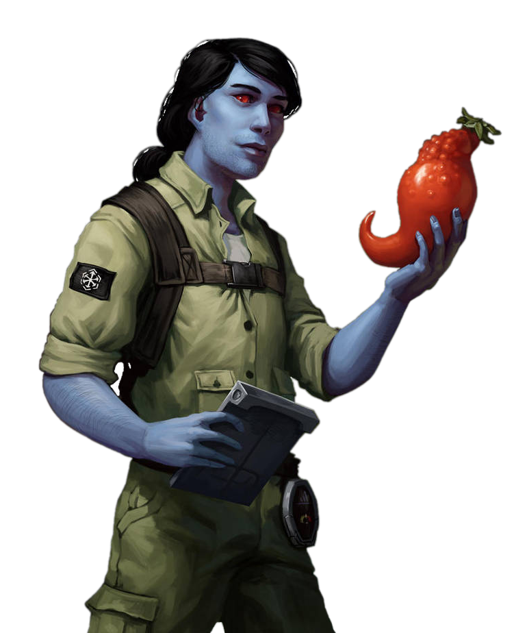

# Chef Pursuit

Without it empires fall, armies dissolve into nothingness, and species are forgotten with the passage of time. A favored tool of assassins, crime lords, and moguls: food. Those scholars who choose the Chef Pursuit know the importance and power that food carries.

## Culinary Knowledge
_**Chef Pursuit:** 3rd level_ 
You gain proficiency with chef's kits and your choice of the Nature or Survival skills. Additionally, you can't have disadvantage on checks you make with them.

## Emergency Supplements
_**Chef Pursuit:** 3rd level_ 
You are prepared to assist allies with specially prepared, instantly effective supplements. When an ally is the target of your Critical Analysis feature and within 5 feet of you, you may expend a superiority die and give that ally the benefits of any discovery that utilizes a superiority die and is exclusive to the Chef Pursuit, regardless of whether or not you've chosen it. 

Once you've used this feature, you must complete a short or long rest before you can use it again.

## Balanced Diet
_**Chef Pursuit:** 6th level_ 
Your cooking is so nutritionally balanced that it allows allies to stave off the effects of continued rigorous activity. Creatures of your choice who eat food prepared by you have advantage on Constitution saving throws to avoid exhaustion, as described in chapter 8, until the end of their next long rest.

## Comfort Food
_**Chef Pursuit:** 9th level_ 
If you or any friendly creatures who have consumed food you prepared during a short rest regain hit points by spending hit dice at the end of the short rest, each of those creatures regains an extra 1d8 hit points.

The extra hit points increase when you reach certain levels in this class: to 1d10 at 11th level, and to 1d12 at 15th level.

## Heroes' Feast
_**Chef Pursuit:** 17th level_ 
You have developed a signature feast that is the purest distillation of your knowledge and talent as a chef.

Over the course of a long rest, you can expend rare culinary supplies worth 1,000 cr to create your feast, which can feed a number of creatures equal to twice your Critical Analysis ability modifer. Any creature partaking in the feast gains the following benefits:
- It is cured of all poisons and disease, and becomes immune to poison and disease.
- It makes Wisdom saving throws to avoid being frightened with advantage.
- Its hit point maximum and current hit points increase by 2d10.

These benefits last until the end of the creature's next long rest or 24 hours have passed. This feature has no effect on droids or constructs.

___

## Chef Discoveries
When you select this pursuit, you gain access to new discoveries which reflect the progress of your studies into the culinary arts. Whenever you learn a new discovery, you can choose from any of the following as well. The discoveries are listed in alphabetical order. 

### Allergens
As a bonus action while preparing or touching food, you may expend a superiority die and add to it an irritating allergen. At the start of each of its turns, a creature that consumes this food must make a Constitution saving throw. On a failed save, it subtracts half the result of your superiority die (minimum of one) from the first ability check, attack roll, or saving throws it makes before the start of its next turn. The effect of this maneuver ends when the creature completes its next long rest or 24 hours have passed. This maneuver has no effect on droids or constructs.

### Alternative Fuel
Any of your chef features, maneuvers, or discoveries can now affect droids and constructs.

### Banquet
_**Prerequisite:** 17th level, Full Course_ 
Over the course of a long or short rest, you may utilize an additional maneuver from this archetype (total of four).

### Brain Food
At the end of a short or long rest you may expend a superiority die and choose a number of friendly creatures up to your maneuver modifier (minimum of one), if they ate food you prepared. Each creature gains a number of temporary force or tech points (their choice) equal to the number you roll on the superiority die. When an affected creature casts a force or tech power, the temporary force or tech points are spent first. An affected target can only benefit from one source of temporary force or tech points at a time, and they last until they're depleted or until the affected target completes their next short or long rest. This maneuver has no effect on droids or constructs.

### Debilitants
As a bonus action when preparing or touching food, you may expend a superiority die and add to it a subtle poison. Any creature that consumes this food must make a Constitution saving throw. On a failed save, their hit point maximum is reduced by an amount equal to twice the number rolled on your superiority die + your maneuver modifier. The effect of this maneuver ends when the creature completes its next long rest or 24 hours have passed. This maneuver has no effect on droids or constructs.

### Energizers
At the end of a short or long rest you may expend a superiority die and choose a number of friendly creatures up to your maneuver modifier (minimum of one), if they ate food you prepared. Each creature has their walking speed increased by 10 until the end of their next short or long rest. This maneuver has no effect on droids or constructs.

### Enhancers
At the end of a short or long rest you may expend a superiority die and choose a number of friendly creatures up to your maneuver modifier (minimum of one), if they ate food you prepared. Once before the end of their next short or long rest, affected targets may add the result of the superiority die to a damage roll that would affect only one target. This maneuver has no effect on droids or constructs.

### Filling Meal
_**Prerequisite:** 7th level_ 
Over the course of a long or short rest, you may utilize up to two different maneuvers from this archetype, rather than one.

### Full Course
_**Prerequisite:** 12th level, Filling Meal_ 
Over the course of a long or short rest, you may utilize an additional maneuver from this archetype (total of three).

### Health Food
At the end of a short or long rest you may expend a superiority die and choose a number of friendly creatures up to your maneuver modifier (minimum of one), if they ate food you prepared. Each creature gains a number of temporary hit points equal to twice the number you roll on the superiority die. This maneuver has no effect on droids or constructs.

### Muscle Relaxants
As a bonus action while preparing or touching food, you may expend a superiority die and add to it a fast acting muscle relaxant. At the start of each of its turns, a creature that consumes this food must make a Constitution saving throw. On a failed save, it subtracts the result of your superiority die from the first damage roll it makes before the start of its next turn. The effect of this maneuver ends when the creature completes its next long rest or 24 hours have passed. This maneuver has no effect on droids or constructs.

### On the Rocks
Any food you prepare over a short or long rest carries with it an additional cooling effect. Creatures that consume it are considered adapted to hot climates, as described in chapter 5 of the Dungeon Master's Guide, until the end of the creature's next long rest or 24 hours have passed. Additionally, the first time a creature who eats your food takes fire damage before the end of their next short or long rest, they are considered resistant to the damage.

### Secret Ingredient
If you or any friendly creature that has consumed food made by you during their last short or long rest gains temporary hit points, the number of temporary hit points they gain increases by an amount equal to your Critical Analysis ability modifer.

### Spice of Life
Any food you prepare over a short or long rest carries with it an additional warming effect. Creatures that consume it are considered adapted to cold climates, as described in chapter 5 of the Dungeon Master's Guide, until the end of the creature's next long rest or 24 hours have passed. Additionally, the first time a creature who eats your food takes cold damage before the end of their next short or long rest, they are considered resistant to the damage.

### Supplements
At the end of a short or long rest you may expend a superiority die and choose a number of friendly creatures up to your maneuver modifier (minimum of one), if they ate food you prepared. Once before the end of their next short or long rest, affected targets may add the result of the superiority die to one ability check, attack roll, or saving throw. The creature can wait until after it rolls the d20 before deciding to use this feature, but must decide before the DM says whether the roll succeeds or fails. This maneuver has no effect on droids or constructs.

### Vitamins
At the end of a short or long rest you may expend a superiority die and choose a number of friendly creatures up to your maneuver modifier (minimum of one), if they ate food you prepared. Each creature gains proficiency in Constitution saving throws until the end of their next short or long rest. If a creature was already proficient in Constitution saving throws, they instead become proficient in a saving throw of your choice. This maneuver has no effect on droids or constructs.
